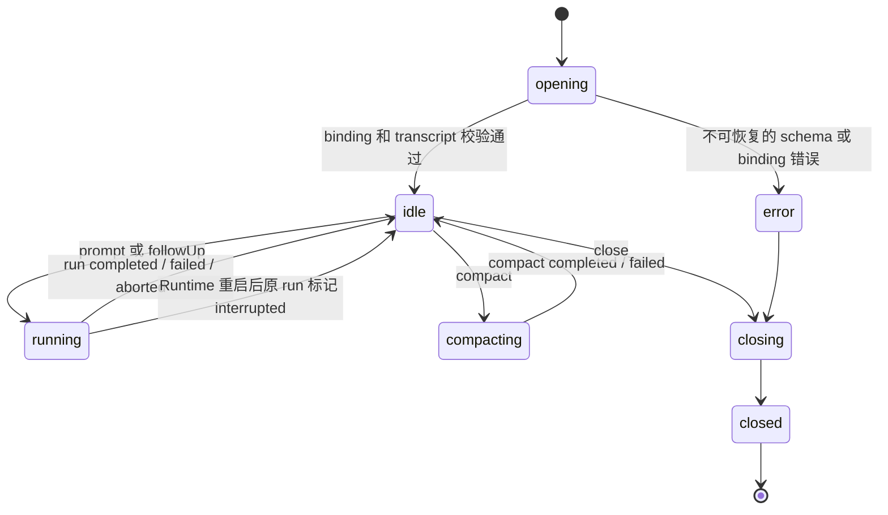
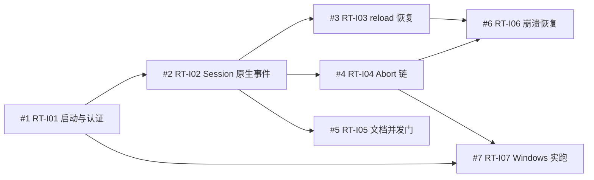

# Runtime IPC 与 Session 契约

<!-- markdownlint-disable MD013 MD060 -->

状态：Contract Stable

主要读者：Runtime、Electron main/preload、共享 Agent UI、Office Tool、测试与发布工程师。

本文把已经批准的 Runtime 决策收敛为实现契约。规范性关键词“必须”“不得”“应当”用于
发行门；Spike 代码只提供设计证据，不能代替本文中的生产实现与三平台测试。

## 1. 目标与非目标

本契约固定 `open-genoffice-pi-agent-runtime` 与 Electron main 之间唯一、版本化、可测试的
机器边界，使 PDF、Docs、Sheets、Slides 与 Slide QC 不理解 Pi 内部实现，也能创建、驱动、
恢复和关闭绑定文档的 Pi `AgentSession`。

首版必须同时满足四个目标：`AgentSession` 是唯一 Agent 事实源；renderer reload 不终止
正在运行的 turn；Runtime crash 不自动重放不确定操作；同一文档的 mutation 永远串行。

以下内容不由本契约承载：

- Office 编辑器领域模型和各应用 executor 的具体实现；
- Provider、MCP、Skills、Subagent、OCR 与同步服务的内部协议；
- renderer 直连 Runtime、读取 secret、执行 Extension 或启动子进程的能力；
- 旧聊天、旧 AgentLoop 或 Genspark wire contract 的兼容层；
- Runtime 与 Electron 的 N-1 兼容窗口。

数据布局、CredentialStore 与 Project Trust 由
[数据、配置与安全契约](02-data-config-security-contract.md)继续固定；本文只规定 IPC
可见面和生命周期。

## 2. 已冻结决策

| ID     | 决策                                                                                                               |
| ------ | ------------------------------------------------------------------------------------------------------------------ |
| RT-D01 | 每个 Electron 应用进程启动并管理一个 sidecar；不共享 daemon。                                                      |
| RT-D02 | 一个 sidecar 可以维持多条文档 Session；一条 Session 的 `documentId` 终身不可变。                                   |
| RT-D03 | renderer reload 不取消活跃 run；新 renderer 通过 snapshot + cursor 重新订阅。                                      |
| RT-D04 | Runtime crash 后不自动 replay；已落盘 Session 恢复，原活跃 run 终态写为 `interrupted`。                            |
| RT-D05 | 正式传输使用 NDJSON envelope；大对象只传受控 artifact handle、大小和 hash，不传 base64。                           |
| RT-D06 | Electron、Runtime、protocol schema 必须精确版本匹配；不提供 N-1。                                                  |
| RT-D07 | 同一文档的 mutation 严格串行；readonly tool 可并行执行，但写入 Session 和发给 UI 的事件保持原调用顺序。            |
| RT-D08 | debug 模式默认使用隔离的临时 Resource Home 和 fake credentials；只有显式危险开关才能读取真实 `~/.open-genoffice`。 |

这些选择与
[ADR-0011](../adr/0011-bundle-and-manage-the-pi-runtime-sidecar-with-electron.md)、
[ADR-0015](../adr/0015-use-authenticated-local-sockets-for-runtime-ipc.md)一致。修改任一项必须先
更新 ADR、本契约和相应故障测试，不能只改实现。

## 3. 当前代码与迁移入口

当前实现把模型 turn 拆散在 renderer、Electron main 和自研循环中，缺少可恢复的 Session
事实源：

| 当前落点                                         | 当前职责                                                      | 迁移动作                                                                 |
| ------------------------------------------------ | ------------------------------------------------------------- | ------------------------------------------------------------------------ |
| `packages/agent-core/src/loop.ts`                | 自研 AgentLoop、工具循环                                      | 四应用切换后删除；生产路径不得引用                                       |
| `packages/agent-core/src/electron-transport.ts`  | `ai:stream` 的 requestId、chunk 订阅和 renderer silence timer | 由共享 Session client 取代；不保留旧 chunk adapter                       |
| `apps/docs/src/main/docs-main.ts::registerAiIpc` | Shell/Docs/PDF 共用 Provider 代理、AbortController            | 改为注册 Runtime manager 与 typed Session bridge；随后删除旧 handler     |
| `apps/sheets/src/main/sheets-main.ts`            | Sheets 独立 `ai:*` handler                                    | 接入同一 Runtime manager；不保留第二套流协议                             |
| `apps/slides/src/main/ai-ipc.ts`                 | Slides Provider、Genspark 图片/媒体入口                       | 文本切到 Runtime；图片/媒体按独立 Provider 契约迁移                      |
| `apps/{pdf,docs,sheets,slides}/src/preload`      | 暴露 `aiStream`、cancel、chunk listener                       | 暴露窄 `agentSession` API；不得暴露 socket endpoint、token 或任意 method |
| `apps/*/src/renderer/ai/transport.ts`            | 把旧 Electron IPC 适配为 `AgentTransport`                     | 改为消费 Session snapshot/event；不再创建 `AgentLoop`                    |
| `.scratch/.../prototypes/runtime-sidecar`        | 封装、握手、token、进程回收与 debug 证据                      | 提炼为生产测试；目录本身不得进安装包                                     |

迁移不得长期保留 `ai:stream` → 新 Runtime 的兼容转发，因为它会丢弃 thinking、compaction、
branch、tool lifecycle 和 lineage 事件。应用切换完成后，对应 preload、main handler、renderer
transport 和旧类型必须同票删除。

## 4. 进程拓扑与所有权

完整拓扑见
[Runtime 进程拓扑图](diagrams/runtime-ipc-session-topology.html)。进程责任固定如下：

| Owner                               | 权威状态与能力                                                                                      |
| ----------------------------------- | --------------------------------------------------------------------------------------------------- |
| Electron main                       | Sidecar supervisor、Office 文档实例、executor、document mutation queue、renderer 订阅和窗口生命周期 |
| `open-genoffice-pi-agent-runtime`   | Pi `AgentSession`、Session registry、模型调用、资源加载、MCP client、Subagent 调度、事件 journal    |
| Renderer                            | AI Panel 投影视图、用户命令和当前 cursor；没有长期权威状态                                          |
| Office Tool Bridge                  | Runtime → Electron 的 typed tool request；按文档授权、排序、取消、回滚和 provenance                 |
| MCP/Subagent child process          | Runtime 的子进程；不得 daemonize；必须加入 Runtime 的 abort/退出回收树                              |
| Project Store / `~/.open-genoffice` | 文档绑定、Pi JSONL、资源、设置和非 secret 元数据；具体路径由数据契约定义                            |

每个 Electron 应用进程只创建一个 `PiRuntimeManager`。这个 manager 可以服务该进程内多个窗口、tab
和文档 Session。renderer 销毁只移除订阅者，不改变 Session 或 run；最后一个窗口关闭也不能绕过
Electron app 的统一 shutdown。

Runtime 与 Electron main 通过同一条全双工连接互相发起 typed request。Runtime 发出的
`office.tool.invoke` 只能由 Electron main 执行；不得把 Office mutation 下放给 renderer。

## 5. Sidecar Bootstrap 与认证

### 5.1 产物和 endpoint

正式 Runtime 是 Electron `extraResources` 中的 unpacked bundle。Electron 必须从经过 hash
验证的 manifest 解析 executable 和 entry，然后使用
`spawn(executable, [entry], { stdio: ['pipe', 'pipe', 'pipe'] })` 启动。不得使用
`utilityProcess`、系统 Node、`npx`、SEA 或常驻服务。

macOS/Linux 使用位于 `0700` instance directory 的短路径 UDS，socket mode 固定 `0600`。
Windows 使用含至少 96-bit 随机后缀的 Named Pipe，并显式设置 `readableAll: false`、
`writableAll: false`。endpoint 从不监听 TCP。

### 5.2 Bootstrap record

Electron 在子进程启动后向 inherited stdin 写入恰好一条 NDJSON bootstrap，随后保持该 pipe
打开作为 lifetime sentinel：

```json
{
  "kind": "bootstrap",
  "protocolVersion": "1",
  "runtimeVersion": "1.0.0",
  "schemaVersion": "1",
  "parentPid": 4242,
  "endpoint": "/private/.../runtime.sock",
  "token": "<64 lowercase hex chars>"
}
```

`token` 必须来自 256-bit CSPRNG，只存在于 Electron 内存和匿名 pipe，不得进入 argv、环境
变量、磁盘、日志或 renderer。Runtime 必须在 listen 前验证版本、字段和
`parentPid === process.ppid`；失败使用稳定 bootstrap exit code 并向 stderr 写脱敏诊断。

### 5.3 Hello 与 token 消费

Electron 连接 socket 后发送首条 `hello`。Runtime 在 constant-time token 比较、三个版本
精确匹配和父进程身份全部通过后才消费 token，并返回 Runtime PID、capabilities 与
instance ID。只有成功 hello 消费 token；错误 hello 被关闭，但不会让攻击者耗尽合法
token。成功后 Runtime 拒绝所有第二连接和 token 重用。

renderer 永远不知道 endpoint、bootstrap 或 hello。开发工具如需直连，必须使用下文的
隔离 debug 模式，不复用生产 endpoint。

## 6. Wire format

### 6.1 Framing

正式 socket 使用 UTF-8 NDJSON，一行一个 JSON object，以 `\n` 结束。协议实现必须：

- 接受 chunk 任意切分和多 frame 合并；忽略空行；拒绝未终止尾帧；
- 单帧上限 `1 MiB`，超过立即返回 `frame_too_large` 并关闭连接；
- 拒绝非 object、未知 envelope kind、未知字段类型和 schema validation failure；
- 不在 error 中回显原始 frame、prompt、tool input/result、URL、token 或 base64；
- 对 stdout/stderr 和 socket 使用背压，不能无界缓存事件。

### 6.2 Envelope

`packages/agent-runtime-protocol` 必须用 TypeBox 定义 schema，并从同一来源生成 TypeScript
类型、JSON Schema 与固定 vectors。不得维护手写类型和独立 JSON Schema 两份事实源。

请求、响应和事件使用同一基础字段：

```ts
type RequestEnvelope = {
  protocolVersion: '1'
  kind: 'request'
  id: string
  method: RuntimeMethod | ElectronMethod
  correlationId: string
  params: unknown
}

type ResponseEnvelope = {
  protocolVersion: '1'
  kind: 'response'
  id: string
  correlationId: string
  result?: unknown
  error?: ProtocolError
}

type EventEnvelope = {
  protocolVersion: '1'
  kind: 'event'
  eventId: string
  instanceId: string
  sessionId: string
  documentId: string
  runId?: string
  sequence: number
  cursor: string
  occurredAt: string
  type: SessionEventType
  payload: unknown
}
```

一条 response 必须且只能包含 `result` 或 `error`。`id` 只在当前连接内关联 request；会改变
状态的命令另外携带 UUID `operationId`。Runtime 以 `operationId + canonical request hash`
做幂等：完全相同的重试返回原 receipt；相同 ID、不同内容返回
`duplicate_operation_mismatch`。transport request ID 不能当业务幂等键。

### 6.3 大对象

frame 内不得出现图片、音视频、Office 文件或 PDF 的 base64。大对象只使用：

```ts
type ArtifactRef = {
  artifactId: string
  mediaType: string
  byteLength: number
  sha256: string
  displayName?: string
}
```

`artifactId` 是当前 document/session scope 的 opaque capability。实际文件必须位于
Project Store 或该 Runtime instance 的受控临时根；接收方在打开前校验 scope、大小和
SHA-256，拒绝 symlink escape、路径穿越和 hash 漂移。路径如需在 Electron 与 Runtime
之间传递，只能出现在专用 `artifact.register/open` method，不得进入 renderer event 或
日志。artifact 的配额、清理和持久化归数据契约。

## 7. Runtime 命令

所有长操作采用“快速 receipt + 事件终态”。请求超时只表示没有拿到 receipt，不得据此
自动重发 mutation；调用方使用同一 `operationId` 查询 receipt。

| Method              | 合法前置状态            | 立即结果                                         | 终态/备注                                                                |
| ------------------- | ----------------------- | ------------------------------------------------ | ------------------------------------------------------------------------ |
| `runtime.status`    | 已 hello                | 版本、PID、instance、supervisor health           | 2 秒超时；不返回 secret                                                  |
| `session.create`    | Runtime ready           | 新 `sessionId`、binding、snapshot、cursor        | 调用方提供稳定 `documentId`；新建 Pi JSONL                               |
| `session.open`      | 已有 Session            | 校验 binding 后返回 snapshot、cursor             | `documentId` 不同必须 `document_mismatch`                                |
| `session.close`     | idle/interrupted        | close receipt                                    | running 时先显式 abort；不能隐式取消                                     |
| `session.prompt`    | idle                    | `runId`、accepted cursor                         | 开始新 run；实际内容经事件流出                                           |
| `session.steer`     | running                 | queued receipt                                   | 在 Pi 的下一个安全模型边界注入；不直接改历史                             |
| `session.followUp`  | running 或 idle         | queued `runId`/receipt                           | running 时排在当前 turn 后；idle 时等价开始新 run                        |
| `session.abort`     | running/cancelling/idle | 当前 abort 状态                                  | 幂等；idle 返回 `already_terminal`；完成见 `run.aborted` 或 `run.failed` |
| `session.compact`   | idle                    | compaction `runId`                               | 终态必须含 before/after token usage 与新 cursor                          |
| `session.fork`      | idle                    | 新 `sessionId`、`parentSessionId`、binding       | 新 Session 仍绑定同一 `documentId`；不得借 fork 换文档                   |
| `session.navigate`  | idle                    | 新 active leaf 与 snapshot                       | 只在同一 Pi transcript tree 中切换；不改变 document binding              |
| `session.snapshot`  | open                    | 当前投影、last sequence、cursor                  | snapshot 包含消息、run、branch、tool、capability 状态，不含 secret       |
| `session.subscribe` | open                    | subscription receipt、replay range 或 reset 标志 | `afterCursor` 可选；见第 9 节                                            |
| `runtime.shutdown`  | ready                   | shutdown receipt                                 | 停止接单、取消活跃 run、落盘、回收子进程；5 秒后 Electron 强制回收       |

`session.create/open/fork` 默认 receipt 超时 10 秒，`status/snapshot/subscribe` 为 5 秒，
`prompt/steer/followUp/abort` 为 2 秒。模型、tool、compaction 本身不受 transport receipt timeout
控制，而由各能力的 execution budget 和 event watchdog 控制。

Runtime → Electron 使用受限 method：

| Method                | 用途                                                                                   |
| --------------------- | -------------------------------------------------------------------------------------- |
| `office.tool.invoke`  | 以 `sessionId/documentId/runId/toolCallId/actor/tool/input` 调用已注册 executor        |
| `office.tool.abort`   | 向同一 toolCall 传播 AbortSignal；返回 mutation outcome                                |
| `office.context.read` | 读取版本化、最小化的文档上下文或 selection snapshot                                    |
| `artifact.register`   | 注册受控 artifact；校验路径 root、大小、hash 与 scope                                  |
| `permission.request`  | 请求 Electron/UI 展示需要用户确认的能力；首版不能用于绕过 Subagent Mutation Grant 契约 |

Runtime 不能使用任意 IPC channel 名调用 Electron，也不能通过 tool name 拼接 main handler。

## 8. Session、Run 与文档状态机

### 8.1 不变量

- `sessionId`、`documentId`、`createdAt` 和 resource snapshot 在 Session 生命周期内不可改；
- 同一文档可以拥有多条 Session，同一 Runtime 可以打开多文档 Session；
- Session registry 必须对 `(sessionId, documentId)` 建唯一 binding，并在每次命令和
  Office Tool 调用时复验；
- Pi JSONL 是 transcript 唯一事实源；UI 缓存、旧 chat Markdown 和旧 AgentLoop message
  不能参与恢复；
- 应用重启加载已落盘 Session 后创建新的 Runtime `instanceId`，但保持 `sessionId` 和
  `documentId`；
- renderer reload 不创建新 Session，也不取消 run。

### 8.2 Session 状态



`interrupted` 是 Run 终态，不是让 Session 永久卡死的状态。Runtime 重启恢复后 Session
回到 `idle`，snapshot 中保留原 run 的 `interrupted` 终态和诊断；用户可以继续对话，也可
显式创建一个新 prompt，但系统绝不自动重放旧 prompt 或不确定 tool。

### 8.3 Run 状态

```text
queued -> running -> completed
                  -> failed
                  -> cancelling -> aborted
                  -> interrupted   # Runtime 非正常退出后由恢复程序补记
```

每个 run 只有一个终态事件。收到 terminal 后的迟到 delta/tool event 必须丢弃并记录
`late_event_dropped` 计数，不能进入 transcript 或 UI。

## 9. 事件、顺序与重连

### 9.1 事件族

首版事件至少覆盖：

- `session.opened/closed/snapshot.updated`；
- `run.queued/started/cancelling/completed/failed/aborted/interrupted`；
- `message.started/delta/completed` 与 `thinking.started/delta/completed`；
- `tool.requested/started/progress/completed/failed/aborted`；
- `compaction.started/completed/failed`；
- `branch.created/navigated`；
- `permission.requested/resolved`；
- `runtime.degraded` 与 `diagnostic.available`。

UI 专用的 `details` 必须与写入模型上下文的 tool result 分离。event payload 只含渲染所需
结构和脱敏 provenance，不得携带完整 hidden prompt、secret 或未经裁剪的 tool output。

### 9.2 Sequence 与 cursor

Runtime 为每条 Session 分配单调递增的 `sequence`，在写入持久 journal 成功后才发布事件。
同一 Session 的事件发布顺序必须与 journal 顺序一致；跨 Session 不承诺全局顺序。
`cursor` 是 opaque、带 `instanceId/sessionId/sequence` 完整性保护的值，调用方不得解析。

Electron main 以 `eventId` 去重、以 sequence 检测 gap，并把事件按文档路由给 renderer。
renderer 自己的 React state 不是恢复事实源。

### 9.3 Snapshot + cursor 恢复

renderer 初次加载或 reload 的固定流程是：

1. preload 发送 typed `agentSession.connect(documentId, sessionId?, afterCursor?)`；
2. Electron main 确认当前 webContents 对该文档有访问权；
3. main 调用 `session.open` 或复用已打开 Session，再调用 `session.subscribe`；
4. Runtime 原子返回 snapshot 及其 `cursor`，随后只发送 sequence 更大的事件；
5. main 先把 snapshot 投给新 renderer，再按 sequence 转发 replay/live events；
6. renderer 用 snapshot 替换本地投影，再应用事件，并持久记录最后 cursor。

如果 `afterCursor` 属于当前 instance 且仍在 replay window，Runtime 可以只返回缺失事件；
否则返回 `resetRequired: true` 和新 snapshot。`cursor_expired` 不是 fatal，也不得导致
Session 或 run 重启。snapshot 与订阅切换必须原子，不能在二者之间丢事件。

Electron main 可供 renderer 使用的 API 必须是按方法定义的窄桥接，例如
`connect/prompt/steer/followUp/abort/compact/fork/navigate/disconnect/onEvent`；不得暴露
`invoke(method, params)`、socket handle、任意文件路径或 Runtime token。

## 10. Tool 并发、mutation 与结果顺序

Electron main 为每个 `documentId` 维护一条跨 Session 的 mutation queue。任何 actor
（父 Agent、Subagent、MCP 间接调用）最终产生的 Office mutation 都进入同一队列，并在
执行前再次校验文档绑定、工具 capability 和 permission snapshot。

readonly tool 可并行，但 Runtime 在 dispatch 时固定 `toolOrder`。并行完成的结果先进入
有界 reorder buffer，只有前序调用已经得到 terminal outcome 后，才按 `toolOrder` 写入
Pi Session 并发布 `tool.completed/failed/aborted`。这样并行读不会改变模型看见的结果顺序。

mutation 必须满足：

- 前一 mutation 得到明确 `committed/rolled_back/not_started` 后才启动下一项；
- mutation 执行前记录可回滚 snapshot 或使用 executor 已有原子提交边界；
- 网络断开、Runtime crash 或超时导致结果不确定时标记 `unknown`，阻塞该文档后续
  mutation，提示用户核对；不得自动 retry；
- tool terminal event 包含 `mutationOutcome` 和最小 provenance，不包含文档正文；
- 一个 Session 的 abort 不取消同文档其他 Session 已经提交的操作，但会撤销尚未开始的
  本 run queue item。

## 11. Abort、超时与进程回收

UI Stop 只发一次 `session.abort(operationId, runId)`。Runtime 为 run 建立根
`AbortController`，并把同一 abort 链传播到模型 Provider、Office Tool、MCP call、
Subagent 与测试/转换子进程。

取消契约如下：

- receipt 在 2 秒内返回，表示取消已登记，不表示所有工作已经结束；
- cooperative 模型/tool/MCP/Subagent 应在 2 秒内 terminal；
- 不协作的 Runtime 子进程在 5 秒内强制回收；
- Office main 中不可杀死的 in-process executor 必须返回明确 mutation outcome，不能把
  未确认终止伪装为 `aborted`；
- Runtime 只有在全部已登记 descendant terminal 后发布 `run.aborted`；存在不确定
  mutation 时发布 `run.failed(code=abort_incomplete)` 并把文档标为需核对；
- abort 完成后同一 Session 必须可接受新 prompt。

macOS/Linux 的 Runtime、MCP 与 Subagent 进入独立 process group。Windows 使用经过
原生 runner 验证的 kill-on-close Job Object；若实现期先采用 PID ledger +
`taskkill /T /F`，它必须通过“孙进程忽略 stdin EOF”故障 fixture，失败即必须升级为 Job
Object launcher。任何平台发现孤儿进程都阻断发布。

## 12. Runtime 崩溃、重启与关闭

Electron supervisor 状态机固定为：

```text
stopped -> starting -> ready -> stopping -> stopped
                    -> crashed -> backoff -> starting
                                        -> circuit_open
```

崩溃后使用新 instance directory、endpoint、token 和 `instanceId`，不复用遗留 UDS。
60 秒内最多自动重启 3 次，退避 `250 ms / 1 s / 4 s`；再次失败打开 circuit breaker，AI
Panel 显示可诊断的 Runtime unavailable，Office 本地编辑保持可用，不启用旧 Agent。

恢复程序必须扫描已落盘但没有 terminal event 的 run，追加唯一的
`run.interrupted(reason=runtime_crash)`，并将相关 tool outcome 标记为
`not_started/committed/rolled_back/unknown` 中可证明的一项。无法证明时只能是 `unknown`。
恢复后生成 snapshot，等待 renderer 重新订阅。不得自动 replay prompt、MCP、Subagent 或
mutation。

正常退出先停止接收新 run，向活跃 run 发 abort，落盘终态、关闭 MCP/Subagent、删除 UDS，
最后退出。`runtime.shutdown` 或父 stdin EOF 都走这一条路径；5 秒仍未退出时 Electron
强制回收整棵树。Runtime crash 使用退出码 `70`，bootstrap/配置错误使用稳定的非零退出码，
有序 shutdown 与父 EOF 使用 `0`。

## 13. 版本策略

manifest、bootstrap 和 hello 都携带 `runtimeVersion`、`protocolVersion` 与
`schemaVersion`。三者任何一个不等于 Electron 构建时固定值，都必须 fail closed，UI
显示“安装内容不完整或版本不匹配”，不得尝试降级字段、连接旧 Runtime 或启动旧
AgentLoop。

协议演进规则：

- optional event 只能在同一 protocol 中新增，接收方对未知 event type 记录并忽略；
- command 字段语义、状态机或安全边界变化必须提升 protocol version；
- 持久 Session schema 变化提升 schema version，并提供向前升级；
- Runtime 二进制或依赖树变化提升 runtime version；
- 同一安装包始终只携带一组精确匹配版本，不承诺跨安装包在线兼容。

## 14. 错误契约与重试

```ts
type ProtocolError = {
  code: RuntimeErrorCode
  message: string
  retryable: boolean
  correlationId: string
  details?: Record<string, string | number | boolean>
}
```

稳定错误类别至少包含：

| 类别                                   | 默认可重试 | 行为                                           |
| -------------------------------------- | ---------- | ---------------------------------------------- |
| `invalid_json/schema/invalid_request`  | 否         | 拒绝该请求；连续协议违规可关闭连接             |
| `hello_required/unauthorized`          | 否         | 关闭连接；不泄露哪个字段错误                   |
| `protocol/runtime/schema_mismatch`     | 否         | fail closed，要求修复安装                      |
| `method_not_found`                     | 否         | 记录版本诊断                                   |
| `session_not_found/document_mismatch`  | 否         | 不创建隐式 Session、不重新绑定                 |
| `invalid_state`                        | 视命令而定 | 返回当前状态与允许动作                         |
| `duplicate_operation_mismatch`         | 否         | 安全告警，不执行第二次                         |
| `cursor_expired`                       | 是         | 走 snapshot reset，不重启 run                  |
| `permission_denied`                    | 否         | 不把未授权工具暴露给模型                       |
| `provider_auth/rate_limit/unavailable` | 视类别而定 | 只影响当前 Provider；遵守 Provider retry-after |
| `tool_failed/tool_timeout`             | 视 outcome | mutation `unknown` 永不自动重试                |
| `abort_incomplete`                     | 否         | 文档需核对，Session 保持可诊断                 |
| `artifact_invalid`                     | 否         | 拒绝打开或转发                                 |
| `runtime_unavailable/internal_error`   | 有限       | supervisor 按固定预算重启；不启用旧 Runtime    |

自动重试只允许 transport 连接、明确 readonly 操作和 Provider 明确声明的 transient failure。
同一个 mutation、MCP side effect 或 Subagent mutation 在结果不确定时不得重试。

## 15. 安全、日志与 debug

Runtime 日志默认只记录 correlation/session/run/provider/server/tool ID、状态、耗时、错误类别
和 redacted process metadata。不得记录 prompt、thinking、Office 正文、tool input/result、
完整 URL、OAuth/API token、bootstrap token、图片 base64 或真实 artifact path。

日志和诊断必须满足：

- renderer 只得到用户可行动的错误和 opaque diagnostic ID；
- stderr 进入 Electron 的有界、脱敏 ring buffer，不直接转发 renderer console；
- endpoint directory 权限和 token 测试属于 contract test，不是安装文档建议；
- parent PID、instance ID、session/document binding 每次调用都复验，不能只在 UI 检查；
- `permission.request` 没有用户响应时默认拒绝，不能因 renderer reload 自动允许。

同一入口提供 `--debug-stdio`，但默认创建一次性临时 HOME、Project Store 和 fake
CredentialStore，网络 Provider、真实 MCP 和 project Extension 默认禁用。只有同时提供
显式 `--use-real-home` 与交互确认后才可读取 `~/.open-genoffice`；CI 中该开关必须 hard
fail。debug 输出同样遵守日志脱敏，不能把真实 secret 打到 terminal。

## 16. 测试向量与验收映射

每个 schema 必须有 accepted/rejected JSON vectors；所有实现（Runtime、Electron client、
测试 probe）消费同一 vectors。新平台模块 lines/branches/functions 覆盖率均不得低于 95%。

| Test ID | 自动化场景                                                                     | 通过条件                                                                             | 验收映射           |
| ------- | ------------------------------------------------------------------------------ | ------------------------------------------------------------------------------------ | ------------------ |
| RT-001  | 完整复制 Runtime bundle 后启动、hello、status、shutdown                        | 不用系统 Node；版本/PID 正确；退出无 socket/进程残留                                 | AR-009, PK-001/002 |
| RT-002  | 错 token、token 重用、错误父 PID、protocol/runtime/schema mismatch             | 全部 fail closed；token/secret 不进日志；错误 hello 不消费合法 token                 | AR-010             |
| RT-003  | fake Provider 产生 message/thinking/tool/compaction/branch 事件                | journal、Socket、main、renderer 顺序一致，无缺失/重复                                | AR-001/002/005/006 |
| RT-004  | run 中 reload renderer 50 次                                                   | run 不取消；snapshot + cursor 恢复；无重复气泡、gap 或 listener 泄漏                 | AR-004             |
| RT-005  | 长模型、Office tool、MCP、Subagent 各执行中 Stop                               | cooperative ≤2 秒；强制回收 ≤5 秒；Session 可继续；mutation outcome 明确             | AR-003             |
| RT-006  | mutation 与 readonly 并发，两个 Session 同时操作同一文档                       | mutation 串行；readonly 可并行；tool result/event 仍按 `toolOrder`                   | OT-002             |
| RT-007  | prompt 后在模型、Office mutation、MCP、Subagent 四个故障点杀 Runtime           | 不自动 replay；原 run 唯一 `interrupted`；不确定 mutation 标 `unknown`；用户可继续   | AR-004/009, PK-002 |
| RT-008  | 使用同 operationId 重发相同/不同 payload                                       | 相同返回原 receipt；不同返回 `duplicate_operation_mismatch`；mutation 不重复         | AR-003, OT-002     |
| RT-009  | Session A 尝试用 document B 调用 open/tool/fork                                | 全部 `document_mismatch`；无文件访问或 transcript 污染                               | AR-004/005         |
| RT-010  | 注入 1 MiB+ frame、未终止行、base64、大对象伪 handle、symlink escape           | 被稳定错误拒绝；连接和临时 artifact 可回收                                           | AR-010, PK-002     |
| RT-011  | 连续 100 次启停、20 条开放 Session、三次崩溃与 circuit breaker                 | cold-ready p95 ≤5 秒；restart-ready p95 ≤8 秒；资源增长有上限；Office 编辑不中断     | AR-009, QA/PK      |
| RT-012  | Windows native runner：Named Pipe、孙进程忽略 EOF、Job Object/PID-tree cleanup | Named Pipe 实连；Electron 强退后 Runtime/MCP/Subagent 全部消失；静态 PE 检查不能替代 | AR-010, PK-001/002 |
| RT-013  | `--debug-stdio` 无参数启动并运行 fake Session                                  | 只使用隔离 temp HOME/fake credentials；零真实网络、零真实 `~/.open-genoffice` 读取   | AR-009             |

AR-008 的旧数据删除属于数据契约；本契约只要求 Runtime 不读取旧 chat/Provider/Genspark 数据。

## 17. 文件级实施边界

首版允许的最小新增与演进边界：

```text
apps/pi-agent-runtime/                  # Runtime host、Session registry、event journal
packages/agent-runtime-protocol/        # TypeBox schema、generated JSON Schema、vectors
packages/electron-utils/                # PiRuntimeManager、launcher、socket client、process cleanup
packages/ui/                            # 共享 Session projection 与 typed renderer client
apps/{pdf,docs,sheets,slides}/src/main/agent-tools/
                                        # Office Tool Bridge adapters
apps/{pdf,docs,sheets,slides}/src/preload/
                                        # 窄 agentSession bridge
```

G1 完成时不要求一次迁完四应用 Office tool，但必须能用 fake Provider 创建、运行、取消和恢复
无 Office tool 的 Pi Session。`packages/agent-core` 和 `packages/ai-provider` 在最后一个应用
切换前可以暂存，生产入口切换后立即删除；不得成为 Runtime fallback。

## 18. 实施 Issues

这些切片按 `to-issues` 规则贯穿 schema、Runtime、Electron/UI 投影和自动化测试，不拆成
“只写协议”“只写 launcher”之类横向票。用户已批准协议参数、粒度、依赖与 AFK 分类，
Issues 已按依赖顺序发布到 `yoko19191/open-genoffice`。

| Local ID | Issue                                                      | Title                                                       | Type | Blocked by | 覆盖验收                       | 状态 |
| -------- | ---------------------------------------------------------- | ----------------------------------------------------------- | ---- | ---------- | ------------------------------ | ---- |
| RT-I01   | [#1](https://github.com/yoko19191/open-genoffice/issues/1) | 从安装资源启动并认证唯一 Pi Runtime                         | AFK  | 无         | RT-001/002/013, AR-009/010     | Open |
| RT-I02   | [#2](https://github.com/yoko19191/open-genoffice/issues/2) | 创建绑定文档的 Pi Session 并在 AI Panel 显示原生流事件      | AFK  | #1         | RT-003/009, AR-001/002         | Open |
| RT-I03   | [#3](https://github.com/yoko19191/open-genoffice/issues/3) | 用 snapshot + cursor 在 renderer reload 后无损接续活跃 run  | AFK  | #2         | RT-004, AR-004                 | Open |
| RT-I04   | [#4](https://github.com/yoko19191/open-genoffice/issues/4) | 贯通 Stop 到模型、Office Tool、MCP 与 Subagent 的同一 Abort | AFK  | #2         | RT-005, AR-003                 | Open |
| RT-I05   | [#5](https://github.com/yoko19191/open-genoffice/issues/5) | 跨 Session 串行同文档 mutation 并稳定排序并行 readonly 结果 | AFK  | #2         | RT-006/008, OT-002             | Open |
| RT-I06   | [#6](https://github.com/yoko19191/open-genoffice/issues/6) | Runtime 崩溃后恢复 Session 并把活跃 run 标为 interrupted    | AFK  | #3, #4     | RT-007/011, AR-004/009, PK-002 | Open |
| RT-I07   | [#7](https://github.com/yoko19191/open-genoffice/issues/7) | 在 Windows 原生 runner 验证 Named Pipe 与整棵进程树回收     | AFK  | #1, #4     | RT-012, AR-010, PK-001/002     | Open |

建议依赖图：



每票的实现正文必须说明同票删除或拒绝的旧路径，并引用本文 test ID。没有真实发布凭据的
macOS notarization/Windows Authenticode 不放进 Runtime 切片，留给打包运维文档标为
HITL；Named Pipe 和无签名 CI 进程树测试本身是 AFK。

## 19. Reader Test

没有参与迁移讨论的工程师读完本文，应能准确回答：

1. 为什么一条 Runtime 连接能服务多个文档，但一条 Session 不能换 `documentId`？
2. renderer reload 时谁保存权威 run，如何保证 snapshot 和 live event 之间没有 gap？
3. transport `id` 与 `operationId` 有什么区别，什么时候允许重试？
4. 同一文档的两个 Session 同时发 mutation 会怎样？并行 readonly 为什么不会乱序？
5. UI Stop 何时可以显示为真正完成，遇到不确定 mutation 时产品如何处理？
6. Runtime 在 tool 执行中崩溃后，哪些内容恢复，哪些内容明确不得 replay？
7. 为什么版本不匹配不能 N-1 降级？用户还能否继续本地编辑 Office 文档？
8. debug 模式在没有危险开关时能否读取真实凭据、Project Extension 或联网 Provider？

任一问题不能仅凭本文得到一致答案，本文就不能进入 `Contract Stable`。
