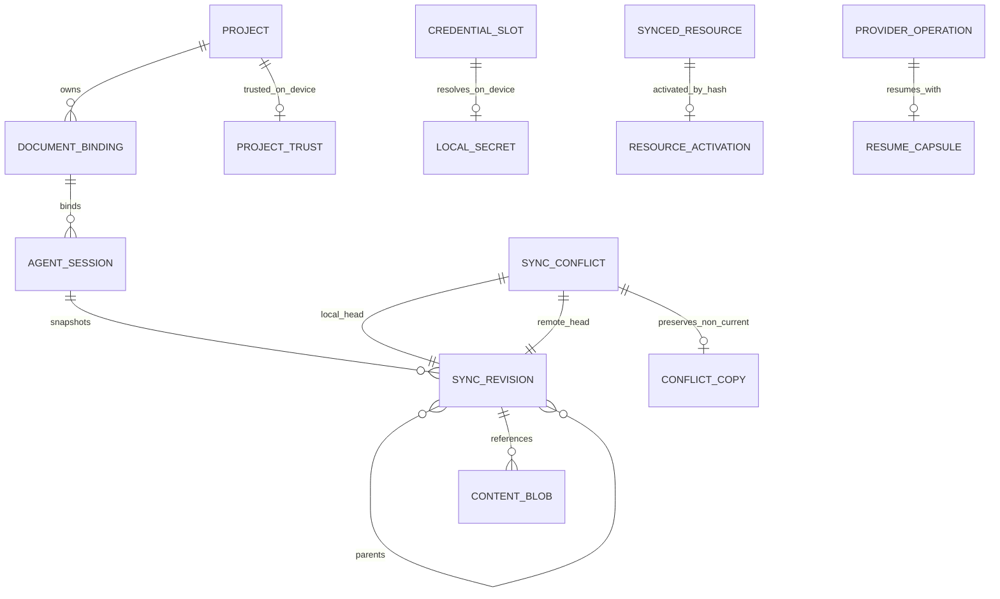
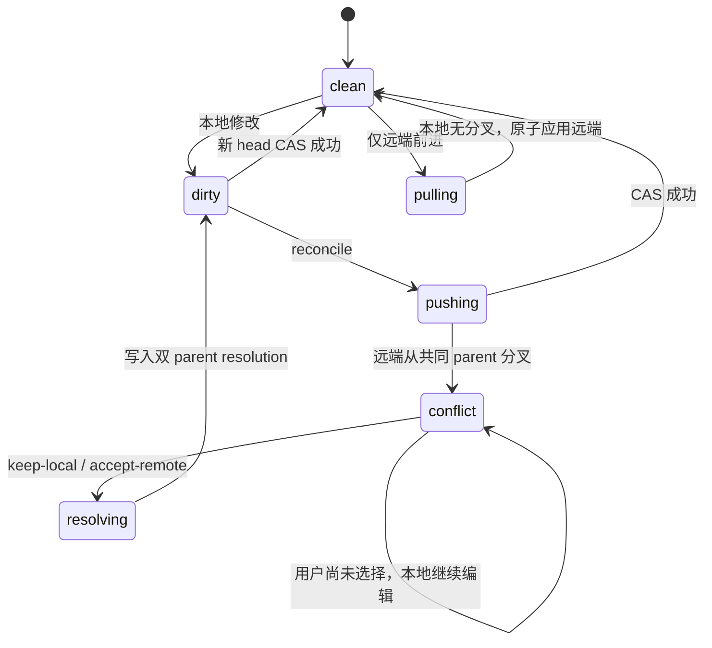
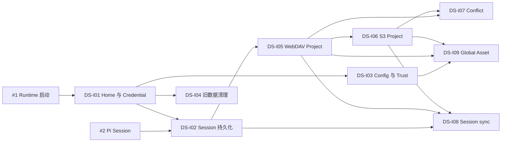

# 数据、配置与安全契约

<!-- markdownlint-disable MD013 MD060 -->

状态：Contract Stable

主要读者：Runtime、Electron main、Project Store、设置、安全、同步与升级工程师。

本文固定 Agent Platform 的本地数据、配置、Credential Reference、Project Trust、Session
绑定和同步 revision 边界。它不创建第二份 Agent transcript，也不与 Pi CLI、Pi Web、
Codex CLI 或其他 Agent 客户端共享资源和凭据。

## 1. 目标与非目标

本契约要让工程团队仅凭一个字段就能判断四件事：它存在哪里、谁能读取、是否同步、发生
冲突或升级失败时哪份仍是权威。

必须实现：

- `~/.open-genoffice` 是唯一 Agent Resource Home；
- Pi JSONL 是 Agent transcript 唯一事实源；
- secret 只存在于内存或本机安全 CredentialStore，不进入普通 JSON、renderer、Session、
  日志或同步包；
- 受信项目可以携带 `.open-genoffice`，未受信项目不能改变模型工具集、执行代码或联网；
- Project 与 Global Asset 使用相同 revision 语义、不同远端 namespace；
- 本地 Office 工作文件始终是 Local Current，远端分叉不得静默覆盖；
- 旧聊天、索引、Provider 配置、明文 key 和 Genspark token 直接删除，不迁移。

以下不由本文解决：

- Office 文档格式和各编辑器内部 undo/recovery；
- WebDAV/S3 transport 的具体请求代码；
- MCP、Subagent、MinerU 与 Provider 的业务协议；
- 对已攻破操作系统、root/admin 或同用户任意进程的强隔离；
- 客户端端到端同步加密。

## 2. 已冻结决策

前四项由迁移规格和 ADR 固定；DS-D05–DS-D10 于 2026-08-09 在本契约轮次获得批准，
DS-D11 随子系统 SS-D12 同日获得批准。任何实现若要改变这些边界，必须先更新契约及其
验收映射，不能在单个子系统中隐式偏离。

| ID     | 状态   | 决策                                                                                                                                        |
| ------ | ------ | ------------------------------------------------------------------------------------------------------------------------------------------- |
| DS-D01 | 已冻结 | 全局 Agent Resource Home 只使用 `~/.open-genoffice`，不得扫描或写入其他 Agent 客户端目录。                                                  |
| DS-D02 | 已冻结 | 项目可以携带 `.open-genoffice`；只有取得 Project Trust 后才允许装载、执行或连接其资源。                                                     |
| DS-D03 | 已冻结 | Credential、Project Trust、设备设置永不上传；Global Asset 包含 Assets、Skills、Extensions、Prompts、Package lock 和脱敏 MCP 配置。          |
| DS-D04 | 已冻结 | Local Current 不被远端分叉覆盖；非当前分支成为 Conflict Copy，用户选择产生双 parent resolution revision。                                   |
| DS-D05 | 已批准 | 配置优先级为 compiled defaults → global → trusted project → explicit session override；安全能力采用 deny-wins，项目不能反向开启全局禁用项。 |
| DS-D06 | 已批准 | Runtime 逻辑拥有 Pi CredentialStore；密文操作由 Electron main 的异步 `safeStorage` broker 执行，sidecar 不增加 native keyring 依赖。        |
| DS-D07 | 已批准 | Linux 无安全 secret backend 时禁止持久化凭据，仅允许进程内临时凭据；不得使用 `basic_text` 或明文 fallback。                                 |
| DS-D08 | 已批准 | Project Trust 按 canonical root 持续生效；同步得到的可执行/联网资源另用 content-hash Resource Activation，新设备或 hash 变化后重新授权。    |
| DS-D09 | 已批准 | `documentId` 是 UUID，不由绝对路径或正文 hash 派生；应用内 Save As/Move 保持 ID，外部搬移不能证明身份时要求用户显式 rebind。                |
| DS-D10 | 已批准 | Revision 与 `head.json` 使用 canonical JSON 的 SHA-256 内容寻址和强 ETag CAS；不使用 mtime、S3 ETag 或跨设备 wall-clock 决定胜者。          |
| DS-D11 | 已批准 | Provider Operation 只持久化脱敏索引与加密 Resume Capsule；重启只能继续查询/下载同一任务，不能重新提交可能计费的请求，且两者都不进入同步。   |

## 3. 当前代码与迁移边界

当前仓库混合了 Office 项目、旧聊天、Provider secret 和 Genspark 云状态。实施时必须外科式
分离：

| 当前落点                                   | 当前行为                                                      | 迁移动作                                                                                              |
| ------------------------------------------ | ------------------------------------------------------------- | ----------------------------------------------------------------------------------------------------- |
| `packages/project-store/src/store.ts`      | 在 Electron `userData/projects` 保存项目索引与自研 chat JSONL | 保留 package 并重建为 DocumentBinding/Project/Sync store；旧 chats、index 和 `project:*Chat` IPC 删除 |
| `packages/project-store/src/types.ts`      | `ChatMessage` 保存正文、工具输入输出、附件绝对路径            | 删除旧 chat 类型；Agent 消息只存在 Pi JSONL；UI details 使用 Runtime event                            |
| `apps/docs/src/main/docs-main.ts`          | `ai-settings.json` 直接保存 Provider 配置和 API key           | 非敏感模型配置迁入 Resource Home；所有旧 key 直接删除，不导入安全库                                   |
| `packages/ai-provider/src/types.ts`        | `AiProviderConfig.apiKey` 是普通字符串并经过 renderer IPC     | Provider 配置改用 Credential Reference；renderer 只能 write-only 提交 secret                          |
| `packages/ai-search/src/genoffice-auth.ts` | Genspark key/access token 明文存于 `~/.genoffice/auth.json`   | 幂等删除文件和登录入口；不得导入、刷新或保留只读状态                                                  |
| `apps/shell/src/main/cloud-projects.ts`    | 拉取并缓存 Genspark 云项目                                    | 完整删除；由 WebDAV/S3 Project Sync Provider 取代                                                     |
| `apps/shell/src/main/app-settings.ts`      | 保存 UI 语言、onboarding 等普通应用偏好                       | 保留在 Electron `userData`；它不是 Agent Resource，也不参与 Agent sync                                |
| 各应用 recent/autosave/recovery            | 编辑器 UI 与故障恢复数据                                      | 保持原位；不因为 Agent 迁移搬入 Resource Home                                                         |

旧 Project Store 的“write failure 只 warn、不抛错”不适用于新 binding、Session、credential index、
revision 或 head。权威数据写失败必须返回结构化错误；只有日志和可重建 cache 可以 best-effort。

## 4. 领域模型与权威数据



| 实体                | 权威位置                                    | 不变量                                                                             |
| ------------------- | ------------------------------------------- | ---------------------------------------------------------------------------------- |
| Project             | Resource Home `projects/<projectId>`        | `projectId` 为 UUID；不由名称、路径或远端 bucket 推导                              |
| DocumentBinding     | Project Store                               | 一条 binding 对应一个 `documentId`；路径可变，ID 不随 Save As/应用内移动改变       |
| Agent Session       | Pi JSONL                                    | 一 Session 只绑定一文档；消息、工具结果、branch、compaction 不复制进 Project Store |
| Credential Slot     | 普通配置/credential index                   | 可同步、非 secret；只标识“此处需要哪类凭据”                                        |
| Local Secret        | safeStorage 密文 blob + 进程内解密值        | 不同步、不返回 renderer、不进入 session/log                                        |
| Project Trust       | 当前设备 `state/trust.json`                 | 绑定 canonical root；持续到撤销、root identity 变化或设备变化                      |
| Resource Activation | 当前设备 `state/activations.json`           | 绑定 namespace/resource/content hash；hash 变化立即失效                            |
| Content Blob        | 本地 blob store + 远端 immutable object     | ID 是正文 SHA-256；读取时复验                                                      |
| Sync Revision       | 本地 revision store + 远端 immutable object | canonical JSON hash；0–2 parent；不保存 wall-clock                                 |
| Remote Head         | 远端唯一可变 `head.json`                    | 只用 Provider 强 ETag CAS；S3 ETag 是 CAS token，不是正文 hash                     |
| Local Current       | 用户 Office 工作路径                        | reconcile 期间始终保持主路径；远端分叉不能覆盖                                     |
| Conflict Copy       | 本地 conflicts store                        | 永远保存当前选择下的非 current/旧分支，能比较、恢复或删除                          |
| Provider Operation  | 当前设备 `state/provider-operations.json`   | 普通索引只含 operation/provider/document/status/expiry，不含远端 task ID 或 URL    |
| Resume Capsule      | safeStorage 加密 operation blob             | 只允许续查/下载同一远端任务；不表示重新提交；过期或解密失败即不可恢复              |

Project Store 可以建立索引以快速查找这些实体，但索引必须可从权威文件重建；索引损坏不得造成
Session 或 Office 文件丢失。

## 5. Resource Home 文件系统契约

### 5.1 全局布局

```text
~/.open-genoffice/
├── schema.json
├── agent/
│   ├── settings.json
│   ├── models.json
│   ├── sessions/<document-id>/<session-id>.jsonl
│   ├── skills/
│   ├── extensions/
│   ├── packages/
│   ├── packages.lock.json
│   ├── prompts/
│   └── logs/
├── mcp/
│   └── servers.json
├── assets/
├── projects/<project-id>/
│   ├── project.json
│   ├── documents/<document-id>/binding.json
│   └── revisions/
├── sync/
│   ├── providers.json
│   ├── manifests/
│   ├── intents/
│   └── conflicts/
└── state/
    ├── trust.json
    ├── activations.json
    ├── migrations.json
    ├── provider-operations.json
    ├── leases/
    └── secure-store/
        ├── index.json
        ├── blobs/<credential-id>.bin
        └── operation-capsules/<operation-id>.bin
```

`schema.json` 至少包含 `schemaVersion`、`createdByRuntimeVersion` 和随机 `deviceId`。deviceId
只用于 revision attribution 和诊断，不是账号，不含设备名、用户名或硬件序列号。

### 5.2 项目布局

```text
<canonical-project-root>/.open-genoffice/
├── project.json
├── agent/
│   ├── settings.json
│   ├── models.json
│   ├── skills/
│   ├── extensions/
│   ├── packages/
│   ├── packages.lock.json
│   └── prompts/
├── mcp/
│   └── servers.json
└── assets/
```

项目目录不得包含 Credential、Project Trust、Resource Activation、设备设置、日志、同步
Provider 或 Runtime lease。Pi Session 保存在全局 Resource Home 的文档命名空间，通过
Project Sync manifest 同步，不直接写进可能由 Git 管理的项目 `.open-genoffice`。

### 5.3 权限、原子写与锁

- macOS/Linux Resource Home、`state/`、`agent/sessions/` mode 固定 `0700`；普通文件和
  secret blob 固定 `0600`。启动时发现更宽权限必须收紧或 fail closed。
- Windows ACL 只允许当前用户、SYSTEM 和安装所需受信主体；不得继承 Everyone 写权限。
- 权威 JSON 写入临时同目录文件，完成 schema 校验、`fsync`、atomic rename；POSIX 还要
  `fsync` parent directory。不能原地 truncate。
- 跨 Electron/Runtime 进程使用按实体粒度的文件锁和有界重试，不使用一把全局锁。
- Session 写入需要 `sessionId` lease；第二个 Runtime 发现有效 lease 时返回
  `session_in_use`，不得双写或“最后保存者获胜”。
- sync 使用 namespace/scope lease；credential refresh 使用 slot lease；lease 必须含
  instanceId/PID、可验证 heartbeat 和有限 TTL，崩溃后可安全接管。
- Provider Operation index 与 Resume Capsule 使用同一 operationId generation CAS 原子提交；
  任一写入失败不得重新发起远端请求，只能保留旧 generation 或标记 `interrupted`。
- cache/log 写失败可以降级；binding/session/revision/head/credential/trust 写失败必须通知
  调用方，不得只输出 console warning。

损坏 JSON 不被静默覆盖。系统将原文件移动到 `state/recovery/<opaque-id>`，记录脱敏诊断，
再对可重建索引使用重建，对不可重建设置使用安全默认值。secret blob 解密失败只使对应
credential unavailable，不能删除其他 credential。

## 6. 配置文件与合并

### 6.1 单一 schema 来源

全局与项目配置使用 TypeBox 作为 TypeScript 类型和 JSON Schema 的单一来源，固定
`schemaVersion` 且 `additionalProperties: false`。普通配置使用 UTF-8 JSON，不支持
comments、环境变量插值、`!command`、shell substitution 或动态 JavaScript。

每个 source 必须整体通过 schema 后才参与合并。项目 source 无效时隔离该 source、显示
诊断，并继续使用 defaults/global；不能“尽量解析”出部分安全字段。

### 6.2 优先级和安全交集

值配置按以下顺序覆盖：

```text
compiled safe defaults
  < global user config
  < trusted project config
  < explicit session override
```

这只是普通值的优先级。能力不是 last-writer-wins，而是下面四层的交集：

```text
product hard policy
  ∩ global enabled capabilities
  ∩ Project Trust / Resource Activation
  ∩ current actor permission snapshot
```

因此项目可以选择模型、增加 prompt、声明 Skill 或 MCP server，但不能开启全局关闭的网络、
OCR、Extension、Subagent mutation 或同步。Session override 必须来自用户显式 UI 动作，
模型和 project config 不能产生 override。

### 6.3 字段合并规则

| 字段类型               | 规则                                                                                          |
| ---------------------- | --------------------------------------------------------------------------------------------- |
| scalar                 | 最后一个获准 source 覆盖；`null` 不表示删除，除非 schema 明确定义                             |
| keyed object           | 按稳定 ID 合并；同 ID 的允许字段逐项覆盖                                                      |
| ordered list           | 整体替换，不隐式 concatenate                                                                  |
| Skill/Extension/Prompt | 按 resource ID + content hash；项目同 ID 可以 shadow global，但 UI 必须展示 provenance        |
| Provider/model         | 项目可声明非 secret endpoint、模型与 Credential Slot；不得提供 secret、命令或任意环境变量     |
| MCP server             | 项目可声明 server/transport/slot；只有 Trust/Activation 和全局策略同时允许才连接              |
| `enabled: false`       | 当前 source 可以禁用继承项；低信任 source 不能把高层 policy 的禁用改回 true                   |
| Package                | npm 精确版本、Git 完整 commit、本地目录 content hash；浮动 tag/range/branch 全部 schema error |

`AgentSession` 打开时解析当前有效配置；每个 Agent run 开始时冻结 `effectiveConfigHash`、
`resourceSnapshotId` 和 `capabilitySnapshotId`。配置变化可以在下一 run 重新解析，但不在活跃
run 中热加入 Extension、MCP 或工具。Project Trust、Resource Activation、Mutation Grant
撤销与紧急禁用可以即时收窄当前 run 的执行入口；Credential refresh 不改变 resource snapshot。

## 7. CredentialStore

### 7.1 分层设计

Runtime 持有实现 Pi `CredentialStore` 的 `OpenGenOfficeCredentialStore`，负责 provider login、
refresh、logout、slot lease、状态和错误归一化。加解密由 Electron main 中窄
`SecureStorageBroker` 提供，因为 `safeStorage` 只在 main process 可用。

Runtime 与 Electron 的受信 socket 只允许以下 credential method：

- `credential.put(slot, kind, secretPayload)`；
- `credential.get(slot)`；
- `credential.delete(slot)`；
- `credential.status(slot)`；
- `credential.rotate(slot, expectedGeneration, newPayload)`。

同一个 broker 为 Resume Capsule 暴露独立、不可泛化的受信 method：

- `operationCapsule.put(operationId, expectedGeneration, expiresAt, encryptedPayload)`；
- `operationCapsule.get(operationId)`；
- `operationCapsule.delete(operationId, expectedGeneration)`。

这些 method 永远不能经过 preload 暴露给 renderer。设置 UI 只允许 write-only 提交新 secret
和执行 logout；保存成功后必须清空输入框和组件内存，后续只能获取 provider ID、认证状态、
capabilities、expiry 状态和用户同意显示的脱敏账号标签。

### 7.2 Credential Reference 与密文

配置中的非 secret 引用示例：

```json
{
  "credentialRef": {
    "slot": "model/openai/default",
    "kind": "api_key"
  }
}
```

slot 是可同步的语义标识；目标设备没有对应 Local Secret 时保留空槽并显示“需要在本机配置”。
`state/secure-store/index.json` 只保存 credentialId、slot、kind、providerId、generation 和状态，
不保存账号 email、access token、refresh token、API key、MCP header 或 S3 secret。

完整 secret payload 作为一条 JSON string 交给异步 `safeStorage.encryptStringAsync()`，密文
写入随机 credentialId 对应的 `.bin`。读取使用 `decryptStringAsync()`；返回
`shouldReEncrypt` 时以 generation CAS 原子轮换，不中断当前调用。

### 7.3 Resume Capsule

`state/provider-operations.json` 只保存 operationId、providerId、documentId、status、generation、
createdAt、updatedAt 与 expiresAt，不保存远端 task ID、signed/result URL、prompt、文档内容或
响应 body。需要跨重启续查的 provider task ID、URL 和最小 continuation state 作为一个 JSON
string 交给异步 safeStorage 加密，写入 `operation-capsules/<operation-id>.bin`。

Runtime 恢复时先校验 index generation、document binding、provider/schema version 和 expiry，
再解密 capsule。成功只允许继续查询同一个远端任务或下载已存在结果；任何代码路径都不能从
capsule 重建“提交任务”请求。capsule 缺失、过期、解密失败或版本不兼容时把 operation 标记为
`interrupted`，保留原始 Office 文件与已有 artifact，并要求用户显式发起新 operation。

terminal operation 在结果落盘并确认后删除 capsule；脱敏 index 可按本地 retention 保留。两者
都不进入 Project/Global sync。Linux 没有安全 backend 时不得持久化 capsule；长 operation
仍可在当前 Runtime 内运行，但应用重启后只能标记 `interrupted`。

### 7.4 三平台行为

- macOS 使用 Keychain-backed safeStorage；Windows 使用 DPAPI-backed safeStorage；
- Linux 只有安全 password store 可用、`isAsyncEncryptionAvailable()` 成功且 selected
  backend 不是 `basic_text` 时才允许持久化；
- 没有安全 backend 时提供明确诊断，persistent save hard fail；用户仍可选择只在当前
  Runtime 内存保存临时 credential，应用退出即失效；
- `setUsePlainTextEncryption(true)`、hardcoded password、明文 `auth.json`、环境变量自动发现
  和 shell command resolver 全部禁止；
- Runtime 不读取 `~/.pi/agent/auth.json`、`~/.codex` OAuth、`~/.genoffice/auth.json` 或任何
  其他客户端凭据；Codex OAuth 必须由本产品自己的 login flow 写入自己的 slot。

OAuth refresh 使用 per-slot single-flight 和 generation CAS。远端 refresh 已成功但本地密文
提交失败时返回 `credential_persist_failed`，保留旧 generation 并要求重新登录；不能把网络
refresh 盲目重试成多次 token rotation。logout 先撤销远端能力，再删除本地 secret；远端
撤销失败时让用户选择仅本地删除，但不得误报远端已撤销。

## 8. Project Trust 与 Resource Activation

### 8.1 Canonical project root

Project root 只从当前 Office 文件的真实路径祖先或用户显式选择中解析。解析必须：

- 使用 `realpath` 消除 `.`/`..` 和 symlink；
- 只向上查找当前文件祖先，不扫描相邻目录、HOME 或其他工作区；
- 拒绝 `.open-genoffice` 本身为 symlink 或资源逃出 root；
- `project.json` 使用随机 UUID projectId，不用路径 hash；
- trust identity 绑定 deviceId、projectId、canonical root 和可用的 volume/file identity。

项目复制、外部移动、projectId 重置或 root identity 无法证明相同时视为新项目。不得因为
内容相同或 Git remote 相同自动继承 trust。

### 8.2 首次授权和持续生效

第一次发现项目资源时，UI 必须说明项目将能够提供哪些 Skill、Extension、Package、MCP
连接和模型 endpoint；用户可以 trust 或保持 restricted。Project Trust 决策保存在本机，
后续打开同一 root 持续有效，直到用户撤销或 root identity 变化。

未受信时：

- 可以安全解析 `project.json` 和资源 manifest 用于展示；
- 不读取 Extension/Skill 正文进入 prompt，不执行代码，不安装 Package；
- 不启动 stdio MCP、不连接 HTTP MCP、不改变模型或 Office 工具集合；
- 不把项目声明的 credential slot 解析为 Local Secret。

Project Trust 是对用户控制的本地 root 的授权，不等于对所有同步内容永久授权。Global Asset
或远端项目同步得到的 `executable: true` / `network: true` 资源必须在目标设备取得
Resource Activation。Activation 精确绑定 resource ID、来源、content hash 和 capabilities；
hash 变化后默认禁用并再次提醒。普通图片/模板等数据资产不要求执行授权，但仍做路径、大小、
media type 和 hash 校验。

## 9. Session 与文档绑定

### 9.1 DocumentBinding

```ts
type DocumentBinding = {
  documentId: string
  projectId: string
  format: 'pdf' | 'docx' | 'xlsx' | 'pptx'
  canonicalPath?: string
  state: 'unsaved' | 'bound' | 'missing' | 'needs_rebind'
  lastKnownContentHash?: string
}
```

`documentId` 在第一次打开/新建时生成 UUID。未保存文档先以 `unsaved` 存在；第一次 Save
只补上 canonicalPath，不更换 ID。应用内 Save As、rename、move 以原子事务重键路径映射，
Session 继续绑定原 ID。

正文 hash 只用于完整性、外部移动候选提示和 sync blob，不是身份。外部文件被移动后，系统
可以提示 content-hash candidate，但只有用户确认 rebind 才更新 binding；目标路径已经绑定
其他 documentId 时不得自动合并。

### 9.2 Pi Session

Session 位于 `agent/sessions/<documentId>/<sessionId>.jsonl`，保持 Pi 原生 JSONL。开头的
custom entry/details 记录 documentId、projectId、format、parentSessionId 和
resourceSnapshotId；Project Store 只保存 binding 与可重建 Session index，不复制消息。

- fork 创建新 sessionId，parentSessionId 指向来源，documentId 不变；
- navigate 只改变同一 Session tree 的 active leaf；
- compaction 和 tool call/result 配对完全由 Pi JSONL 表达；
- 同一 sessionId 同时只允许一个 write lease；
- 同步时先取得 read barrier、fsync 并生成一致 snapshot，不直接上传正在 append 的文件；
- 远端 Session 与本地同 ID 分叉时不 merge JSONL，远端成为 Conflict Copy；用户可把它导入
  为绑定同一文档的新 fork，不能覆盖活跃 Session。

旧 `ChatMessage`、chatId、path-hash chat、timeline 和 Markdown chat 不进入此目录。

## 10. Sync Revision 与远端对象

### 10.1 Namespace 与路径

远端固定为：

```text
open-genoffice-sync/v1/{project|global}/{scopeId}/
├── blobs/sha256/<prefix>/<hash>
├── revisions/sha256/<prefix>/<revisionId>.json
└── head.json
```

Project 与 Global 使用不同 namespace 和 scopeId；Global Asset 不能复制进每个项目。
canonical path 必须是 UTF-8 NFC、POSIX `/` 分隔的 scope-relative path，拒绝绝对路径、空段、
`.`、`..`、NUL、反斜杠逃逸和 reserved device names。同步前检测大小写/Unicode normalization
碰撞；目标文件系统无法无损表达时 fail closed，不自动改名。

### 10.2 Blob、Revision 与 Head

Content Blob 以字节 SHA-256 命名，上传使用 `If-None-Match: *`，下载后复验 size/hash。
Revision 使用 canonical JSON 序列化并计算 SHA-256，至少包含：

```ts
type SyncRevision = {
  schemaVersion: 1
  namespace: 'project' | 'global'
  scopeId: string
  canonicalPath: string
  kind: string
  contentHash?: string
  size: number
  tombstone: boolean
  parents: string[] // 0..2
  authorDeviceId: string
  event: 'create' | 'update' | 'delete' | 'resolve'
  executable: boolean
  network: boolean
}
```

Revision 不保存 wall-clock。`head.json` 只包含 schemaVersion、scopeId、revisionId 和
manifestHash；更新必须携带最近读取的强 ETag `If-Match`。WebDAV 缺少强 ETag/conditional
PUT，或 S3-compatible endpoint 不支持 conditional `PutObject` 时连接诊断 fail closed。
S3 ETag 只作 CAS token，不替代 SHA-256。

任何远端 head 不是本地 `lastSeenRemoteHead` 的 descendant 都进入 reconcile/conflict，不能
当作“较新版本”。离线队列只保存 `reconcile(scopeId, paths)` 意图；重连后重新读 head，
不得重放旧 ETag、旧 PUT 或结果不确定的 mutation。

## 11. 同步范围与隔离

| 数据类别                                | Project sync | Global sync | 新设备行为                                         |
| --------------------------------------- | ------------ | ----------- | -------------------------------------------------- |
| Office 文档、项目资产与项目元数据       | 是           | 否          | 普通数据可拉取；Office 文件成为本地工作副本        |
| 已落盘且一致 snapshot 的 Pi Sessions    | 是           | 否          | 保持 documentId 绑定；冲突作为 fork candidate      |
| 项目 `.open-genoffice`                  | 是           | 否          | 配置可见但 restricted，取得 Project Trust 后才装载 |
| 全局图片、附件、模板                    | 否           | 是          | hash 校验后可用                                    |
| Global Skills/Extensions/Prompts        | 否           | 是          | 文本/数据可见；可执行内容按 hash 重新 Activation   |
| Global Package lock                     | 否           | 是          | 不自动下载安装；授权后按精确 source/integrity 获取 |
| 脱敏 MCP 配置与 Credential Slots        | 可随项目     | 是          | server 默认禁用；本地填 secret 并授权后连接        |
| Provider 模型设置、应用偏好             | 否           | 否          | 每设备独立配置                                     |
| Local Secrets、密文 blob                | 否           | 否          | 必须在目标设备重新登录/输入                        |
| Provider Operation index/Resume Capsule | 否           | 否          | 不恢复远端任务；目标设备自行发起新 operation       |
| Project Trust、Resource Activation      | 否           | 否          | 必须重新授权                                       |
| deviceId、leases、logs、recovery files  | 否           | 否          | 目标设备自行生成                                   |
| sync provider endpoint/credential       | 否           | 否          | 用户在目标设备配置                                 |

首版只接受 HTTPS/TLS。S3 支持 provider-side `AES256` 或 `aws:kms` 配置；产品必须明确说明
没有客户端端到端加密。同步停用、离线、凭据失效或 Provider 故障不阻塞本地 Office 编辑和已配置
模型的 Agent Session。

## 12. Conflict Copy 与用户 resolution



发现分叉时：

1. 保持本地工作路径和内容不变，它仍是 Local Current；
2. 下载并校验远端 blob，把远端 branch 写入
   `~/.open-genoffice/sync/conflicts/<namespace>/<scopeId>/<path-id>/<revision-id>/`；
3. UI 显示两个 parent、来源设备、内容 hash 和可比较副本，不用“远端较新”措辞；
4. 在用户选择前停止发布该 canonical path，其他无冲突路径可继续同步；
5. `keep-local` 以本地内容创建双 parent resolution，远端 branch 留作 Conflict Copy；
6. `accept-remote` 先把原 Local Current 原子保存为 Conflict Copy，再以远端内容替换工作路径，
   创建双 parent resolution；
7. 未被选为 current 的分支始终是旧 Conflict Copy，可恢复或显式删除。

Conflict Copy 文件名只使用安全 basename、来源 device 短 ID 和 revision 短 ID，不使用远端
原始路径直接拼接。Conflict Copy 不在 resolution 前反向上传，避免形成同步循环。

删除只通过 tombstone revision 表达。远端 tombstone 到达本地必须要求用户确认；已知路径
从 manifest 消失视为远端损坏，不解释为删除。

## 13. 数据分类与威胁模型

### 13.1 分类

| 级别         | 示例                                                                      | 存储/传输规则                                               |
| ------------ | ------------------------------------------------------------------------- | ----------------------------------------------------------- |
| Secret       | API key、OAuth token、MCP header、远端 task ID/signed URL、Resume Capsule | 只在内存和 safeStorage 密文；不进 renderer/session/log/sync |
| User Content | Office 正文、附件、prompt、tool input/result、Session                     | 本地权限保护；只有用户显式启用对应云能力才上传              |
| Executable   | Extension、script Skill、Package、stdio MCP command                       | Project Trust/Resource Activation、hash、路径和能力校验     |
| Network      | HTTP MCP、Provider endpoint、MinerU、sync endpoint                        | 明示配置、TLS、credential slot、host allow/deny 和审计      |
| Metadata     | IDs、hash、kind、状态、耗时、错误类别                                     | 最小化；可按契约同步非敏感部分                              |
| Diagnostic   | 日志、crash/recovery、stderr tail                                         | 本地、有界、脱敏、不可同步                                  |

### 13.2 攻击者与控制

| 场景                        | 控制                                                                                         |
| --------------------------- | -------------------------------------------------------------------------------------------- |
| 恶意 renderer/XSS           | context isolation、窄 preload、write-only secret、main/runtime 再校验；不能列举或读取 secret |
| 恶意项目 `.open-genoffice`  | restricted 默认、Project Trust、no command interpolation、realpath/symlink escape 拒绝       |
| 被篡改的同步内容            | SHA-256、revision hash、CAS、path normalization、Resource Activation                         |
| 远端 rollback/分叉          | ancestry 检查、lastSeen head、Local Current、Conflict Copy、用户 resolution                  |
| 同一用户其他普通进程        | 文件权限与 safeStorage 提高门槛；Windows DPAPI 不承诺隔离同用户恶意进程                      |
| 无 Linux secret service     | 禁止 persistent credential，不降级 basic_text                                                |
| Runtime/Electron 并发或崩溃 | 原子写、per-entity lease、generation CAS、recovery quarantine                                |
| 远端 Provider 重复计费      | Resume Capsule 只能续查/下载同一任务；任何恢复路径都禁止重新提交 operation                   |
| 日志和诊断泄露              | metadata-only、URL/path/payload/token redaction、有界 retention                              |

不把内容 hash 当作来源真实性证明，也不宣称 TLS + provider-side encryption 是端到端加密。持有同步
Provider 写凭据的攻击者仍能写入新的合法 revision；可执行/联网内容因此始终受本地 Activation 控制。

## 14. 升级、旧数据清理与回滚

首个 Pi 平台版本运行一次幂等 cleanup manifest。只删除已知 Agent/Genspark 路径和 key，不使用
HOME 级递归删除或模糊 glob：

- Electron userData 下旧 `projects/index.json`、`projects/*/chats/*.jsonl` 与 chat path map；
- `ai-settings.json` 中全部旧 Provider、模型和明文 key；文件本身随后删除；
- `cloud-projects.json` 和 Genspark 云项目 cache；
- `~/.genoffice/auth.json` 中 Genspark API key/access token；不读取或迁移；
- 旧 Genspark login/device-code/session cache 和本产品明确拥有的 CLI sidecar 状态；
- 四应用旧 chat renderer cache 与 `project:*Chat` IPC 对应索引。

cleanup 不删除普通 Office 文件、最近文件、编辑器 autosave/recovery、用户模板或无法证明归属
本产品的其他客户端目录。每项删除前解析 exact path、拒绝 symlink，删除后验证不存在；结果
只记录路径类别和状态，不记录旧内容。

如果文件锁定或权限导致删除失败，新 Runtime 仍不得读取它；UI 显示 cleanup incomplete，
下次启动重试。`state/migrations.json` 只在全部目标处理完后记录完成 generation。

Resource Home schema 升级使用 `prepare → validate → atomic switch → cleanup`。上一签名版本必须
安全忽略未知新 schema，不能把它误读成旧 chat/Provider。允许产品回滚到上一安装包，但不在
同一版本中回退旧 Agent 或 Genspark。

## 15. 测试与验收映射

新 Project Store、CredentialStore、config/trust/sync schema 模块 lines/branches/functions
覆盖率均不得低于 95%。普通 CI 使用 fake HOME、fake safeStorage 和本地 Provider；不得读取
开发机真实 HOME、Keychain、DPAPI、Secret Service、用户文档或云 bucket。

| Test ID | 自动化场景                                                                      | 通过条件                                                                                          | 验收映射                |
| ------- | ------------------------------------------------------------------------------- | ------------------------------------------------------------------------------------------------- | ----------------------- |
| DS-001  | 干净 fake HOME 初始化并拦截全部文件访问                                         | 只创建约定 Resource Home；不读写 `.pi/.codex/.genoffice` 等外部 Agent 路径；权限正确              | RS-001                  |
| DS-002  | defaults/global/trusted project/session 四层配置与恶意字段                      | 合并确定；deny-wins；未知字段、secret、command interpolation 和低信任反向开启被拒绝               | RS-004/005, MCP-004     |
| DS-003  | API key 与 OAuth login/refresh/logout，检查 renderer、文件、session、日志和 IPC | secret 只出现在 Runtime-main 受信 method 内；普通 JSON 和 renderer 无法读取                       | MD-003/004, MCP-004     |
| DS-004  | macOS/Windows/Linux 安全存储与 Linux `basic_text`/无 keyring                    | 安全 backend 可持久化；不安全 backend hard fail 并只提供临时内存 credential                       | MD-003                  |
| DS-005  | 恶意项目、root 移动、新设备、同步 Extension hash 变化                           | Project Trust 和 Resource Activation 按契约失效；未授权资源不执行、不联网、不进工具集             | RS-004, SY-007          |
| DS-006  | 新建、首次保存、应用内 Save As、外部搬移、fork 和第二 Runtime 同开 Session      | documentId 稳定；外部搬移需 rebind；同 sessionId 不双写；Pi JSONL 唯一 transcript                 | AR-004/005, SY-005      |
| DS-007  | 带旧 chat、index、ai-settings、Genspark auth/cloud cache 的升级 fixture         | 全部已知旧数据幂等删除且不迁移；普通 Office/autosave 保留；失败项不被新 Runtime 读取              | AR-008                  |
| DS-008  | WebDAV loopback 与 S3/MinIO 的 blob/revision/head contract                      | SHA-256、canonical JSON、strong ETag CAS、conditional writes 和 path collision 全通过             | SY-001/002/008          |
| DS-009  | 双客户端从共同 parent 并发修改同一路径并选择两种 resolution                     | Local Current 从不静默覆盖；旧分支为 Conflict Copy；新 revision 有两个 parent                     | SY-003                  |
| DS-010  | 同步包内容审计、离线/关闭同步、目标设备缺 secret/trust                          | credential/trust/device/log 不上传；本地 Office/Agent 可继续；空 slot 与 disabled resource 可解释 | SY-004/007/008          |
| DS-011  | Pi Session 一致 snapshot 跨设备恢复与同 ID 分叉                                 | 一 Session 一文档；不上传半条 JSONL；分叉远端可作为新 fork，不覆盖活跃 Session                    | SY-005                  |
| DS-012  | Global Asset 双端增量、hash 变化与 10,000 path manifest                         | 独立 namespace；unchanged blob 不重传；资源齐全；可执行/联网资源重新 Activation                   | SY-006/007              |
| DS-013  | crash 注入到 JSON、credential rotation、binding/revision/head 原子写各阶段      | 旧或新 generation 完整可读；无半写、secret 丢失、双写 Session 或 silent failure                   | MD-003, RS-001, SY-003  |
| DS-014  | Provider dispatch 后在 capsule/index 各提交阶段 crash，再重启、过期或解密失败   | 只续查/下载同一远端任务；不重新提交；失败标记 interrupted；原文件与已有 artifact 保留             | MD-003, OCR-003, GX-002 |

DS-D11 与 DS-014 的端到端实现由已批准的子系统切片
[#24](https://github.com/yoko19191/open-genoffice/issues/24) 追踪。

## 16. 已发布 tracer bullets

以下切片遵循 `to-issues`，每票都包含数据 schema、受信 Runtime/Electron 路径、最小设置/UI、
故障测试与旧路径处理。所有切片都已按 blocker-first 顺序发布到 fork 的 Issue tracker。

| Local ID | GitHub                                                       | Title                                                       | Type | Blocked by    | 覆盖验收                           | 状态   |
| -------- | ------------------------------------------------------------ | ----------------------------------------------------------- | ---- | ------------- | ---------------------------------- | ------ |
| DS-I01   | [#8](https://github.com/yoko19191/open-genoffice/issues/8)   | 初始化安全 Resource Home 并保存首个 Provider Credential     | AFK  | #1            | DS-001/003/004, MD-003/004, RS-001 | 已发布 |
| DS-I02   | [#9](https://github.com/yoko19191/open-genoffice/issues/9)   | 持久化单文档 Pi Session 并阻止多 Runtime 双写               | AFK  | #2, #8        | DS-006/013, AR-004/005, SY-005     | 已发布 |
| DS-I03   | [#10](https://github.com/yoko19191/open-genoffice/issues/10) | 合并全局与受信项目配置并按 hash 激活可执行/联网资源         | AFK  | #8            | DS-002/005, RS-004/005, SY-007     | 已发布 |
| DS-I04   | [#11](https://github.com/yoko19191/open-genoffice/issues/11) | 幂等删除旧聊天、Provider key 与 Genspark 本地数据           | AFK  | #8            | DS-007, AR-008                     | 已发布 |
| DS-I05   | [#12](https://github.com/yoko19191/open-genoffice/issues/12) | 通过 WebDAV 同步一个完整 Office Project                     | AFK  | #9            | DS-008/010, SY-001/004/008         | 已发布 |
| DS-I06   | [#13](https://github.com/yoko19191/open-genoffice/issues/13) | 通过 S3/MinIO 复用同一 revision contract 同步 Project       | AFK  | #12           | DS-008/010, SY-002/004/008         | 已发布 |
| DS-I07   | [#14](https://github.com/yoko19191/open-genoffice/issues/14) | 解决双客户端分叉并始终保留 Local Current 与旧 Conflict Copy | AFK  | #12, #13      | DS-009/013, SY-003                 | 已发布 |
| DS-I08   | [#15](https://github.com/yoko19191/open-genoffice/issues/15) | 跨设备同步绑定文档的 Pi Sessions 并把分叉恢复为新 fork      | AFK  | #9, #12, #13  | DS-006/011, SY-005                 | 已发布 |
| DS-I09   | [#16](https://github.com/yoko19191/open-genoffice/issues/16) | 同步 Global Asset 并在目标设备重新授权可执行/联网资源       | AFK  | #10, #12, #13 | DS-005/010/012, SY-006/007         | 已发布 |

建议依赖图：



真实 AWS/WebDAV 账号、macOS Keychain UI 和发布证书证据留给后续 HITL 发行门；上述切片使用
loopback、MinIO、fake safeStorage 和原生无签名 runner，均可由 AFK Agent 独立完成。

## 17. Reader Test

没有参与迁移讨论的工程师读完本文，应能准确回答：

1. 一个字段如何判断应该在 Electron userData、Resource Home、项目 `.open-genoffice`、
   safeStorage 还是同步包？
2. 为什么 Credential Reference 可以同步，而 encrypted secret blob 仍绝对不能同步？
3. trusted project 为什么仍不能开启全局关闭的网络或 Subagent mutation？
4. Project Trust 与 Resource Activation 的边界是什么，什么时候各自失效？
5. Save As、外部移动和 Session fork 分别如何影响 documentId 与 sessionId？
6. 两个 Electron app process 同时打开同一 Session 时为什么不会产生两份 JSONL writer？
7. 远端 head 看起来“更新”时，系统为什么不能比较 mtime 或直接覆盖 Local Current？
8. `accept-remote` 后哪一份成为 Conflict Copy，新的 resolution 为什么必须有两个 parent？
9. 新设备同步到 Extension、MCP 配置和 Pi Session 后，哪些可立即使用，哪些必须重新授权？
10. 升级时哪些旧文件会被删除，哪些普通 Office/编辑器数据必须保留？

任一问题不能仅凭本文得到一致答案，本文就不能进入 `Contract Stable`。

## 18. 官方实现依据

- [Electron safeStorage](https://www.electronjs.org/docs/latest/api/safe-storage)：main-process
  OS-backed 加密、异步 API、Linux backend 与 `basic_text` 风险。
- [Pi SDK](https://github.com/earendil-works/pi/blob/main/packages/coding-agent/docs/sdk.md)：
  `ModelRuntime` 可注入自定义 `CredentialStore`，Session 使用 Pi 原生管理器。
- [Pi Agent Session services](https://github.com/earendil-works/pi/blob/main/packages/coding-agent/src/core/agent-session-services.ts)：
  可注入 `agentDir`、ModelRuntime、SettingsManager 和 ResourceLoader。
