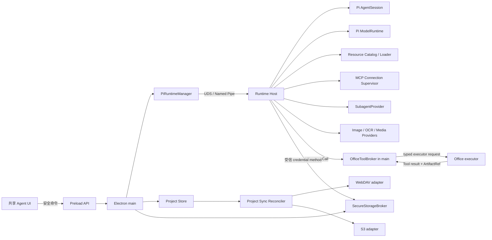
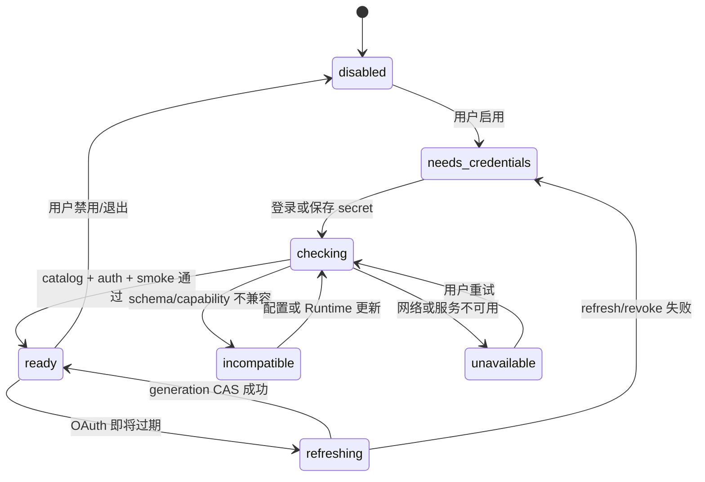
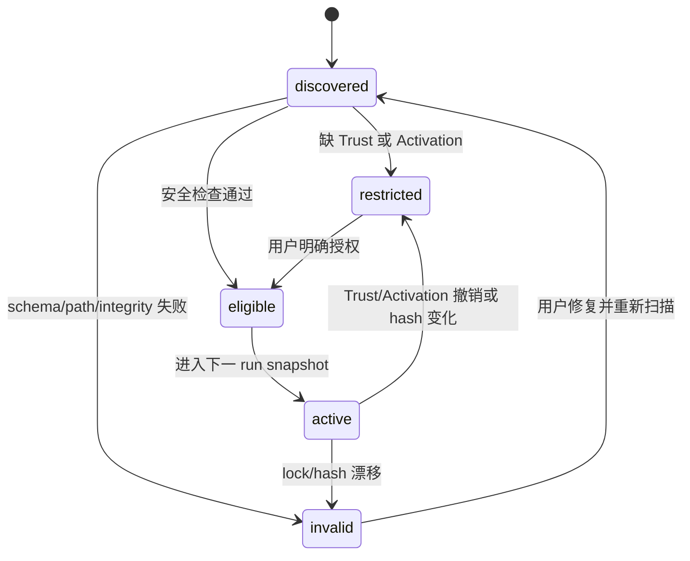
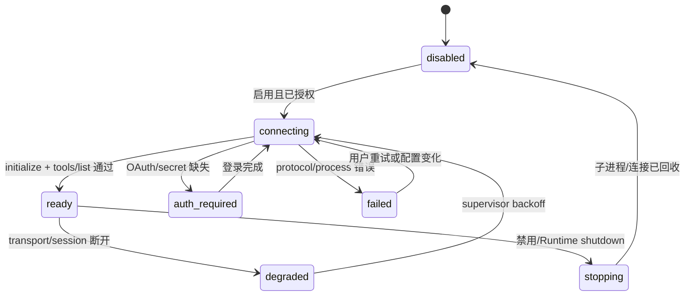
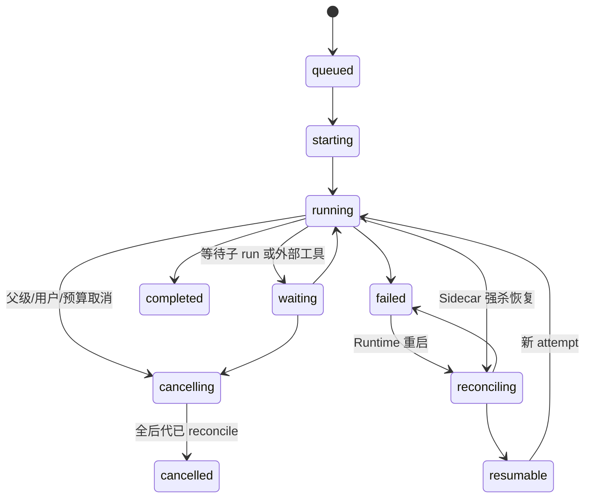
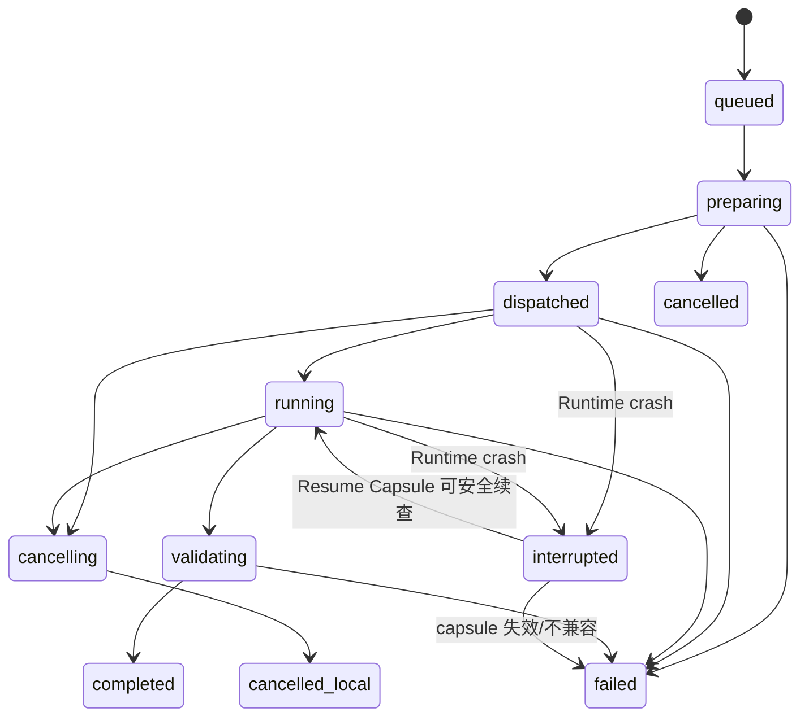
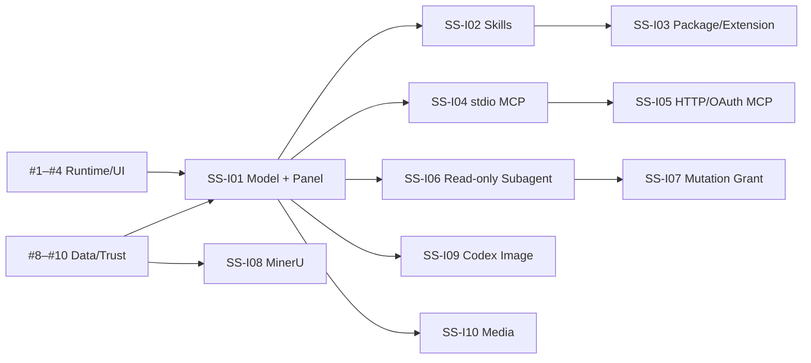

# 子系统详细设计

<!-- markdownlint-disable MD013 MD060 -->

状态：Contract Stable

主要读者：Runtime、Electron main、Office executor、Provider、MCP、Subagent、Project Store、
共享 UI、测试与安全工程师。

本文把已经稳定的 [Runtime IPC 与 Session 契约](01-runtime-ipc-session-contract.md)和
[数据、配置与安全契约](02-data-config-security-contract.md)落到模块、公开接口、状态机、
依赖方向和删除点。它不重新选择 Pi、MCP、Subagent、MinerU、图片或同步技术路线；这些
选择已经由 ADR、Spike 和最终实施规则固定。

## 1. 目标与非目标

本文回答一个实现者真正会遇到的问题：某项能力由哪个进程、哪个模块拥有，它可以调用谁，
失败时影响多大，哪些旧代码在新路径通过后必须删除。

必须实现：

- `open-genoffice-pi-agent-runtime` 内只有一个 Pi `AgentSession`/`ModelRuntime` 组合；
- Provider、Resource、MCP、Subagent 和 Office Tool 共享同一 Agent Actor、Capability
  Snapshot、Abort 和 Tool Provenance；
- Runtime 不直接修改 Office 文件，外部 Provider 也不能绕过 Office Tool Bridge；
- renderer 只发送用户命令、执行受控编辑器操作和显示安全投影，不持有 secret，不直接
  连接 Runtime socket；
- Skills、Extensions、Packages、MCP 与 Subagent 优先复用已固定的 Pi 生态能力；
- 每个子系统都有可独立测试的接口、状态、错误和删除旧路径的完成条件；
- 已发布的 #1–#16 是前置契约，不被本文重复拆成横向“搭框架”票。

本文不解决：

- 四类 Office Tool 的逐项迁移清单与参数兼容，见后续文档 04；
- 各应用切换、旧入口删除的逐文件操作顺序，见后续文档 05；
- 完整验收矩阵与三平台发行证据，见后续文档 06/07；
- 新的通用 Office document model、Workflow DSL 或客户端端到端同步加密；
- 任意第三方 Extension 的沙箱化。首版依赖 Project Trust、Resource Activation、能力最小化
  和进程边界，不宣称对受信代码提供强隔离。

## 2. 已冻结决策

前八项来自已批准规格与 Spike；后六项落地选择于 2026-08-09 获得批准。实现如果需要改变
这些边界，必须先更新契约、领域语言和验收映射，不能在单个 adapter 中隐式偏离。

| ID     | 状态   | 决策                                                                                                                                                                      |
| ------ | ------ | ------------------------------------------------------------------------------------------------------------------------------------------------------------------------- |
| SS-D01 | 已冻结 | Pi `AgentSession` 是编排与 transcript 唯一事实源，Pi `ModelRuntime` 是对话模型执行与认证入口；不得再包一层自研 AgentLoop 或通用 LLM stream contract。                     |
| SS-D02 | 已冻结 | Runtime 拥有 Session、模型、资源、MCP 和 Subagent；Electron main 拥有 Runtime supervision、用户授权和 Office Tool 路由；renderer 不直接访问 Runtime、Provider 或 secret。 |
| SS-D03 | 已冻结 | Skills/Extensions/Packages 复用 Pi `DefaultResourceLoader` 与 Package/Extension API；安装只接受本地目录、精确 npm 版本或固定 Git commit。                                 |
| SS-D04 | 已冻结 | MCP 固定使用 `@modelcontextprotocol/client@2.0.0` 与 Pi inline Extension 薄桥；GenOffice 只补配置、连接监督、授权和 provenance。                                          |
| SS-D05 | 已冻结 | Subagent 固定使用 `@agwab/pi-subagent@0.4.8` 作为 execution/artifact engine；run tree、预算、只读默认和 Mutation Grant 由 GenOffice 掌握。                                |
| SS-D06 | 已冻结 | Codex OAuth 图片使用独立 `CodexOAuthImageProvider`；MinerU 是默认关闭的 OCR 服务商；两者都不是普通对话模型，也不能互相或向 Genspark 静默回退。                            |
| SS-D07 | 已冻结 | WebDAV/S3 adapter 只实现同一 Object Store contract；revision、reconcile、Conflict Copy 与 Local Current 语义由 Project Sync Reconciler 独占。                             |
| SS-D08 | 已冻结 | Provider 输出先成为校验后的 Artifact Reference 或结构化只读结果；真正写入 Office 必须重新经过 Office Mutation Tool、顺序队列、快照和授权。                                |
| SS-D09 | 已批准 | 每个 Agent run 在开始时生成不可变 Capability Snapshot；新增配置只影响后续 run，紧急禁用、Trust 撤销和 Grant 撤销可以在执行入口即时收窄当前快照。                          |
| SS-D10 | 已批准 | 内置资源命名空间不可覆盖；global/project 同类型同 ID 冲突时两者都隔离并报错，不采用 project-last-wins 或静默重命名。                                                      |
| SS-D11 | 已批准 | 工具内部 ID 固定为 `office:<app>:<name>`、`mcp:<serverId>:<name>`、`platform:<name>`；模型可见 alias 由 Runtime 确定性生成并做碰撞检查。                                  |
| SS-D12 | 已批准 | 长 Provider Operation 持久化“脱敏状态 + 加密 Resume Capsule”；重启只恢复轮询/下载，绝不重新提交可能计费的请求。无法安全恢复时标记 `interrupted`。                         |
| SS-D13 | 已批准 | 音视频分析只使用用户显式选定的 Model Provider；允许本地受限转码/抽帧为该模型已声明支持的输入，不自动换模型、OCR 服务商、Genspark 或其他云服务。                           |
| SS-D14 | 已批准 | 四应用复用一个 headless `AgentPanelController` 和共享视图组件；应用差异只通过 context/tool-detail slots 注入，不复制 Session 状态机。                                     |

SS-D12 同步补入数据契约 DS-D11/DS-014：Resume Capsule 的加密 blob 使用现有
`SecureStorageBroker`，普通索引只保存 operationId、providerId、documentId、状态和过期时间，
不保存 provider task ID、signed URL、prompt 或文档内容。

## 3. 总体组合与依赖方向



依赖只能沿图中箭头前进：

- `packages/agent-runtime-protocol` 是 Runtime/Electron 双方都能依赖的叶子包，不反向依赖
  Electron、Pi、Office engine 或 Provider；
- Runtime 不能 import 任一 renderer 包；Office executor 不能 import Pi；
- MCP、Subagent 和 Provider adapter 不能直接调用 Electron IPC，它们只依赖 Runtime 内部
  ports；
- Project Sync Reconciler 不调用 AgentSession，不解析工具事件，也不决定 Agent 能否运行；
- 共享 UI 不保存 transcript，reload 后总是用 Runtime snapshot + cursor 重建投影；
- current code 暂时仍可存在旧依赖，但一项纵向切片切换后，对应生产入口必须只有新方向。

## 4. 模块登记册与所有权

| 子系统              | Target owner                             | 拥有                                                                      | 明确不拥有                                                 | 已有前置 Issue  |
| ------------------- | ---------------------------------------- | ------------------------------------------------------------------------- | ---------------------------------------------------------- | --------------- |
| Runtime Host        | `apps/pi-agent-runtime`                  | AgentSession registry、ModelRuntime、Capability Snapshot、统一 Abort      | Electron 生命周期、Office editor、同步 transport           | #1–#7、#9       |
| Model/Credential    | Runtime + Electron `SecureStorageBroker` | 模型 catalog、登录/刷新/退出、能力状态                                    | renderer 设置明文、图片/OCR 模型混入对话模型列表           | #8              |
| Resource Catalog    | Runtime                                  | global/project 资源发现、lock 校验、Trust/Activation 过滤、Pi loader 注入 | Package 浮动更新、其他 Agent Home 扫描                     | #10、#16        |
| MCP                 | Runtime                                  | server lifecycle、tool mapping、OAuth、授权、provenance                   | Office mutation 直接执行、renderer 子进程                  | #4、#8、#10     |
| Subagent            | Runtime                                  | run tree、预算、事件、grant snapshot、reconcile                           | 自行扩大工具、独立 Runtime、named-agent 外部发现           | #4、#5、#9、#10 |
| Office Tool Bridge  | 各应用 Electron main                     | descriptor、实时 context、授权、顺序 mutation、snapshot/rollback          | 模型循环、Provider secret、跨文档全局写锁                  | #2、#4、#5      |
| Provider Operations | Runtime + main artifact broker           | Image/OCR/Media 请求、进度、校验、ArtifactRef                             | 直接编辑 Office、静默换 Provider                           | #4、#8          |
| Project Sync        | `packages/project-store`                 | revision/reconcile/conflict；WebDAV/S3 adapter                            | Agent orchestration、Trust 同步、secret                    | #12–#16         |
| Shared Agent UI     | `packages/ui` + app slots                | Session 投影、MCP/Subagent/Provider 状态、授权交互                        | transcript、secret、socket endpoint、tool execution policy | #2–#4、#9       |

目标文件落点：

```text
apps/pi-agent-runtime/src/
├── host/
│   ├── runtime-host.ts
│   ├── session-registry.ts
│   ├── capability-snapshot.ts
│   └── authorization-service.ts
├── providers/
│   ├── model-catalog.ts
│   ├── image/codex-oauth-image-provider.ts
│   ├── ocr/mineru-provider.ts
│   └── media/model-media-provider.ts
├── resources/
│   ├── resource-catalog.ts
│   ├── resource-resolver.ts
│   └── package-lock-service.ts
├── mcp/
│   ├── config-resolver.ts
│   ├── connection-supervisor.ts
│   ├── pi-extension-factory.ts
│   └── authorization-broker.ts
├── subagents/
│   ├── provider.ts
│   ├── run-registry.ts
│   ├── event-mapper.ts
│   └── mutation-grant-service.ts
└── operations/
    ├── operation-registry.ts
    └── resume-capsule-store.ts

packages/agent-runtime-protocol/src/
├── envelopes.ts
├── runtime-methods.ts
├── electron-methods.ts
├── events.ts
├── errors.ts
└── artifacts.ts

apps/{pdf,docs,sheets,slides}/src/main/agent-tools/
├── catalog.ts
├── context-provider.ts
├── broker.ts
└── executor-adapter.ts

packages/project-store/src/sync/
├── object-store.ts
├── reconciler.ts
├── conflicts.ts
├── webdav-adapter.ts
└── s3-adapter.ts

packages/ui/src/agent/
├── AgentPanel.tsx
├── AgentPanelController.ts
├── projection-store.ts
├── McpStatusView.tsx
├── SubagentTree.tsx
└── ProviderOperationView.tsx
```

路径是 owner 边界，不要求在一个 PR 中一次性创建所有文件。单一实现很短时可以合并文件；
不能为了匹配目录树提前造空抽象。

## 5. 跨子系统执行契约

### 5.1 Agent Actor、Execution Context 与 Capability Snapshot

```ts
type AgentActor =
  | { type: 'parent'; actorId: string; sessionId: string }
  | { type: 'subagent'; actorId: string; subagentRunId: string; parentRunId: string }

type ExecutionContext = {
  instanceId: string
  sessionId: string
  documentId: string
  runId: string
  actor: AgentActor
  correlationId: string
  abortSignal: AbortSignal
}

type CapabilitySnapshot = {
  snapshotId: string
  createdForRunId: string
  model: { providerId: string; modelId: string; capabilities: string[] }
  resourceHashes: Record<string, string>
  toolIds: string[]
  permissionVersion: string
}
```

Runtime 在 `session.prompt` 或 Subagent spawn 接受后、第一次模型请求前构造快照。快照写入
run metadata，但不复制 Skill 正文、工具 schema 或 secret。执行入口仍重新检查 hard policy、
Project Trust、Resource Activation、Mutation Grant 与紧急禁用状态；因此撤销能立即阻止
执行，却不能向当前 run 临时加入新工具。

### 5.2 Tool Identity 与 Provenance

内部 canonical ID 与模型 alias 分离：

```ts
type ToolDescriptor = {
  id: `office:${string}:${string}` | `mcp:${string}:${string}` | `platform:${string}`
  modelAlias: string
  source: 'office' | 'mcp' | 'platform'
  effect: 'read' | 'mutation' | 'external'
  inputSchema: object
  timeoutMs: number
}

type ToolProvenance = {
  toolId: string
  actorId: string
  runId: string
  documentId: string
  officeApp?: 'pdf' | 'docs' | 'sheets' | 'slides'
  mcpServerId?: string
  mcpToolName?: string
}
```

`modelAlias` 只能使用模型 Provider 接受的安全字符，Runtime 由 canonical ID 确定性生成并
限制长度。两个 canonical ID 产生相同 alias 时，相关工具都不进入快照并返回
`tool_alias_collision`；不能靠注册顺序覆盖。

Tool Provenance 进入 Pi tool details 和安全 UI 投影。日志只记录 identity、状态、耗时和
correlationId，不记录原始 arguments/result。

### 5.3 Artifact Reference

所有跨进程二进制继续使用文档 01 的 `ArtifactRef`。Provider 或 MCP 返回外部 URL 时，
Runtime 不能把 URL 当成安全资产直接交给 renderer；必须由 Artifact Broker 下载/读取、限制
大小、验证协议/MIME/魔数/hash、原子落盘后再签发 scope-bound ArtifactRef。

ArtifactRef 不是自动写权限。把图片插入 Slides、把 DOCX 加入项目或把分析结果写回文档，
仍需要一次显式 Office Tool call。这样 Provider 重试、MCP 网络结果与文档 mutation 不会
合并成一个不可恢复事务。

### 5.4 统一错误

```ts
type PlatformError = {
  code: string
  category:
    | 'validation'
    | 'authorization'
    | 'unavailable'
    | 'timeout'
    | 'cancelled'
    | 'conflict'
    | 'internal'
  retry: 'never' | 'user_action' | 'safe_before_dispatch' | 'reconcile'
  messageKey: string
  details?: Record<string, string | number | boolean>
  correlationId: string
}
```

`details` 只允许 schema 白名单字段。原始 Provider body、MCP stderr、signed URL、prompt、
tool input/result、token、account ID 和 base64 永不进入协议错误。UI 依据 `messageKey` 本地化，
不能向 renderer 透传上游错误全文。

## 6. Model Provider 与 Credential

### 6.1 目标设计

`ModelCatalogService` 组合 Pi 内置 catalog、用户的 global `models.json` 和受信项目模型声明，
再交给 Pi `ModelRuntime`。它只管理发现、选择、capability 和健康状态，不实现另一套 chat/
streaming adapter。

首版必须贯通：

- 一个 Pi 支持的 API-key 云 Provider；
- 一个用户自配 base URL 的 OpenAI-compatible Provider，可指向本地服务；
- Pi `openai-codex` device-code OAuth 的登录、刷新、退出与撤销；
- 文本、图片输入、audio/video 等 modality 的明确 capability；
- 对话模型、Image Provider 与 OCR 服务商分开的选择器。

```ts
type ModelCapability =
  'text-input' | 'image-input' | 'audio-input' | 'video-input' | 'tool-use' | 'reasoning'

type ModelSelection = {
  providerId: string
  modelId: string
  credentialRef?: { slot: string; kind: 'api_key' | 'oauth' }
  capabilities: ModelCapability[]
}
```

capability 来自固定 Pi catalog 或用户模型配置，并在首次真实请求后用健康检查校正。Runtime
不能根据 model ID 字符串猜测 modality。设置页允许用户保存模型/endpoint 普通配置和
write-only secret；Agent UI 只显示选中模型、认证状态、能力与脱敏错误。

### 6.2 状态



401 在请求尚未产生可计费用量时最多触发一次 single-flight refresh；已有输出、tool call 或
usage 后不自动重发。429、配额、模型不存在和 schema 不兼容必须分开呈现。

### 6.3 当前替换点

- 删除 renderer 传入的 `AiSettings`/`AiProviderConfig.apiKey`；
- 删除每个应用的 `ai-settings.json` 与 `ai:get-settings/set-settings` 明文路径；
- 删除 `packages/ai-provider` 的自研 stream/watchdog/provider catalog；
- 删除 Genspark forced provider、proxy URL、credits error 与 `ai:gsk-login/status`；
- 各应用只使用 Runtime Session command，不再提交 system/messages/tools 给 main process。

## 7. Skills、Extensions 与 Packages

### 7.1 Resource Catalog

`ResourceCatalog` 先安全解析 manifest，再经过 Trust/Activation 与 lock 校验，最后才把获准
资源交给一个按 Session 创建的 Pi `DefaultResourceLoader`。它不 fork Pi loader，也不扫描
`~/.pi`、`.pi`、`.codex` 或 `.mcp.json`。

```text
built-in resources
  + ~/.open-genoffice/agent/{skills,extensions,packages,prompts}
  + trusted <project>/.open-genoffice/agent/{...}
  -> schema/integrity/collision check
  -> Project Trust / Resource Activation filter
  -> Capability Snapshot
  -> Pi DefaultResourceLoader
```

资源状态固定为：



内置资源使用保留 ID 前缀 `open-genoffice/`。global 与 project 同类型同 ID 不允许 shadow；
冲突项都隔离，UI 展示来源、hash 和修复动作。Skill、Prompt 只读正文也必须通过 Project
Trust，因为把文本放入 prompt 本身就是能力影响。

### 7.2 Package lock

每个安装动作先解析到 immutable source，再生成 lock entry：

```ts
type PackageLockEntry = {
  packageId: string
  source:
    | { type: 'local'; sourceRef: string }
    | { type: 'npm'; name: string; version: string; integrity: string }
    | { type: 'git'; url: string; commit: string }
  contentSha256: string
  license?: string
  activatedCapabilities: string[]
}
```

npm range、Git branch/tag、安装脚本的隐式网络、运行时 silent update 和 lock/hash 不一致
全部拒绝。更新是新的显式安装事务；旧内容在新版本通过校验前保持可用。同步 lockfile 后，
目标设备重新下载/校验并重新 Activation，不能同步执行授权。

本地目录的 `sourceRef` 只在当前设备解析为 canonical path，绝对路径不进入同步 lock。目标
设备没有同一内容来源时显示 `source_unavailable`，不能猜测路径或从 npm/Git 自动替代。

### 7.3 Extension 工具

Extension 注册工具时只能提交 descriptor/factory。Runtime 把工具加入 Resource Catalog，
再经过 alias collision、actor permission 与 Capability Snapshot；Extension 不能直接修改
Session active tools，也不能访问 CredentialStore 全表。需要 secret 的 Extension 只能声明
Credential Reference slot，由 Runtime 在精确调用范围解析。

## 8. MCP 子系统

### 8.1 生产模块

MCP 只新增四个产品 seam：

```text
OpenGenOfficeMcpConfigResolver
  -> 合并 global 与 trusted project 配置，解析 Credential Reference

McpConnectionSupervisor
  -> stdio / Streamable HTTP / explicit legacy SSE 生命周期

PiMcpExtensionFactory
  -> listTools 映射 ToolDescriptor，callTool 映射 Pi content blocks

McpAuthorizationBroker
  -> actor/document/server/tool/args/effect 的调用前授权
```

底层 transport、OAuth client、protocol negotiation、AbortSignal 和标准 content type 复用
`@modelcontextprotocol/client@2.0.0`。配置只保存 serverId、transport、endpoint/command、
非敏感 args、环境变量名白名单、credentialRef、enabled tool IDs 与 timeout。

### 8.2 Tool identity 与可见性

MCP 工具 canonical ID 为 `mcp:<serverId>:<toolName>`，provenance 同时保留 serverId 和
上游 toolName。配置禁用、连接隔离、Trust/Activation 不足或 actor 无权使用时，工具必须
同时从下一 run 的模型集合和执行入口消失；不能只在 UI 隐藏。

当前 run 中发生紧急禁用时，模型可能仍看到旧 schema，但执行入口返回
`capability_revoked`，并把安全事件投影给 UI。服务重新连接后只影响后续调用，不在当前
模型 turn 中偷偷加入新工具。

### 8.3 生命周期与重试



一次 tool call dispatch 后，连接丢失统一返回 `mcp_result_unknown`。首版不自动重放任何
MCP tool，包括看似 read-only 的调用；只有模型或用户在看到明确状态后发起新 operation。
这避免 server 对 effect 的声明不准确时造成重复写入。Supervisor 可以重建连接，但不能
重放旧 request。

stdio 只注入白名单环境，禁止 daemonize，stderr 经过大小限制和脱敏分类；macOS/Linux
进入 Runtime process group，Windows 进入同一进程树回收边界。HTTP 默认 Streamable HTTP，
legacy SSE 只能由用户显式选择。OAuth callback 校验 PKCE、state、issuer 与 server URL
binding，token 只进入 CredentialStore。

### 8.4 授权顺序

```text
hard policy
  -> server enabled + Project Trust/Resource Activation
  -> current Agent Actor permission
  -> tool effect classification
  -> Subagent Mutation Grant if effect=mutation
  -> argument policy / document scope
  -> dispatch
```

所有结果包含 Tool Provenance。MCP 返回的 binary/resource/link 必须经过 Artifact Broker；
远端内容不能直接作为 `file://`、本地路径或未经检查的 HTML 进入 renderer。

## 9. Subagent 与 Mutation Grant

### 9.1 Provider boundary

`@agwab/pi-subagent/api` 只提供执行、artifact 和 headless session 基础；唯一产品接口为：

```ts
interface SubagentProvider {
  spawn(request: SpawnSubagentRequest, context: ExecutionContext): Promise<SubagentRun>
  watch(runId: string, cursor?: string): AsyncIterable<SubagentEvent>
  status(runId: string): Promise<SubagentSnapshot>
  wait(runId: string, options?: WaitOptions): Promise<SubagentSnapshot>
  cancel(runId: string, options: { cascade: true; reason: string }): Promise<CancelReport>
  resume(runId: string, options?: ResumeOptions): Promise<SubagentRun>
  listChildren(parentRunId: string): Promise<SubagentRef[]>
}
```

GenOffice 的 `RunRegistry` 权威保存 `runId`、`parentRunId`、`rootRunId`、`parentSessionId`、
`documentId`、`providerRunId`、`attemptId`、`correlationId`、budget、Capability Snapshot ID、
Grant snapshot 和 status。第三方 package 的 ID 只作为 providerRef，不能取代产品 run tree。

### 9.2 状态与事件



只向 UI/Parent Session 发布稳定事件：`queued`、`started`、`assistant.delta`、
`tool.started`、`tool.completed`、`usage.updated`、`child.linked`、`completed`、`failed`、
`cancelled`。事件带 root/parent/run lineage 与 cursor，不带第三方原始 event body。

父级取消按 GenOffice run tree child-first、幂等地取消全部后代，然后 reconcile provider
状态。depth、children、concurrency、wall time、token 与 cost 共用 root budget；不能只在
UI 隐藏超额任务。

### 9.3 默认只读与 Mutation Grant

spawn 时 Runtime 忽略模型传入的任意 tools 字段，只从父 run Capability Snapshot 合成更窄
的只读集合。Subagent 可获得获准的 Office Context、read-only Office Tool、read-only MCP
Tool、Skills 和 Prompts；默认没有任何 mutation。

```ts
type MutationGrant = {
  grantId: string
  subagentRunId: string
  documentId: string
  exactToolIds: string[]
  issuedByUserActionId: string
  issuedAt: string
  expiresAt: string
  status: 'active' | 'revoked' | 'expired'
}
```

授权弹窗显示 Subagent 角色、具体文档、精确工具和当前 run，不能提供“以后都允许”或
通配符。Grant 由 Electron main 接受真实用户 gesture 后签发，Runtime 只消费；父 Agent、
Subagent、Extension 和 MCP server 都不能代签或扩大。

获准 mutation 仍回到父 Session 的同文档 mutation queue，创建首次 snapshot、记录
Tool Provenance 并使用 Office rollback。Subagent terminal、父 run terminal、文档关闭、
超时或用户撤销立即使 Grant 失效。

## 10. Office Tool Bridge

### 10.1 保留 executor，替换编排

当前 PDF/Docs/Sheets/Slides 的 `AgentSkill`、`buildContext()` 和 `executeTool()` 多数位于
renderer，并直接由 renderer `AgentLoop` 调用。迁移不重写这些领域算法，而是拆成三个
职责：

1. `ContextProvider` 在调用时读取最新 selection/document/workbook/slide 状态；
2. `ToolCatalog` 暴露稳定 schema、effect、timeout 与 rollback 能力；
3. `ExecutorAdapter` 包装现有函数，返回结构化 result/details/artifact。

Runtime 的 Office tool proxy 调用 Electron main `OfficeToolBroker`。Broker 完成文档绑定、
actor 授权、operation 幂等与 mutation queue 后，再路由到实际持有编辑器对象的 executor：

- Slides 等 main-owned 状态可直接在 main 执行；
- Docs/Sheets/PDF 等 renderer-owned 编辑器通过专用、schema-checked preload channel 执行；
- renderer executor 只收到 `operationId + toolId + validated args + document scope`，不知道
  Model Provider、MCP、Subagent token 或 Runtime endpoint；
- renderer 不能自行注册工具、扩大 schema 或向 Runtime 回发任意事件。

因此 Electron main 在安全与顺序意义上拥有 Tool Bridge，renderer 只是被动领域 executor。
未来若某个 editor engine 搬入 main，只替换 executor transport，不改变 Runtime contract。

### 10.2 调用与 mutation

```text
Pi tool call
  -> Runtime alias -> canonical Tool ID
  -> Capability Snapshot + current authorization check
  -> Electron OfficeToolBroker
  -> current ContextProvider / argument validation
  -> same-document queue
  -> capture first-mutation snapshot
  -> executor
  -> validate result / ArtifactRef
  -> Pi tool result + UI-only details + Tool Provenance
```

read-only 工具可并行，但结果按 `toolCallId` 稳定排序后回到 Pi。mutation 无论来自 Parent、
Subagent 或 Extension 都进入同一 document queue；不同文档可以并行。Abort 若发生在不可
中断 mutation 中，Broker 等待安全边界并返回实际 outcome，不能把“UI 已停止”等同于
“文档未修改”。

Office Context 不写入全局缓存。每个模型 turn 和每个工具调用都按需要读取最新状态；
大文档使用摘要/ArtifactRef，但摘要不能成为文档事实源。

## 11. Provider Operations

### 11.1 共同接口与状态

Image、OCR 和 Media 使用共同 lifecycle，但请求/结果 schema 分开：

```ts
interface ProviderOperationPort<Request, Result> {
  start(request: Request, context: ExecutionContext): Promise<{ operationId: string }>
  status(operationId: string): Promise<ProviderOperationSnapshot>
  abort(operationId: string): Promise<{ localWorkStopped: boolean; remoteMayContinue: boolean }>
  resume(operationId: string): Promise<ProviderOperationSnapshot>
}
```



Resume Capsule 只允许“续查同一个远端 operation 或下载已生成结果”，禁止重新提交生成/
转换请求。`abort()` 必须区分本地工作已停止与远端是否确认取消。

### 11.2 Codex OAuth Image Provider

固定路径：

```text
Pi ModelRuntime.getAuth("openai-codex")
  -> POST https://chatgpt.com/backend-api/codex/responses
  -> outer model gpt-5.4-mini
  -> image_generation tool model gpt-image-2
  -> final image_generation_call result
  -> validate + atomic project asset + ArtifactRef
```

首版一请求一图并省略 `tools[0].n`。只从 final output item/completed event 取结果；partial
image 只做进度和 incomplete artifact 证据。校验 base64、MIME、魔数、实际尺寸、字节上限
与 SHA-256 后才能落盘，UI 显示真实尺寸和 image tool usage。

收到任一 partial image 后不自动重试；401 只在没有图片事件前刷新一次；429 映射 usage
limit；400 schema 错误映射 `provider_contract_incompatible` 并只禁用该 Image Provider。
不能改用 API key、OpenRouter、Sub2API 或 Genspark。用户显式配置的 OpenAI-compatible
Images endpoint 是另一条独立 Provider 与 credential slot。

### 11.3 MinerU OCR 服务商

设置默认关闭。第一次开启必须完成第三方云上传、持续授权与关闭入口的确认；关闭时不读
token、不创建 operation、零 MinerU 请求。

本地 PDF 固定一文件一批：

```text
POST /api/v4/file-urls/batch
  -> raw PUT to signed HTTPS URL
  -> poll /api/v4/extract-results/batch/{batch_id}
  -> HTTPS result archive
  -> bounded unzip + exactly one DOCX + OOXML validation
  -> ArtifactRef
```

请求固定 `model_version: "vlm"` 与 `extra_formats: ["docx"]`，只走精准解析 Standard API。
状态映射覆盖 `waiting-file`、`pending`、`running`、`converting`、`uploading`、`done`、
`failed`。Agent 轻量解析与 Pandoc 都不是失败回退。

下载限制 archive bytes、entry count、single entry、total extracted bytes，拒绝绝对路径、
`..`、symlink 和多 DOCX；目标必须包含合法 WordprocessingML content type 与
`word/document.xml`。原 PDF 永不删除，完成后提供并排检查。

固定产品文案：转换优先保留可编辑正文和阅读顺序；不保证结构化公式、原始栏布局、页数、
字体、图内可搜索文字、扫描底图或逐像素版式。本地取消不声称远端任务已取消。

### 11.4 Model Media Provider

Media analysis 是所选 Model Provider 的 capability，不新增隐藏账号体系。Runtime 在开始前
检查模型声明：image 需要 `image-input`；audio/video 需要对应原生 capability，或使用
GenOffice 本地、确定性的受限预处理生成该模型支持的 frames/audio ArtifactRefs。

本地预处理由 Electron main 的 `MediaPreparationService` 完成，负责 MIME/魔数校验、时长/
大小/帧数限制、转码与抽帧。它不做云端上传、不选择模型，也不保存 transcript。若选定模型
不支持所需 modality，能力显示 disabled 并要求用户换模型；不得自动换 Provider 或调用
Genspark/MinerU。

分析结果作为 Pi tool result 回到当前 Session，带模型 Provider/model/tool provenance。
需要把结果写入文档时另发 Office Mutation Tool。

## 12. Project Sync Provider

同步语义已经在文档 02 和 #12–#16 固定。这里仅规定 transport port：

```ts
interface SyncObjectStore {
  probe(): Promise<ProviderDiagnostics>
  get(key: string): Promise<{ bytes: Uint8Array; versionToken: string } | null>
  putImmutable(key: string, bytes: Uint8Array): Promise<'created' | 'already-exists'>
  compareAndSwap(
    key: string,
    bytes: Uint8Array,
    expectedVersion: string | 'absent',
  ): Promise<{ versionToken: string } | { conflict: true }>
}
```

WebDAV adapter 负责 HTTPS、Basic/Digest/Bearer、强 ETag、conditional PUT 与 Buffer 边界；
S3 adapter 负责 endpoint/region/bucket/prefix/path-style、conditional PutObject、SSE-S3/
SSE-KMS。两者都不能解析 revision ancestry、创建 Conflict Copy、自动删除对象或重放离线
请求。

`ProjectSyncReconciler` 是唯一语义 owner：它读取 Local Current、last acknowledged base 与
Remote Head，规划 fast-forward/conflict/tombstone，离线队列只存 reconcile intent。Provider
切换不改变 revision ID、manifest 或冲突行为。

设置连接时必须先通过 capabilities probe。WebDAV 缺强 ETag/conditional PUT、S3 缺
conditional PutObject、任何非 TLS endpoint 都 fail closed；loopback 测试例外不能进入产品
配置 schema。

## 13. 共享 Agent UI

### 13.1 Controller 与视图

当前四应用分别维护 `AiPanel`/`AiChatPanel`、本地 chat 数组、`AgentLoop`、transport、
tool chips 和持久化。目标把通用状态收敛为：

```ts
interface AgentPanelController {
  open(documentId: string): Promise<void>
  prompt(text: string, attachments: ArtifactRef[]): Promise<void>
  steer(text: string): Promise<void>
  followUp(text: string): Promise<void>
  abort(): Promise<void>
  fork(): Promise<void>
  navigate(sessionId: string): Promise<void>
  grantMutation(requestId: string, exactToolIds: string[]): Promise<void>
  denyAuthorization(requestId: string): Promise<void>
}
```

Controller 只调用 preload 暴露的安全 command/subscribe API，用 snapshot + cursor 维护投影。
共享视图负责 message/thinking/tool/compaction、Provider 状态、MCP server/tool、Subagent tree、
Mutation Grant、Provider Operation、错误与诊断入口。

应用通过 slots 注入：

- 当前 Office Context 摘要与 selection badge；
- Office tool details 的领域展示；
- attachment picker 和 ArtifactRef 注册；
- undo/restore 入口；
- PDF→DOCX side-by-side、Slides 图片/整页候选等应用专有视图。

slots 只能渲染安全 projection 或发送声明式用户 action，不能拿到 Runtime client、credential
method 或任意 tool executor。

### 13.2 Reload 与授权

renderer reload 后先请求 `session.snapshot`，再用 snapshot cursor subscribe。收到
`cursor_expired` 或 instance change 时丢弃本地 projection 重建，绝不把 React state 当作
历史补写回 Runtime。

授权请求显示 actor、文档、server/resource/tool、effect 和有效期。只有真实用户点击产生
main-process authorization action；模型文本、Extension UI、网页内容和 keyboard synthesis
不能直接构造 allow receipt。第一次启用项目执行/联网资源的持续提醒与一次 Mutation Grant
是两种不同 UI，不能合并成一个“允许全部”。

## 14. 取消、重试与影响面

| 能力             | Abort 行为                                  | 自动重试                              | 失败影响面                  |
| ---------------- | ------------------------------------------- | ------------------------------------- | --------------------------- |
| Model turn       | 中止 Pi stream；Session 收到 terminal event | 仅未产生输出前的一次安全 auth refresh | 当前 run                    |
| Office read tool | 传给 executor；超时返回失败                 | 不自动重放，由模型决定新调用          | 当前 tool                   |
| Office mutation  | 在安全边界停止；报告真实 outcome            | 永不自动重放                          | 当前文档 mutation queue     |
| MCP call         | AbortSignal 传给 client；断线结果可能未知   | dispatch 后永不重放                   | 当前 MCP tool/server 可隔离 |
| Subagent         | child-first 取消全后代并 reconcile          | 用户显式 resume 产生新 attempt        | 当前 run tree               |
| Codex image      | 关闭 stream；partial 后保留 incomplete 证据 | partial 后永不重试                    | 仅图片能力                  |
| MinerU           | 停本地上传/轮询/下载；远端可能继续          | Resume Capsule 只续查，不重提任务     | 仅 OCR/转换                 |
| Media analysis   | 中止预处理和模型请求                        | 已上传/已有 usage 后不重发            | 当前 operation              |
| Sync             | 中止当前 reconcile，保留 intent             | 重连后重新读 head/replan              | 同步；本地编辑继续          |

Runtime shutdown 先停止接单，再取消 Parent/Subagent/MCP/Provider Operation，落盘安全状态，
最后回收子进程。Electron 5 秒后强制回收不等于各远端服务已经取消，恢复时必须按各子系统
状态机 reconcile。

## 15. 安全与日志矩阵

| 数据                         | Runtime memory         | Electron main                 | renderer                  | Pi Session      | 普通日志           | 同步                  |
| ---------------------------- | ---------------------- | ----------------------------- | ------------------------- | --------------- | ------------------ | --------------------- |
| Model/OAuth/API secret       | 调用期可见             | safeStorage broker 调用期可见 | 禁止                      | 禁止            | 禁止               | 禁止                  |
| MCP secret/header            | 精确 server 调用期可见 | broker 调用期可见             | 禁止                      | 禁止            | 禁止               | 仅 credentialRef      |
| Provider task ID/signed URL  | 调用期或加密 capsule   | 加密 broker                   | 禁止                      | 禁止            | 禁止               | 禁止                  |
| Prompt/document/tool args    | 当前 run 所需          | Office broker 所需            | UI/本地 executor 所需     | Pi 原生所需部分 | 默认禁止           | 仅文档本身按 manifest |
| Tool Provenance              | 是                     | 是                            | 安全投影                  | details         | ID/status/duration | 否                    |
| Artifact bytes               | 受控临时根/项目资产    | Project Store                 | 只经 scope-bound ref 展示 | 禁止 base64     | 禁止               | 按 manifest/hash      |
| Capability Snapshot metadata | 是                     | 授权核对所需                  | 安全投影                  | run metadata    | 仅 snapshot ID     | Session generation 内 |

Runtime、main 与 renderer 的 IPC handler 全部校验 sender、document binding、schema、大小和
operationId。preload 不提供 raw invoke、文件任意读写、socket endpoint、credential.get 或
“执行任意 tool”入口。

## 16. 当前代码迁移与删除点

| 当前代码                                                           | 迁入/保留                                                          | 新路径通过后的删除                                    |
| ------------------------------------------------------------------ | ------------------------------------------------------------------ | ----------------------------------------------------- |
| `packages/agent-core/src/{loop,types,skill,electron-transport}.ts` | Office tool schema/executor 行为迁入各应用 adapter；事件由 Pi 投影 | 整个 `packages/agent-core`                            |
| `packages/ai-provider`                                             | 模型选择迁到 ModelCatalog/Pi ModelRuntime；错误进入 PlatformError  | 整个 package、自研 stream/watchdog                    |
| 四应用 renderer `AiPanel`/`AiChatPanel`                            | 应用 slot 与领域 details 保留，共享控制器/视图迁到 `packages/ui`   | 本地 AgentLoop、chat transcript、transport            |
| 四应用 preload `ai:stream*`                                        | 改为 Runtime command/subscribe 与 Office executor 专用 channel     | `ai:stream`、`ai:stream-chunk`、`ai:stream-cancel`    |
| 应用 main `ai:get-settings/set-settings`                           | 普通设置迁 Resource Home，secret write-only                        | `ai-settings.json` 和 renderer provider config        |
| `packages/ai-search/src/gsk.ts`                                    | Serper/DuckDuckGo 搜索留在独立路径                                 | GSK image/media/slide/convert/project/search fallback |
| `packages/ai-search/src/genoffice-auth.ts`                         | 无                                                                 | Genspark login/token/device-code 全部                 |
| `apps/slides/src/main/ai-ipc.ts`                                   | 远端图片/media 迁 Provider Operations；本地插图迁 Office Tool      | `ai:gsk-*`、`ai:generate-image`、`ai:analyze-media`   |
| `apps/slides/src/renderer/ai/slide-qc.ts`                          | QC 规则与 executor 保留，编排改 Pi Session                         | 独立 QC AgentLoop/Provider                            |
| `apps/shell/src/main/cloud-projects.ts`                            | Project Store/Sync UI 取代                                         | Genspark cloud project cache/API                      |
| `packages/project-store` 旧 chat API                               | binding/revision/reconcile 保留                                    | `ChatMessage`、append/list chat 与旧 JSONL            |

删除发生在对应应用或能力纵向切片通过之后，不能为了让新 package 编译而先删除仍在生产使用
的旧路径。最终 Genspark 收束 train 仍按实施规则 G8 执行全仓与安装包清零。

## 17. 测试与验收映射

| ID     | 场景                                                              | 通过标准                                                     | 上位验收                       |
| ------ | ----------------------------------------------------------------- | ------------------------------------------------------------ | ------------------------------ |
| SS-001 | fake Provider 经共享 Panel 完成 prompt/tool/compaction/reload     | 无第二 AgentLoop；snapshot/cursor 无重复；用户模型状态可见   | AR-001/002/004/006、MD-001/002 |
| SS-002 | API key、OpenAI-compatible、Codex OAuth login/refresh/logout      | secret 不出 Runtime-main 受信边界；能力和错误正确            | MD-003/004、RS-001             |
| SS-003 | global/project Skill、Prompt、Extension collision 与 hash 变化    | Trust/Activation/冲突 fail closed；变化只进下一 run          | RS-004/005、SY-007             |
| SS-004 | local/精确 npm/fixed commit Package 安装更新                      | lock/integrity/license/hash 固定；range/floating ref 拒绝    | PK-002、RS-002/003             |
| SS-005 | stdio MCP read tool、Stop、sleep/wake、server exit                | 调用/provenance/Abort/重连通过，无孤儿进程                   | MCP-001/003/004、AR-003        |
| SS-006 | Streamable HTTP + OAuth + result unknown                          | PKCE/state/binding 正确；dispatch 后断线不重放               | MCP-001/002/003/004            |
| SS-007 | 多层只读 Subagent、预算、取消、Runtime crash                      | lineage/usage/cascade/reconcile/resume 稳定，默认无 mutation | SA-001/002/003/004             |
| SS-008 | 用户给一个 Subagent 精确 Mutation Grant                           | 仅指定文档/工具/run 可写；顺序、审计、rollback、终态撤销     | SA-005、OT-002/003             |
| SS-009 | 四应用 read/mutation tool bridge contract                         | context 实时；同文档写串行；跨文档可并行；结果稳定           | OT-001/002/003/004             |
| SS-010 | Codex OAuth 图片完整/partial/401/429/400/Abort                    | 校验后才落 asset；partial 后不重试；失败只禁图片             | MD-004、GX-002                 |
| SS-011 | MinerU disabled/enable/upload/poll/download/cancel/archive attack | 默认零网络；精准解析；安全 DOCX；原 PDF 保留                 | OCR-001/002/003/004            |
| SS-012 | image/audio/video 与不同 Model Capability                         | 只用显式选定模型；不支持时 disabled；无隐藏 fallback         | GX-002、MD-002                 |
| SS-013 | WebDAV 与 S3 对同一 repository contract                           | manifest/revision/CAS/错误等价，provider 不参与 reconcile    | SY-001/002/008                 |
| SS-014 | 双端同步与 Global Asset 新设备                                    | Local Current、Conflict Copy、双 parent、重新 Activation     | SY-003/004/005/006/007         |
| SS-015 | renderer 恶意调用 raw tool/credential/socket                      | preload 无入口；sender/schema/document/operation 校验拒绝    | MCP-004、SA-005、RS-001        |
| SS-016 | 能力逐项切换后的生产扫描                                          | 对应旧 IPC/AgentLoop/Genspark 入口不存在，无 dead button     | GX-001/003、AR-008             |

每个新增子系统模块的 lines/branches/functions 覆盖率均不得低于 95%。MCP、Subagent、Provider
Operation、Office mutation 与 sync 必须有 crash/timeout/Abort/duplicate operation 故障注入，
不能只测 happy path。

## 18. 已发布 tracer bullets

以下拆票遵循 `to-issues`：每票从真实 UI/配置进入 Runtime，再穿过安全边界到可观察结果，
不发布“创建目录”“定义 interface”或“搭 Provider 框架”等横向票。所有切片均已按
blocker-first 顺序发布到 fork 的 Issue tracker。

| Local ID | GitHub                                                       | Title                                                               | Type | Blocked by             | User stories / 验收                            | 状态   |
| -------- | ------------------------------------------------------------ | ------------------------------------------------------------------- | ---- | ---------------------- | ---------------------------------------------- | ------ |
| SS-I01   | [#17](https://github.com/yoko19191/open-genoffice/issues/17) | 在 PDF 共享 Agent Panel 用用户 Model Provider 完成首轮 prompt       | AFK  | #1, #2, #3, #4, #8, #9 | SS-001/002，AR-001/002/004、MD-001/002/003/004 | 已发布 |
| SS-I02   | [#18](https://github.com/yoko19191/open-genoffice/issues/18) | 装载 global 与 trusted project Skill 并冻结 run Capability Snapshot | AFK  | #10, #17               | SS-003，RS-004/005                             | 已发布 |
| SS-I03   | [#19](https://github.com/yoko19191/open-genoffice/issues/19) | 安装固定 Package 并激活一个 Extension read tool                     | AFK  | #10, #18               | SS-003/004，PK-002                             | 已发布 |
| SS-I04   | [#20](https://github.com/yoko19191/open-genoffice/issues/20) | 从 Agent Panel 调用 stdio MCP read tool 并完整停止进程              | AFK  | #4, #8, #10, #17       | SS-005，MCP-001/003/004                        | 已发布 |
| SS-I05   | [#21](https://github.com/yoko19191/open-genoffice/issues/21) | 通过 Streamable HTTP/OAuth MCP 调用并处理 result unknown            | AFK  | #20                    | SS-006，MCP-001/002/003/004                    | 已发布 |
| SS-I06   | [#22](https://github.com/yoko19191/open-genoffice/issues/22) | 创建只读 Subagent 并在 Panel 展示可恢复 run tree                    | AFK  | #4, #9, #10, #17       | SS-007，SA-001/002/003/004                     | 已发布 |
| SS-I07   | [#23](https://github.com/yoko19191/open-genoffice/issues/23) | 用户签发 Mutation Grant 让指定 Subagent 完成一次可撤销编辑          | AFK  | #5, #22                | SS-008/009，SA-005、OT-002/003                 | 已发布 |
| SS-I08   | [#24](https://github.com/yoko19191/open-genoffice/issues/24) | 开启 MinerU 并把一个 PDF 安全转换为可并排检查的 DOCX                | AFK  | #4, #8                 | SS-011，OCR-001/002/003/004                    | 已发布 |
| SS-I09   | [#25](https://github.com/yoko19191/open-genoffice/issues/25) | 用 Codex OAuth 生成一张图片并经 Office Tool 插入文档                | AFK  | #5, #8, #17            | SS-010，MD-004、GX-002                         | 已发布 |
| SS-I10   | [#26](https://github.com/yoko19191/open-genoffice/issues/26) | 用选定 Model Provider 分析音视频并返回带来源的 Session 结果         | AFK  | #8, #17                | SS-012，MD-002、GX-002                         | 已发布 |

建议依赖图：



真实 Codex OAuth 账户、MinerU 云配额、第三方 WebDAV/AWS 账号、macOS Keychain prompt 和
签名证书属于后续 HITL 发行门。上述实施票以 fake Provider、fake OAuth server、recorded
stream、mock MinerU、loopback MCP 和受控 synthetic fixture 为 AFK 合并门，不提交真实
凭据或用户文档。

## 19. Reader Test

不了解本次讨论的工程师应能只凭本文回答：

1. Model Provider、Image Provider 和 OCR 服务商为什么不能放进同一个模型列表？
2. 一次 run 中新增或撤销 MCP tool 时，当前 Capability Snapshot 如何变化？
3. project Skill 与 global Skill 同名时谁生效，为什么不采用 last-writer-wins？
4. MCP tool dispatch 后断线，系统能否自动重试？UI 应显示什么？
5. Subagent 的 tools 从哪里生成，为什么模型提交的 tools 字段不能直接使用？
6. Mutation Grant 精确绑定哪些实体，在什么条件下自动失效？
7. Docs executor 仍在 renderer 时，为什么仍然说 Electron main 拥有 Office Tool Bridge？
8. Codex 图片、MinerU 和媒体分析各自如何取消，哪些远端工作可能继续？
9. Provider Operation 重启后允许恢复什么，明确禁止重做什么？
10. WebDAV/S3 adapter 与 Project Sync Reconciler 的职责分界在哪里？
11. renderer reload 后 UI 从哪里恢复，为什么不能上传本地 React chat state？
12. 一项新能力何时可以删除对应旧 Agent/Genspark 入口？

任一问题不能得到单一、可执行的答案，本文就不能进入 `Contract Stable`。

## 20. 实现依据

- [最终实施规则](../superpowers/specs/2026-08-09-pi-agent-platform-implementation-rules.md)
- [迁移规格与验收矩阵](../superpowers/specs/2026-08-07-pi-agent-platform-migration.md)
- [MCP Spike](../../.scratch/pi-agent-platform-migration/issues/01-select-production-pi-mcp-integration.md)
- [Subagent Spike](../../.scratch/pi-agent-platform-migration/issues/02-select-production-pi-subagent-integration.md)
- [Codex OAuth 图片 Spike](../../.scratch/pi-agent-platform-migration/issues/03-validate-codex-oauth-image-contract.md)
- [MinerU DOCX Spike](../../.scratch/pi-agent-platform-migration/issues/05-calibrate-mineru-docx-fidelity.md)
- [WebDAV/S3 Revision Spike](../../.scratch/pi-agent-platform-migration/issues/06-validate-shared-webdav-s3-revision-model.md)
- [ADR 0004：MCP 与 Subagent 一等能力](../adr/0004-make-mcp-and-subagents-first-class-capabilities.md)
- [ADR 0008：Subagent 默认只读](../adr/0008-make-subagents-read-only-by-default.md)
- [ADR 0013：Codex Responses 图片](../adr/0013-support-codex-oauth-images-through-responses.md)
- [ADR 0014：固定 Package](../adr/0014-pin-every-pi-package-installation.md)
