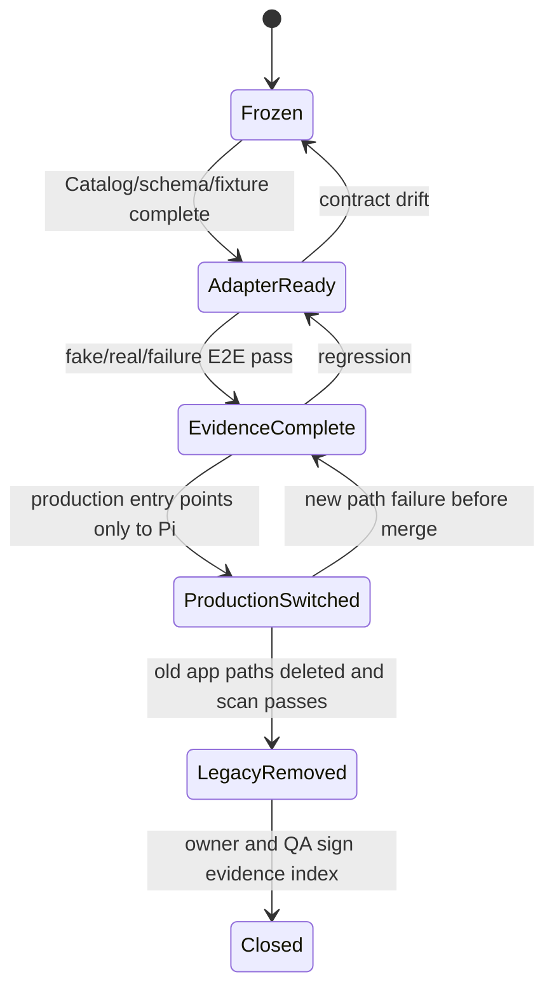

# 应用切换手册

<!-- markdownlint-disable MD013 MD060 -->

状态：Contract Stable

主要读者：各应用 owner、共享 UI、Runtime、QA 与发布工程师。

本文把 [Office Tool 迁移目录](04-office-tool-migration-catalog.md) 转换成逐应用可执行的生产
切换程序。它不重新定义工具 schema，也不允许用 feature flag 在正式安装包长期保留两套
Agent Runtime。

## 1. 目标与非目标

每个应用的 owner 必须能仅凭本文判断：本应用是否可以开始接线、何时允许把生产入口切到
Pi、切换后必须删除哪些旧路径，以及什么证据允许开始下一个应用。

本文不负责重新设计 Office executor、Provider、IPC、同步或打包。跨应用能力必须先按文档
01～04 落地；应用切换只做贴近现有 executor 的 adapter、共享 Panel 接入、端到端验收和
对应旧路径删除。

## 2. 已批准的切换不变量

| ID     | 决策                                                                                                     |
| ------ | -------------------------------------------------------------------------------------------------------- |
| CO-D01 | 正式顺序固定为 PDF → Docs → Sheets → Slides/Slide QC；同一时间只允许一个应用进入生产切换窗口。           |
| CO-D02 | 每个应用以完整 Catalog 为原子切换单位；工具族可以分 PR 实现，但生产入口不能只切一部分工具。              |
| CO-D03 | 一个 gate 只有在新路径验收通过且该应用旧入口已删除后才算关闭；隐藏旧按钮或保留 fallback 都不算删除。     |
| CO-D04 | 正式包不携带运行时开关。developer/nightly 可以显示诊断开关，但不得改变生产 bundle 的依赖与网络审计结果。 |
| CO-D05 | 失败回滚只能安装上一版已签名产物；当前包内不回退旧 AgentLoop、Genspark 或旧 Provider。                   |
| CO-D06 | Slides 与 Slide QC 是一个 gate；整页生成、图片、media、QC 未全部通过时不得切换 Slides 生产入口。         |
| CO-D07 | 共享 `agent-core`、`ai-provider` 只在最后一个应用完成后删除；App 自有旧 transport/IPC 必须随 App 删除。  |
| CO-D08 | 当前 app gate 未关闭时，后一个 app 可以准备 fixture，但不得修改共享 Panel 的生产状态机或切换入口。       |
| CO-D09 | 每次切换保留 Office 普通文件格式和原位 executor；不得为了 Agent 迁移引入统一 Office domain model。       |
| CO-D10 | 任何无法证明 mutation outcome 的断连都标为 `unknown` 并阻塞该文档写队列，不能以重试完成切换演示。        |

## 3. Gate 状态机与证据包



`Closed` 需要一个随 PR 保存的证据索引，至少包含：

```text
app / commit / protocolVersion / catalogHash
unit + contract + Electron E2E commands and artifact links
fake Provider transcript hash
real Provider smoke record without prompts or secrets
golden Office input and output hashes
Abort / rollback / renderer reload failure evidence
deleted path scan and bundle/network audit result
known limitations already allowed by the frozen contract
```

证据可以是 CI artifact、JUnit/coverage、截图、脱敏 JSON receipt 或安装包 smoke 报告。聊天
描述、手工口头确认和本地未保存日志不能成为发布证据。

## 4. 共同切换算法

每个应用严格执行以下循环，不能把删除工作留到“最后清理”：

1. **冻结基线**：从当前源代码生成 Catalog manifest，锁定 accepted/rejected schema vectors、
   黄金 Office 文件、旧入口和删除扫描词。验证 manifest 与文档 04 的 63 个实例盘点一致。
2. **接入开发路径**：Electron main 建立 Catalog/Broker，renderer 只实现被动 ContextProvider
   和 ExecutorAdapter；共享 Panel 通过 Runtime Session 调用，不直接提交 prompt/tools。
3. **验证读取**：fake Provider 触发所有 read/view 工具，检查最新 Context、UI-only details、
   provenance、Abort 和 renderer reload。view effect 只允许 Parent Agent。
4. **验证修改**：同文档 mutation 按 `toolOrder` 串行；第一次 committed mutation 建一个 run
   rollback point；测试 `not_started/committed/rolled_back/unknown` 和 stale context。
5. **验证真实模型**：至少一个云模型和一个本地 OpenAI-compatible 模型各完成一条代表性
   tool E2E。该步骤验证协议兼容，不把模型输出质量替代确定性 Office 断言。
6. **切生产入口**：在同一合并 train 中让本应用唯一入口指向 Pi，删除本应用 preload/main
   旧 channel、renderer AgentLoop/Skill composition、重复 search/files wrapper 和 Genspark 能力。
7. **扫描并关门**：运行应用测试、全仓回归、bundle 字符串/依赖扫描与网络拦截；记录证据后
   才把 gate 标为 `Closed`，随后才允许下一个应用切换。

如果第 6 步尚未合并，回滚代码 PR 即可；一旦形成正式 RC，只能回滚到上一版完整签名产物。
任何阶段都不得重新启用旧运行时使测试变绿。

## 5. PDF 纵向切换

### 5.1 入口与所有权

现有工具来自 `apps/pdf/src/renderer/ai/pdf-skill.ts` 与 `tools.ts`。PDF 文档状态继续由
renderer 持有，main 的 Broker 通过 schema-checked preload 调用被动 executor；Runtime 不接触
pdf.js 对象、文件路径或页面对象。

### 5.2 完整演示路径

1. 用户打开一个带文本、outline、表单和多页内容的 PDF，Panel 恢复绑定文档的 Pi Session。
2. Parent Agent 调用 `read_pages/search_text/get_outline/list_form_fields`，再以 view effect
   `goto_page` 定位；只读 Subagent只能调用四个 read tools。
3. Parent Agent 或获精确 Grant 的 Subagent 完成 `markup_text/fill_form_field/rotate_page/
delete_page`，所有操作使用 original page number 和同一 run rollback point。
4. 用户 Stop 或制造 renderer reload；已提交修改如实显示，未确定结果阻塞后续 mutation。
5. 用户一键回滚整个 run，PDF 回到第一次 committed mutation 前状态。
6. 在同一 gate 开启默认关闭的 MinerU，验证授权、精准解析、并排查看和原 PDF 保留。

### 5.3 必须通过

- `OTC-001/002/003`、`AR-003/004`、`OT-001`～`OT-005`；
- `OCR-001`～`OCR-006`，普通 CI 只用 mock 与脱敏固定结果；
- read-only、至少保留一页、field option、Abort、stale generation 与 rollback 故障注入；
- Panel、Session、Runtime crash 后无重复气泡或跨文档状态。

### 5.4 同批删除

- PDF renderer 的 `AgentSkill`、`AgentTransport`、`new AgentLoop()` 与旧 tool composition；
- PDF 的 `ai:stream` preload/main handler、旧 Provider 类型和 Genspark PDF→DOCX 路径；
- MinerU 替代完成后所有登录/credits/CLI 转换文案和 dead button。

完成条件：PDF 生产 bundle 只存在 Pi 路径，`OT-I01` 与 MinerU [#24](https://github.com/yoko19191/open-genoffice/issues/24)
证据完成，应用级旧路径扫描为零。

## 6. Docs 纵向切换

### 6.1 入口与所有权

现有工具来自 `apps/docs/src/renderer/ai/docs-skill.ts`、`tools.ts`、`commands.ts` 与
`protocol.ts`。ProseMirror/Tiptap executor 仍位于 renderer；main Catalog 固定 schema、权限、
freshness 和路由。`markDocSeen` 的旧 WeakMap 不再是跨进程事实源。

### 6.2 完整演示路径

1. 打开包含标题、列表、tracked changes、图片和图表的 DOCX，读取实时 document/selection
   context 与分页 blocks。
2. 在用户切换 selection 和外部编辑后分别调用读取与 mutation，证明旧 `contextVersion`
   返回 `stale_context`，重新读取后才能继续。
3. 用 restricted HTML 插入内容、替换 blocks、顺序执行 command batch；验证 deleted target
   skip、batch 上限、undo/redo 和 run rollback。
4. 搜索图片后由 Electron main 下载并登记 Artifact，`insert_image` 只接收 `artifactId`；
   renderer 无网络、URL 和绝对路径输入。
5. 插入和修改 native editable chart，失败时恢复原文且 tool details 不污染模型上下文。

### 6.3 必须通过

- `OTC-001/002/004`、`AR-003/004`、`OT-001`～`OT-005`；
- block pagination、restricted HTML、tracked deletion、chart series、图片 hash/MIME 和附件分页；
- fake Provider、云模型、本地模型、renderer reload、外部编辑与失败回滚 E2E；
- 文档未触及 OOXML 部分继续满足现有 preservation tests。

### 6.4 同批删除

- Docs `docs-skill.ts`、transport、renderer AgentLoop 与重复 search/image/files Skill；
- Docs `ai:stream` preload/main channel、旧 Provider settings 与 renderer 下载逻辑；
- Docs 范围内的 Genspark 登录、错误、搜索与图片入口。

完成条件：`OT-I02` 与共享平台工具 `OT-I05` 的 Docs 路径完成，Docs app scan 无旧入口。

## 7. Sheets 纵向切换

### 7.1 入口与所有权

现有工具来自 `apps/sheets/src/renderer/ai/workbook-skill.ts`、readers 与
`domain/workbook-dsl.ts`。52 个 `WorkbookOperation` discriminant 迁到单一 TypeBox 事实源；
现有 plan/apply transaction 与 Rust XLSX sidecar 保持原位。

### 7.2 完整演示路径

1. 打开包含公式、格式、merge、chart、filter 和多 sheet 的 XLSX，读取 active sheet/range、
   data extent、lazy viewport 与 feature inventory。
2. `open-genoffice/sheets-workbook` Skill 提供工作簿操作指导；`load_guide` 不再作为 Tool。
3. Parent Agent 通过 `propose_operations` 完成跨多个区域的公式、值和格式修改；所有 operation
   先展开、预校验，再经一个 plan/apply transaction 串行提交。
4. 在 apply Promise、renderer crash、公式 read-back 和结构类互斥处注入失败，确保不把
   `unknown` 猜成 committed，也不产生竞态覆盖。
5. 保存、重开并运行现有 compatibility gate，未触及 OOXML entries 保持 byte-identical。

### 7.3 必须通过

- `OTC-001/002/005`、`AR-003/004`、`OT-001`～`OT-005`、`RS-002/004`；
- 2000-cell/200-cell/100-address 上限、52 operation schema、formula/value、结构类互斥；
- `npm run gate -w @genoffice/sheets`、fake/云/本地模型 E2E 与并发 mutation fixture；
- 内置 Skill 进入 Capability Snapshot，未受信项目不能覆盖或注入同名资源。

### 7.4 同批删除

- `workbook-skill.ts` 中的旧 Prompt/guide state、transport、AgentLoop 和重复 web/files Skill；
- Sheets `ai:stream` channel、旧 Provider 配置与 renderer 网络入口；
- 迁移完成后的旧 Zod `WorkbookOperation` 声明，不能保留双 schema。

完成条件：`OT-I03` 与 `OT-I05` 的 Sheets 路径完成，compatibility gate 和应用扫描通过。

## 8. Slides 与 Slide QC 原子切换

### 8.1 入口与所有权

现有入口集中在 `apps/slides/src/renderer/ai/slides-skill.ts`，同时混合 23 个 native executor、
隐藏 planning/style Agent、Genspark page generation、图片/media、问答和独立 Slide QC。迁移后
native mutation、`commit_slide_page` 与 page renderer 由 Slides main 持有；Skill、Provider、
Subagent 与 ask-user 由 Runtime 持有。

### 8.2 完整演示路径

1. 先迁移 23 个 native executor，覆盖读取、文本/样式/transform、受限 slide script、图片、
   表格、图表、SmartArt、增删页和 layout audit。
2. `open-genoffice/slides-authoring` Skill 生成一页 `SlidePageSpec`，本地
   `commit_slide_page` 完成 validate → render → reopen → audit → atomic merge → reopen。
3. Codex OAuth 图片或用户显式 Image Provider 只产出 ArtifactRef；媒体分析只使用用户选择的
   Model Provider。能力不可用时只禁用对应功能。
4. 具名 QC Subagent 默认只读。用户分别完成 deny、grant 和 revoke；获准 actor 只得到
   `read_slide + execute_slide_script`，每页最多两轮，修复后重新跑确定性质量门。
5. 对 append/insert/replace 在每一阶段注入失败，证明原页 bytes/hash、页序、选择和 undo
   stack 不变；成功页能整体随 Agent run 回滚。

### 8.3 必须通过

- `OTC-001/002/006/007/008`、`MD-005`、`SA-004`～`SA-006`、`SL-001`；
- 原生工具 schema、sourceId/freshness、script sandbox、Artifact、history 与 connector 回归；
- PPTX 重开、文字可编辑、无越界/文本 overflow/非白名单重叠、图片 relationship 完整；
- 图片 OAuth 的 complete/partial/401/429/400/Abort 和协议回归；
- 全部 `GX-001`～`GX-004` 扫描通过后才允许关闭 gate。

### 8.4 同批删除

- Slides `slides-skill.ts` 旧 transport/AgentLoop/tool composition 与独立 `slide-qc` AgentLoop；
- `generatePageCloud`、`cloudGeneratePage`、`slides:cloud-page-generate`、cloud marker 和
  `runLlmOnce` planning/style/page generation；
- `ai:generate-image`、`ai:analyze-media`、`ai:gsk-*`、GSK CLI 与所有 Slides Genspark 文案；
- 未登记 `execute_layout_script` compatibility alias 和旧 `html-to-pptx` 云 marker 分支。

完成条件：`OT-I04`、`OT-I06`、`OT-I07` 全部完成，Slides/Slide QC 一次切换，任何旧路径均
不能作为 fallback 留在正式 bundle。

## 9. 共享旧层删除

`OT-I08` 只能在四个应用 gate 都为 `Closed` 后开始。收束 train 必须：

- 删除 `packages/agent-core`、`packages/ai-provider` 与 workspace/typecheck/test 引用；
- 从 `packages/ai-search` 删除 `gsk.ts`、`genoffice-auth.ts`、GSK-first 和 GSK fallback，只保留
  Serper/DuckDuckGo 或明确配置的 Extension；
- 删除 Shell 的 Genspark account/device-code/project UI、IPC、i18n、环境变量与缓存；
- 从 `electron-builder` 的 `extraResources`、lockfile、notices、asar/unpacked 产物删除
  `@genspark/cli`、nested commander 和专用 `ws` 携带树；
- 删除旧聊天、旧 Provider 配置和明文凭据的生产读取路径，只保留幂等清理器；
- 运行源代码、lockfile、构建产物、日志模板、网络 fixture 与运行时网络拦截审计。

迁移规格、ADR 和历史 commit 可以保留 Genspark 名称。生产源码中的清理器若必须匹配旧 key，
应集中在带 `legacy-removal` 标识的升级模块并有白名单快照；不能因此放宽安装包扫描。

## 10. 研发、正式发布与回滚边界

developer/nightly 可以暴露 Catalog hash、Runtime endpoint 类型、fake Provider、故障注入和
未关闭 gate，但构建必须明确标识为非正式渠道。stable/RC 不允许：

- 半切换应用、第二运行时、旧网络 fallback 或隐藏的 Genspark 依赖；
- 用远端 feature flag 打开未随包验收的 Agent 路径；
- 把交叉构建或静态检查当成三平台原生安装证据；
- 在发布说明中用“已知问题”豁免安全、数据完整性、进程回收或 Slides 原页保留。

正式回滚仅选择上一版已签名、已保存 SBOM 与验收证据的完整产物。新版本的 Resource Home
schema 必须让旧版安全忽略未知数据；回滚不得恢复旧聊天、旧凭据或 Genspark 登录。

## 11. 实施切片

以下拆票已经批准，发布到 Issue tracker 时按依赖顺序创建。它们复用文档 04 的 local ID，
不再创建一组重复的“切换票”。

| ID     | 完整纵向行为                                                  | 类型 | Blocked by           | 关闭的应用 gate |
| ------ | ------------------------------------------------------------- | ---- | -------------------- | --------------- |
| OT-I01 | PDF Panel 完成读取、修改、Stop、恢复、整 run 回滚与旧入口删除 | AFK  | #2、#4、#5、#17、#24 | PDF             |
| OT-I02 | Docs 用实时 Context 与 Artifact 完成编辑、恢复并删除旧入口    | AFK  | #2、#4、#5、#17、#25 | Docs            |
| OT-I03 | Sheets 用内置 Skill 与 Workbook DSL 原子修改并删除旧入口      | AFK  | #2、#4、#5、#17、#18 | Sheets          |
| OT-I04 | Slides 迁移 23 个 native executor，但暂不切换生产入口         | AFK  | #2、#4、#5、#17      | -               |
| OT-I05 | 合并附件、Web/Image Search 与 ask-user 平台工具               | AFK  | #2、#8、#17、#18     | 随调用 App      |
| OT-I06 | 用 SlidePageSpec 本地生成并原子替换一张可编辑整页             | AFK  | OT-I04、#18、#25     | -               |
| OT-I07 | QC Subagent 经用户 Grant 修复页面，拒绝时保持只读             | HITL | OT-I06、#22、#23     | Slides          |
| OT-I08 | 删除共享旧层、63 个旧注册点与所有 Genspark 生产路径           | AFK  | OT-I01～OT-I07       | 全部            |

每张 Issue 必须在正文列出覆盖的 Gate ID、删除点和证据包；测试属于行为切片，不另拆成“补测试”横向票。

## 12. Reader Test

没有参与迁移讨论的工程师应能回答：

1. 为什么一个 App 的部分工具完成后仍不能切生产入口？
2. 哪一步创建 run rollback point，失败验证为什么不能产生空快照？
3. PDF original page、Docs block、Sheets range 和 Slides sourceId 如何避免 stale mutation？
4. 为什么 Docs 插图不能继续让 renderer 下载 URL？
5. Sheets apply 断连后为什么不能用公式 read-back 证明 committed？
6. Slides native tools 完成后为什么仍不能先切换、再实现 Slide QC？
7. developer/nightly 可以保留什么诊断能力，stable bundle 又绝不能包含什么？
8. 某 App gate 在什么时刻从 `ProductionSwitched` 进入 `Closed`？
9. `agent-core` 与 `ai-provider` 为什么不能随第一个 App 删除，也不能留到正式包中？
10. 新路径失败时允许的回滚是什么，为什么不能回退旧 AgentLoop？
