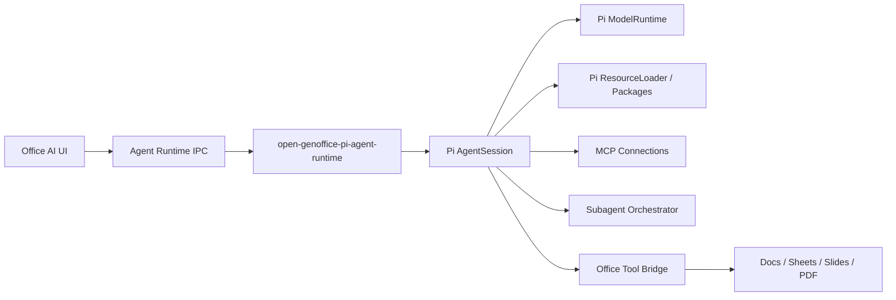

# Pi Agent Platform 迁移规格与验收矩阵

<!-- markdownlint-disable MD013 MD060 -->

日期：2026-08-07
更新：2026-08-09
状态：Approved for implementation；六个高风险 Spike 已关闭，业务代码尚未实施
目标读者：负责 Electron、Agent Platform、Docs、Sheets、Slides、PDF、测试与发布的工程团队

## 1. 目标

GenOffice 将以 Pi Agent Runtime 与其资源生态重建唯一的 Agent Platform。迁移结束后：

- `@earendil-works/pi-coding-agent` 的 `AgentSession` 是唯一 Agent 编排器与会话事实源。
- 模型、会话、Skills、Packages、Extensions、MCP 和 Subagent 通过统一平台进入四个 Office 应用。
- 现有 Office 编辑工具、实时上下文、附件解析、UI side-channel 和 undo/rollback 行为继续存在，但作为 Pi 能力的适配对象。
- 全局配置和资源默认位于 `~/.open-genoffice`，不与 Pi CLI/Pi Web 互通。
- 最终安装包达到 Genspark-Free Build。

本规格定义平台边界、工作包和验收条件，不授权当前阶段实施代码。

## 2. 非目标

- 不复制 Pi Web 的 Git worktree、代码文件浏览器、终端、PWA 或 coding-workspace UI。
- 不让 renderer 直接持有模型 API key、OAuth token 或可执行 Extension。
- 不保留 GenOffice AgentLoop 作为长期回退运行时。
- 不以 `oh-my-pi` 或其他 Pi fork 替换上游 Pi Runtime；可以借鉴其设计或选择兼容的独立 Package。
- 不为追求名义上的“原生实现”而重写已有、可审计且可包装的 Pi Extension/Package。
- 不新建一套类似 Pi Web 的代码工作台；现有四个 AI Panel 在原位接入共享平台组件。

## 3. 已确认架构边界

### 3.1 唯一运行时

平台必须直接创建和驱动 Pi `AgentSession`，复用以下上游能力：

- `createAgentSessionServices()` / `createAgentSessionFromServices()`；
- `ModelRuntime`、`SessionManager`、`SettingsManager`；
- `DefaultResourceLoader` 与 Pi Package/Extension 生命周期；
- Pi 原生消息、工具事件、steering、follow-up、retry 与 compaction；
- Pi 原生 JSONL session tree、fork 和会话内分支。

每个 Agent Session 在生命周期内只绑定一个 Office 文档。同一文档可以有多条
Session，但一条 Session 不得在多个文档之间切换其 Office Context 或 rollback 归属。

以下 GenOffice 通用 Agent 逻辑在迁移完成后删除：

- `packages/agent-core` 的消息协议、`AgentLoop`、自研 compaction、max-turn、取消和 transport；
- `packages/ai-provider` 的 Provider 路由、SSE 解析和协议转换；
- Docs、Sheets、Slides、PDF 各自的 renderer transport 与 `ai:stream` IPC；
- 仅服务于旧运行时的历史恢复和工具活动压缩逻辑。

### 3.2 保留的 Office 领域能力

这些能力不是 Agent Runtime，不得随旧 AgentLoop 删除：

- Docs、Sheets、Slides、PDF 的读取和编辑 executor；
- 每轮构建最新 Office Context 的逻辑；
- 第一次 Mutation Tool 执行前的快照与一键回滚；
- Sheets/Slides/Docs 自身的 undo/redo 机制；
- 工具结果的 `mutated`、摘要、图片、链接和 UI 展示数据；
- 文档附件、项目绑定、搜索 fallback 与 Office 文件引擎。

迁移层应把现有约 60 个 Office 工具包装成 Pi custom tools，优先复用 executor，不逐个重写领域实现。

### 3.3 进程与通信不变量

Runtime Host 必须以 `open-genoffice-pi-agent-runtime` 命名，不能采用 Electron
`utilityProcess`。它是随 Electron 安装包交付、由桌面端启动和管理的独立 sidecar，
不是用户单独安装的常驻服务：

- `open-genoffice-pi-agent-runtime` 在受信进程运行，renderer 只消费窄 IPC API 和结构化事件。
- Electron 负责 Runtime 的版本握手、健康检查、崩溃恢复和退出回收。
- 同一 Runtime 入口可独立启动并接入测试客户端，用于调试和自动化测试。
- 正式模式只接受当前 Electron 实例建立的本地认证连接。
- Runtime Host 是 `AgentSession`、模型凭据、MCP client 和 Extension 执行的所有者。
- renderer 通过 Office Tool Bridge 执行依赖当前编辑器状态的工具。
- 所有 Mutation Tool 顺序执行；不得沿用 Pi 的默认并行策略。
- Stop/Abort 同时终止模型流、活动工具、MCP 调用和 Subagent。
- renderer 崩溃或重新加载后，可以从 Runtime Host 与 session 文件恢复权威状态。

Spike 04 已将物理封装固定为目标平台 Node.js `22.19.0` + unpacked ESM Runtime bundle：

- executable 重命名为 `open-genoffice-pi-agent-runtime[.exe]`，Electron 从 manifest
  读取入口并调用 `spawn(executable, [entry])`；
- Pi、Extensions、MCP stdio 入口和原生模块全部位于 `extraResources` 的真实文件系统，
  不进入 `app.asar`，不使用系统 Node、`npx` 或 SEA；
- macOS/Linux 固定 UDS，Windows 固定 Named Pipe；256-bit 一次性 token、endpoint、
  协议与父 PID 只经 inherited stdin bootstrap，stdin 同时作为父进程 lifetime sentinel；
- macOS/arm64 与 Linux/arm64 glibc 已从完整复制 bundle 实跑通过；Linux 不支持 musl；
  Windows/x64 需在 `windows-2025` runner 补齐 Named Pipe 与进程树回收证据。

建议的逻辑关系：



## 4. 数据与资源布局

安装包中的 Runtime bundle 与用户 Resource Home 分离：

```text
resources/open-genoffice-pi-agent-runtime/
├── manifest.json
├── bin/open-genoffice-pi-agent-runtime[.exe]
├── app/dist/host.mjs
├── app/node_modules/
└── licenses/
```

manifest 固定 Runtime/IPC/Node/Pi 版本、platform、arch、入口、executable 和全树 hash。
各平台安装包只带本平台 bundle；`beforePack` 缺文件、hash 不符、架构不符或无 executable
bit 必须失败。Node LICENSE 与第三方 notices 是 bundle 的组成部分。

默认 Resource Home：

```text
~/.open-genoffice/
├── agent/
│   ├── settings.json
│   ├── models.json
│   ├── sessions/
│   ├── skills/
│   ├── extensions/
│   ├── packages/
│   ├── packages.lock.json
│   ├── prompts/
│   └── logs/
├── mcp/
│   └── servers.json
├── assets/
│   └── ...
├── sync/
│   ├── providers.json
│   ├── manifests/
│   └── conflicts/
└── state/
    └── trust.json
```

约束：

- 目录结构应尽量沿用 Pi `agentDir` 和 ResourceLoader 约定，通过自定义根目录注入，而不是 fork 加载器。
- API key、OAuth refresh token 和 MCP secret 不得以明文写入上述 JSON；实现自有 Pi CredentialStore，底层使用 Electron `safeStorage` 或系统凭据库。
- session 采用 Pi 原生 JSONL 格式。Office 元数据只能使用 Pi 支持的自定义 entry/details 扩展，不创建第二份权威 transcript。
- Global Asset 同步范围覆盖 `assets/`、Skills、Extensions、Prompts、Package lock 和
  脱敏 MCP 配置；各类资源仍保留在 Pi 原生目录，不复制到单一混合目录。
- `sync/providers.json` 只能保存非敏感连接元数据和 CredentialStore 引用，不能保存 secret。
- 凭据、信任状态和设备设置不进入同步；目标设备必须重新授权可执行或网络型资源。
- 项目可以携带 `.open-genoffice` 配置与资源。平台按 canonical project root 请求显式
  Project Trust；未受信时不得执行 Extension、启动 MCP server 或改变工具集。
- 旧 Project Store 中的 Agent 聊天历史完全抛弃，不转换为 Pi JSONL，也不保留只读入口。

## 5. Pi 生态复用策略

每项能力按以下顺序选择实现：

1. Pi 上游稳定 API；
2. Pi 官方 example extension，经过产品化封装；
3. 有维护者、许可证兼容且通过安全审计的 Pi Package；
4. GenOffice 自有 Extension；
5. 只有前四项都不满足验收契约时，才在平台核心中新增实现。

当前候选矩阵：

| 能力                    | 优先复用候选                                                 | 当前判断                                                           | 决策门槛                                            |
| ----------------------- | ------------------------------------------------------------ | ------------------------------------------------------------------ | --------------------------------------------------- |
| Session/compaction/fork | Pi `AgentSession` / `SessionManager`                         | 直接采用                                                           | 固定版本并通过 Electron 打包验证                    |
| 模型与认证              | Pi `ModelRuntime` / CredentialStore                          | 直接采用并注入安全存储                                             | 云 Provider 与 OpenAI-compatible 各至少一个通过     |
| Codex OAuth             | Pi `openai-codex` OAuth Provider                             | 直接复用登录与刷新协议，凭据独立存储                               | 登录、刷新、退出、失效恢复和发行打包通过            |
| 图片生成                | `CodexOAuthImageProvider` + Pi CredentialStore               | 直接 Codex Responses bridge 已通过真实账户 spike                   | refresh、取消、协议回归和安装包 smoke 通过          |
| Skills                  | `DefaultResourceLoader`、Pi PackageManager、skills.sh 安装流 | 直接采用，替换根目录与信任层                                       | 安装、禁用、更新和诊断均可观察                      |
| Extensions/Packages     | Pi Package/Extension API                                     | 直接采用，外部代码必须受信                                         | 未受信项目不得执行 Extension                        |
| Subagent 基础           | Pi 官方 `examples/extensions/subagent`                       | 只作语义参考                                                       | 不直接把示例代码当生产组件                          |
| Subagent 执行           | `@agwab/pi-subagent@0.4.8`                                   | 作为 execution/artifact engine，由 GenOffice Provider 补齐安全边界 | lineage、Mutation Grant、预算、级联取消和打包通过   |
| Subagent 工作流         | `@agwab/pi-workflow`                                         | 作为可选高级层评估                                                 | 不让工作流 DSL侵入核心 Session 契约                 |
| 本机 Subagent Extension | `pi-config/extensions/subagents`                             | 作为行为参考或候选                                                 | 消除对外部 `pi` CLI 进程和 `~/.pi` 的隐式依赖       |
| MCP                     | `@modelcontextprotocol/client@2.0.0` + Pi inline Extension   | 采用官方 client 和 GenOffice 薄适配层                              | transport、认证、重连、日志、工具启停和权限通过     |
| Runtime Sidecar         | Node.js `22.19.0` + unpacked Pi bundle                       | 采用；macOS/Linux glibc spike 已通过，不使用 SEA                   | Windows Named Pipe、签名/公证、installer smoke 通过 |
| OMP MCP/Subagent        | `oh-my-pi`                                                   | 只作为设计参考                                                     | 不引入第二个 Agent Runtime                          |

任何第三方 Package 进入默认安装包前，必须记录：版本固定方式、许可证、维护状态、权限面、网络行为、子进程行为、升级与回滚策略。

### 5.1 Codex OAuth 图片 Provider

图片生成不把 `gpt-image-2` 注册成普通对话模型。Runtime Host 提供独立
`CodexOAuthImageProvider`，复用 Pi `ModelRuntime` 的 `openai-codex` OAuth 登录、刷新与
CredentialStore；renderer 只获得 Provider 状态和非敏感结果。

2026-08-09 真实账户 spike 已通过以下路径：

```text
Pi ModelRuntime.login("openai-codex", "oauth")
  -> POST https://chatgpt.com/backend-api/codex/responses
  -> outer model: gpt-5.4-mini
  -> tool: { type: image_generation, action: generate, model: gpt-image-2 }
  -> SSE image_generation_call
  -> validated image asset
```

参考 Sub2API commit `cc67b1aca1d3b590609abef2fcd3a6ca31c5c651` 的协议行为，
不复制其 LGPL 源码，也不把 Sub2API 作为安装包依赖。首版协议规则固定如下：

- 单次只生成一张图，完全省略 `tools[0].n`；实测传 `n: 1` 会返回
  `400 unknown_parameter`。
- 使用 Pi 自己的 `originator: pi` 和 User-Agent，不伪装官方 Codex CLI；请求只允许访问
  HTTPS 精确主机 `chatgpt.com`。
- final 图片只从 `response.output_item.done` 或 `response.completed` 的
  `image_generation_call.result` 读取；partial image 只作为进度和故障证据。
- base64 解码后校验 MIME、文件魔数、实际尺寸、字节上限和 SHA-256，再原子写入项目
  asset。请求尺寸不等于真实输出尺寸；实测请求 1024×1024，得到 1254×1254 PNG。
- 解析 `response.tool_usage.image_gen` 并展示图片工具用量。token、ChatGPT account ID、
  base64 和完整 prompt 不进入日志、Session 或 renderer。
- UI Stop、文档关闭和 Sidecar shutdown 连接到同一个 AbortSignal；默认硬超时 300 秒。
  收到任何 partial image 后禁止自动重试，避免重复用量。
- 401 只在未收到图像事件时允许刷新一次；429 显示 Codex usage limit；请求 schema 400
  映射为 `provider_contract_incompatible`。协议回归时只禁用图片 Provider，不影响其他能力。

公开 `api.openai.com/v1` 仍不接受这类 Codex OAuth token。它是负向对照，不是生产调用
路径。用户显式配置的 Sub2API 或其他 OpenAI-compatible Images endpoint 可以实现另一项
Image Provider，但不能成为 Codex OAuth 的隐式回退或共享凭据。

## 6. 一等 MCP 能力

MCP 不是“能够注册几个远程工具”就算完成。平台契约至少包括：

- 全局和项目级 MCP server 配置；
- stdio 与 Streamable HTTP；
- legacy SSE 只用于导入和连接已有配置，不作为新配置默认 transport；
- 静态 Header、API key 与 OAuth 认证；
- server 启停、连接状态、能力和工具发现；
- secret 引用、环境变量白名单和请求 header 管理；
- 工具级启停、命名冲突处理和会话内可见性；
- 超时、取消、重连、stderr/诊断日志和健康状态；
- 调用前授权、调用中进度、调用后 provenance；
- MCP tool 转换成 Pi custom tool，但不丢失 server/tool 身份。

Runtime Host 管理 MCP 连接，Agent Session 只接收当次会话获准使用的工具集合。

## 7. 一等 Subagent 能力

Subagent 最低产品契约：

- Parent Agent 可以创建一个或多个具有独立上下文的 Subagent；
- 每个 Subagent 有稳定 ID、角色、状态、开始/结束时间、模型和用量；
- 支持并发上限、模型/Token 预算、取消与父级级联取消；
- 父级能接收结构化结果和失败原因，而不是只读取一段 stdout；
- UI 展示 Agent 树、活动状态、工具调用和最终结果；
- Subagent session 与 Parent Agent Session 的 lineage 可持久化和恢复；
- Subagent 默认只读，只能获得被授予的 Office Context 和 read-only tools；
- 只有用户可以给具体 Subagent 作出 Mutation Grant；父 Agent 不得代替用户授权；
- Mutation Grant 至少绑定 Subagent ID、Office 文档、允许的工具能力和有效期；
- 获准的 Mutation Tool 仍由父 Session 顺序调度、写入审计事件并进入统一 rollback；
- Subagent 结束、取消或绑定文档关闭时，Mutation Grant 自动撤销。

优先把成熟 Pi Subagent Package 包装成 `SubagentProvider`，GenOffice 只拥有稳定产品接口、策略和 UI。若候选实现无法提供结构化事件或可靠取消，再决定补写适配层或自有 Extension。

## 8. Genspark 清零

必须删除：

- Genspark 登录、device-code、token create/revoke 和账户 UI；
- `@genspark/cli` 依赖、子进程调用及 Electron `extraResources`；
- `www.genspark.ai` LLM proxy 与 `X-Agent-Type`；
- GSK search、image、media、slide、convert、project API；
- Genspark model catalog、credits 错误和相关 i18n；
- 构建脚本、测试 fixture、文档和环境变量中的 Genspark 专有项。

能力去向：

| 原 Genspark 能力 | 目标边界                                                                                                                                                           |
| ---------------- | ------------------------------------------------------------------------------------------------------------------------------------------------------------------ |
| LLM proxy        | Pi ModelRuntime + 用户自配 Provider                                                                                                                                |
| Web/图片搜索     | 保留 Serper/DuckDuckGo，并可作为 Extension/MCP 能力扩展                                                                                                            |
| 图片生成         | 使用已实测的 `CodexOAuthImageProvider`：通过 Codex Responses `image_generation` 生成；协议不兼容时仅禁用图片并明确提示，不得用 API key/OpenRouter/Sub2API 静默替代 |
| Slides 整页生成  | 保留；复用现有 HTML→PPTX；PPTX 可打开、文字可编辑、无越界/重叠、图片完整，失败时保留原页                                                                           |
| PDF→DOCX         | MinerU 作为默认关闭的 OCR 服务商，固定优先走精准解析 Standard API 直出 `docx`；Pandoc 与 Agent 轻量解析都不作静默回退                                              |
| 音视频分析       | 通过用户配置的模型 Provider 实现；转码、抽帧、ASR 前处理仍由 GenOffice 负责                                                                                        |
| 云项目           | 本地 Project Store + Project Sync Provider；首版同时支持 WebDAV 与 S3 Bucket，不以 Pi Session 代替 Office 项目存储                                                 |

### 8.1 MinerU PDF→DOCX 适配

MinerU 官方 API 已支持在精准解析 Standard API 任务中通过 `extra_formats: ["docx"]` 请求 DOCX，
因此不需要把 Pandoc 放在 PDF 输入链路。实现独立 `OcrProvider`，产品界面统一称为
“OCR 服务商”：

1. URL 输入调用 `POST /api/v4/extract/task`；本地 PDF 先调用
   `POST /api/v4/file-urls/batch` 获取签名上传地址，再上传文件；
2. 桌面端使用轮询，不依赖公网 callback；处理 `waiting-file`、`pending`、`running`、
   `converting`、`done` 和 `failed` 状态；
3. 完成后从 HTTPS `full_zip_url` 下载有体积/文件数/解压总量上限的结果包，拒绝路径
   穿越，只接受一个 DOCX，并校验 OOXML content type 与 `word/document.xml`；
4. MinerU token 存入 CredentialStore，设置页提供默认关闭的开启按钮；首次开启弹窗
   说明第三方上传与持续授权，用户确认后后续不逐文件重复确认；
5. 本地取消立即停止轮询和下载。由于官方接口不保证取消远端运行任务，UI 必须如实说明。

精准解析是 PDF→DOCX 的默认且首版唯一云端路径。Agent 轻量解析不能在精准解析失败、
超时或配额不足时自动接管；如果以后提供，只能作为用户显式选择、说明为文本优先的独立
模式。

关闭时不得向 MinerU 发起任何网络请求，也不要求用户配置 token。首次开启确认持续
生效，关闭即阻止新任务；相关操作仍需标明文件将由云端 OCR 服务处理。网络失败、配额
耗尽或未配置 token 只影响 OCR/PDF→DOCX，不影响 PDF 本地能力或 Pi Agent Runtime。
签名上传 URL、结果 URL、token 与文档内容不得进入 renderer 状态、Pi Session、日志或
遥测。首版承诺可打开、正文可编辑、阅读顺序与常见表格语义优先，不承诺结构化公式、
原始栏布局、页数、字体、图内可搜索文字、扫描底图或逐页像素级一致；原 PDF 始终保留。

2026-08-09 经用户明确同意，用五个新生成、无敏感内容的单页 PDF 实跑精准解析：5/5
完成上传、转换、下载和 OOXML 打开校验，最终 2/5 通过完整自动门。中英文正文和合并
表格/图片通过；双栏公式退化为顺序段落和普通文本，图片密集页从一页重排为三页且图内
文字不进入正文文本层，扫描页 OCR 正文正确但未保留底图。产品不得把该能力称为“高保真
转换”，转换后必须支持原 PDF 与 DOCX 并排检查。

### 8.2 WebDAV 与 S3 云项目同步

云同步位于 Project Store 外围，不进入 AgentSession 或 Office Tool 的执行语义。两个
Provider 共用以下平台契约：项目清单、内容哈希、远端版本、同步状态、冲突对象、重试、
进度、离线队列和凭据引用。

远端模型固定为
`open-genoffice-sync/v1/{project|global}/{scopeId}/` 下的 immutable SHA-256 blob、
immutable content-addressed revision 与单一 CAS `head.json`。Revision 包含 namespace、
scope、canonical path、kind、content hash、size、tombstone、0–2 个 parent、author
device、event、executable/network 标记；不保存 wall-clock。Manifest generation 只用于
诊断。不可变对象使用 `If-None-Match: *`，head 使用强 ETag 的 `If-Match`；S3 ETag 只作
CAS token，不能代替内容哈希。

- WebDAV 固定 `webdav@5.10.0`，支持 HTTPS、自定义根路径和 Basic/Digest/Bearer；服务
  必须返回强 ETag 并支持 conditional PUT，否则连接诊断 fail closed；
- S3 固定 `@aws-sdk/client-s3@3.1106.0`，支持 AWS S3 与 S3-compatible endpoint、
  region、bucket、prefix 和 path-style；服务必须支持 conditional `PutObject`，bucket
  versioning 不能替代 CAS；
- 凭据只存安全 CredentialStore，不写进项目、session、日志或同步包；
- 同步覆盖 Office 文档、项目资产、项目元数据、绑定文档的已落盘 Pi Sessions 和
  Global Asset；Global Asset 包含 Skills、Extensions、Prompts、固定版本 Package
  lock 和脱敏 MCP 配置，项目数据与 Global Asset 使用不同远端 namespace；
- 设置、模型/MCP/同步凭据和 Project Trust 决策永不上传；
- 新设备上的可执行 Extension、带脚本 Skill 和 stdio MCP 默认禁用，须本地重新授权；
- 首版要求 HTTPS/TLS，并支持 S3 provider-side encryption；不提供客户端端到端加密；
- 检测到远端分叉时保持本地工作副本为 current revision，把远端 revision 保存为
  未决 Conflict Copy，并在用户选择前停止发布该路径，不静默覆盖；
- `keep-local` 或 `accept-remote` 都写入以两个分叉 head 为 parent 的新本地 resolution
  revision，未选中的旧 revision 转为 Conflict Copy；不得用跨设备 wall-clock 决胜；
- 删除只用 tombstone 表达；远端 tombstone 需用户确认，已知路径从 manifest 消失视为
  错误；离线队列只保存 reconcile 意图，重连后重新读 head，不重放旧 ETag/请求。

## 9. 迁移工作包

### WP0：依赖与契约基线

- 固定 `pi-agent-core`、`pi-ai`、`pi-coding-agent` 为同一精确版本 `0.84.0`；不得混用 Pi 版本。
- Runtime bundle 与 CI 固定 Node.js `22.19.0`，不能只写浮动的 `22`。
- 建立 Pi faux/test Provider、事件 contract tests 和打包 spike。
- 冻结旧运行时行为清单与四个应用的黄金用例。

退出条件：Electron 发行构建中可以创建、运行、取消和恢复一个无 Office 工具的 Pi Agent Session。

### WP1：Runtime Host 与 IPC

- 创建随包交付的 `open-genoffice-pi-agent-runtime` sidecar 和唯一 session registry。
- 建立独立 Runtime workspace 与按 platform/arch 生成的 unpacked bundle/manifest，并通过
  现有 electron-builder `extraResources` 复制；`beforePack` fail closed 校验完整性。
- 实现 Electron 启停、版本握手、健康检查、崩溃恢复、退出回收与本地连接认证。
- 正式 IPC 在 macOS/Linux 使用 Unix Domain Socket，在 Windows 使用 Named Pipe，
  每次启动生成一次性握手 token；token/endpoint/父 PID 只经 inherited stdin
  bootstrap，stdin EOF 与显式 shutdown 共用回收路径；stdio 仅用于独立 debug/test。
- 提供可独立启动的 debug/test 模式，但不安装系统常驻服务。
- 暴露 create/open/prompt/steer/followUp/abort/compact/fork/navigate/status/subscribe。
- 透传 Pi 原生事件，并定义 renderer 可消费的稳定 envelope。
- 支持 renderer 重载和应用重启后的状态恢复。

退出条件：UI 不依赖 `AgentLoop`，流式事件和中断行为通过 contract tests。

### WP2：Office Tool Bridge

- 把现有 JSON Schema 工具适配到 Pi TypeBox/tool contract。
- 为每个工具声明 read-only/mutation、支持的编辑器和授权等级。
- 保留实时 Office Context、顺序 mutation、首次 mutation 快照和 UI details。
- 迁移 PDF 作为首个纵向切片，再迁 Docs、Sheets、Slides 和 Slide QC。

退出条件：四个应用的现有核心编辑工具行为和回滚无回归。

### WP3：会话与 Project Store

- Pi JSONL 成为 Agent transcript 唯一事实源。
- 建立一个 Agent Session 只绑定一个 Office 文档的绑定模型。
- 支持 fork、会话内分支、compaction、rename/delete/export。
- 升级时删除旧 Agent 聊天记录及其索引，不提供转换或只读归档入口。
- 删除旧 Provider 配置、明文 API key 和 Genspark token，不迁移、不自动导入。

退出条件：关闭应用后可恢复消息、工具结果、分支、压缩和 Subagent lineage。

### WP4：模型、认证与 Resource Home

- 在 `~/.open-genoffice` 初始化 Pi agentDir。
- 实现受控模型配置 UI、Provider discovery 和 connection test。
- 注入安全 CredentialStore，不把 secret 返回 renderer。
- 支持至少一个云 Provider 和一个本地 OpenAI-compatible Provider。
- 支持 ChatGPT/Codex OAuth 登录、刷新、退出和失效恢复，不读取其他 Pi/Codex 客户端凭据。
- 实现已通过 spike 的 `CodexOAuthImageProvider`，覆盖 Responses SSE、图片校验、用量、取消
  和协议不兼容状态；不能静默改用另一计费通道。

退出条件：模型切换、thinking level、认证失效和重试行为都有自动化测试。

### WP5：Skills、Packages 与 Extension UI

- 复用 Pi ResourceLoader/PackageManager。
- 实现列表、诊断、启停、安装、更新和卸载。
- 只允许本地目录、精确 npm 版本和固定 Git commit，生成带来源与内容哈希的 lockfile。
- 禁止 semver range、浮动 Git ref 和静默自动更新；更新后重新校验与授权。
- 建立全局/项目资源信任边界。
- 映射 extension select/confirm/input/editor/notify/status/widget 等 UI 请求。

退出条件：受信 Skill/Extension 可以被当前 Session 装载，未受信资源不会执行。

### WP6：MCP

- 选型或实现 MCP Extension/Provider。
- 实现配置、连接、工具发现、权限、日志、重连和取消。
- 将 MCP provenance 写入工具结果 details/session。

退出条件：stdio 与 Streamable HTTP 各有一个端到端 fixture，并通过故障恢复测试。

### WP7：Subagent

- 完成现有生态候选评估并固定实现。
- 实现 Parent/Subagent lineage、预算、并发、事件和级联取消。
- 默认只授予 Subagent 受限 Office Context 和 read-only tools。
- 实现由用户触发、按 Subagent/文档/工具能力收窄且仅当前 Subagent run 有效的 Mutation Grant。
- 所有获准 mutation 仍进入父 Session 的顺序执行、审计与统一 rollback。
- 实现 Agent 树和运行详情 UI。

退出条件：并发、失败、取消、恢复和父级汇总均有确定性测试。

### WP8：Genspark 清零与能力替代

- 删除所有 Genspark 代码、资源、UI、配置和依赖。
- 增加默认关闭的 OCR 服务商设置，以 MinerU 精准解析 `docx` 输出替换 Genspark
  PDF→DOCX，并完成上传、轮询、下载、边界提示与清理；不得静默降级到 Agent 轻量解析。
- 按已决策略迁移 Slides、图片生成和 media 能力。
- 增加静态扫描和运行时网络测试。

退出条件：Genspark-Free Build 验收全部通过。

### WP9：WebDAV 与 S3 项目同步

- 定义本地项目清单、版本、内容哈希、同步状态与 Sync Conflict 数据模型。
- 让 WebDAV 与 S3 Provider 通过同一 contract test suite。
- 实现安全凭据、断点/重试、进度、离线队列、远端删除保护和冲突恢复。
- 同步绑定文档的 Pi Sessions，并以独立 namespace 同步 Global Asset Store。
- Global Asset 包含 Skills、Extensions、Prompts、Package lock 和脱敏 MCP 配置；
  目标设备不继承 secret 或 trust。
- 保持本地 current revision；远端分叉落为 Conflict Copy，用户选择形成新的本地 revision。
- 强制 TLS，S3 支持 provider-side encryption；首版不实现客户端端到端加密。
- 保证同步停用、离线或失败时，Office 编辑和 Agent Session 仍可本地工作。

退出条件：同一项目可分别经 WebDAV 和 S3 完成首次上传、增量同步、跨设备拉取与冲突检测，且两种 Provider 的用户语义一致。

### WP10：四应用切换与旧层删除

- 依次切换 PDF、Docs、Sheets、Slides/Slide QC。
- 复用并原位演进现有四个 AI Panel，通过共享组件接入 Session、Skills、MCP 和 Subagent 状态。
- 不在正式版本中长期保留双运行时开关。
- 删除旧包、旧 IPC、旧设置和无效测试。
- Slides 整页生成在替换原页前执行结构性质量检查，失败时保持原页不变。

退出条件：仓库无 `@genoffice/agent-core`、`@genoffice/ai-provider` 或旧 Agent wire contract 的生产依赖。

### WP11：发布硬化

- 单元、contract、集成、Electron E2E、macOS/Windows/Linux 打包 smoke。
- 新增模块行覆盖率不低于 95%，并通过 lint/typecheck/license/notices。
- 进行第三方 Package 供应链和权限审计。

退出条件：验收矩阵全部通过，没有临时豁免。

## 10. 验收矩阵

| ID      | 能力                | 验收方法                                    | 通过标准                                                                                                                                                                                          |
| ------- | ------------------- | ------------------------------------------- | ------------------------------------------------------------------------------------------------------------------------------------------------------------------------------------------------- |
| AR-001  | 唯一运行时          | 静态依赖扫描 + runtime contract test        | 生产路径只创建 Pi `AgentSession`，无自研 AgentLoop 回退                                                                                                                                           |
| AR-002  | 原生事件            | Faux Provider 事件序列测试                  | message/thinking/tool/compaction/agent 事件不丢失且顺序稳定                                                                                                                                       |
| AR-003  | 取消                | 长模型流、长 Office tool、MCP、Subagent E2E | 一次 Abort 在限定时间内终止全部子操作且 Session 可继续使用                                                                                                                                        |
| AR-004  | 会话恢复            | 应用重启与 renderer reload E2E              | 消息、工具结果、活动状态和分支从 Pi session 恢复，无重复气泡                                                                                                                                      |
| AR-005  | Fork/分支           | SessionManager 集成测试                     | 独立 fork 与同文件分支语义和 Pi 一致，切换不污染原分支                                                                                                                                            |
| AR-006  | Compaction          | 长上下文 fixture                            | tool-call/result 配对保留，恢复后可继续调用 Office tools                                                                                                                                          |
| AR-008  | 旧数据清除          | 升级 fixture                                | 旧聊天、索引、Provider 配置、明文 key 和 Genspark token 均删除且不迁移                                                                                                                            |
| AR-009  | Sidecar 生命周期    | Electron + 独立 debug E2E                   | Runtime 随包交付，由 Electron 启停/恢复/回收；显式 shutdown、崩溃和父 stdin EOF 均回收，同一入口可独立调试且不是 `utilityProcess`                                                                 |
| AR-010  | 本地 IPC            | 三平台打包 E2E                              | UDS/Named Pipe 只接受 inherited bootstrap 的一次性 token；拒绝错误 token、协议/Runtime 版本、token 重用和错误父 PID，renderer 不能直连                                                            |
| OT-001  | Office 工具适配     | 四应用工具 contract tests                   | 现有核心 executor 无需通过旧 AgentToolCall 类型即可执行                                                                                                                                           |
| OT-002  | 顺序 mutation       | 并发工具调用 fixture                        | 同一文档的 Mutation Tool 按模型顺序执行，无竞态覆盖                                                                                                                                               |
| OT-003  | 回滚                | 每应用 mutation E2E                         | 第一次修改前只有一个回滚点，一键恢复整个 Agent run                                                                                                                                                |
| OT-004  | 实时上下文          | selection/page/cell 变化测试                | 每轮读取最新编辑器状态，不使用上一轮静态 Skill 快照                                                                                                                                               |
| OT-005  | UI details          | 图片、链接、文本和摘要 fixture              | 模型上下文与 UI-only details 分离，展示信息不污染 prompt                                                                                                                                          |
| MD-001  | 云模型              | Provider 集成测试                           | 至少一个云 Provider 支持流式文本、thinking 和 tools；图片能力由 MD-005 独立判定                                                                                                                   |
| MD-002  | 本地模型            | OpenAI-compatible E2E                       | Ollama/vLLM/LM Studio 任一端点可配置、测试并运行工具调用                                                                                                                                          |
| MD-003  | 密钥隔离            | IPC/文件系统安全测试                        | renderer 和明文配置文件均拿不到模型/MCP secret                                                                                                                                                    |
| MD-004  | Codex OAuth         | 真实登录 + token refresh/revoke 集成测试    | Provider 可登录、刷新、退出和处理失效，且不读取 `~/.pi`/`~/.codex` 凭据                                                                                                                           |
| MD-005  | Codex OAuth 图片    | 真实账户 + 协议回归 + 安装包 E2E            | Pi OAuth 经 Codex Responses 生成有效图片，尺寸/hash/usage 可验证；停止可取消，schema 回归只禁用图片且无隐式计费回退                                                                               |
| RS-001  | Resource Home       | 干净用户目录 E2E                            | 所有默认资源只写入 `~/.open-genoffice`，不读写 `~/.pi/agent`                                                                                                                                      |
| RS-002  | Skills              | 安装/禁用/更新测试                          | Skill 能装载、调用、禁用、诊断和更新，格式保持 Pi 兼容                                                                                                                                            |
| RS-003  | Packages            | 安装/启停/卸载测试                          | Package 资源计数正确，禁用后 Extension 与工具不再出现                                                                                                                                             |
| RS-004  | Project Trust       | 恶意 fixture                                | 未受信项目的 Extension、Skill 和 Package 不执行、不进入工具集                                                                                                                                     |
| RS-005  | Package 固定版本    | 来源与 lockfile contract tests              | npm 使用精确版本、Git 使用 commit、本地目录记录 hash；拒绝浮动引用和静默更新                                                                                                                      |
| MCP-001 | stdio               | 本地 fixture E2E                            | 启动、发现工具、调用、取消、重启和 stderr 日志均可用                                                                                                                                              |
| MCP-002 | Streamable HTTP     | 模拟服务器 E2E                              | 认证、发现、调用、断线重连和超时符合配置                                                                                                                                                          |
| MCP-003 | 工具治理            | UI + Session 集成测试                       | Server/tool 可独立启停，冲突可解释，调用保留 provenance                                                                                                                                           |
| MCP-004 | 密钥与权限          | 安全测试                                    | secret 不进入 renderer/日志/session；敏感工具按策略授权                                                                                                                                           |
| SA-001  | Agent 树            | 双层 Subagent E2E                           | Parent/Child lineage、状态、模型、耗时和结果可观察并持久化                                                                                                                                        |
| SA-002  | 并发与预算          | 确定性 fake-agent 测试                      | 超过上限不启动；预算耗尽产生结构化终态而非悬挂                                                                                                                                                    |
| SA-003  | 级联取消            | 并行 Subagent E2E                           | 取消 Parent 后全部 Child 和内部工具都停止                                                                                                                                                         |
| SA-004  | 默认只读            | read/mutation policy E2E                    | 新建 Subagent 无 Mutation Tool，越权调用被结构化拒绝并记入事件                                                                                                                                    |
| SA-005  | 显式 Mutation Grant | UI + policy E2E                             | 只有用户能按 Subagent/文档/能力授权；Grant 仅当前 run 有效，父 Agent 不能自授权或扩权                                                                                                             |
| SA-006  | 授权撤销与回滚      | cancel/close/complete E2E                   | Subagent 终止后权限自动撤销；已执行修改可由父 Session 统一回滚                                                                                                                                    |
| OCR-001 | MinerU 默认关闭     | 干净安装 + 网络拦截 E2E                     | OCR 服务商默认关闭，关闭时不要求 token 且无 MinerU 网络请求                                                                                                                                       |
| OCR-002 | 首次开启授权        | 设置 UI E2E                                 | 首次开启弹窗说明第三方上传和持续授权；确认后持久生效，关闭后不启动新任务                                                                                                                          |
| OCR-003 | MinerU 直出 DOCX    | 官方 API + 合成黄金 fixture 集成测试        | 开启后本地 PDF 只经精准解析签名上传、异步解析和下载得到可打开 DOCX，无 Pandoc 或 Agent 轻量解析静默回退；原 PDF 始终保留                                                                          |
| OCR-004 | MinerU 状态与故障   | 超时/配额/签名过期/失败 fixture             | UI 状态可解释、可重试；本地取消停止后续网络动作且不误报远端已取消                                                                                                                                 |
| OCR-005 | MinerU 隐私与密钥   | IPC/日志/交互安全测试                       | 界面持续标识云端 OCR；token、签名 URL 和文档内容不进入 session 或日志                                                                                                                             |
| OCR-006 | MinerU 保真边界     | 正文/公式/表格/图片/扫描黄金 fixture        | 正文顺序与常见表格可编辑；UI 明示不保证结构化公式、栏布局、页数、字体、图内可搜索文字和扫描底图，完成后可并排检查原 PDF 与 DOCX                                                                   |
| SY-001  | WebDAV              | Provider contract + 厂商矩阵 + 双客户端 E2E | 强 ETag/conditional PUT 兼容诊断、首次上传、增量同步、远端拉取、删除保护、重试和进度通过                                                                                                          |
| SY-002  | S3                  | AWS S3/MinIO contract + 双客户端 E2E        | conditional PutObject、region/endpoint/bucket/prefix/path-style 可配，AWS 与 S3-compatible 行为一致                                                                                               |
| SY-003  | 同步冲突            | 双端并发编辑 E2E                            | 本地 current 不被远端静默覆盖；远端分叉成为 Conflict Copy，用户选择产生新 revision                                                                                                                |
| SY-004  | 同步隔离            | 包内容与离线 E2E                            | 凭据、trust 和设备设置不上传；离线/停用同步不影响本地编辑与 Agent                                                                                                                                 |
| SY-005  | Session 同步        | 跨设备恢复 E2E                              | 绑定文档的已落盘 Pi Session 可恢复，仍保持一 Session 对应一文档                                                                                                                                   |
| SY-006  | Global Asset 同步   | 双客户端增量 E2E                            | 独立 namespace 同步资产、Skills、Extensions、Prompts、Package lock 和脱敏 MCP 配置                                                                                                                |
| SY-007  | 跨设备重新信任      | 新设备安全 E2E                              | 同步的可执行/网络资源默认禁用；本地授权前不能执行或连接，hash 变化使授权失效                                                                                                                      |
| SY-008  | 传输与存储安全      | 网络拦截 + S3 fixture                       | 拒绝非 TLS 远端；支持 S3 provider-side encryption；无客户端端到端加密承诺                                                                                                                         |
| SL-001  | Slides 整页质量     | 黄金 PPTX + 故障注入 E2E                    | PPTX 可打开、文字可编辑、无越界/重叠、图片完整，任何失败都保留原页                                                                                                                                |
| GX-001  | 依赖清零            | lockfile/package/bundle 扫描                | 无 `@genspark/cli`、GSK 二进制或 Genspark 专有 Package                                                                                                                                            |
| GX-002  | 文本清零            | 源码、资源、i18n、构建产物扫描              | 除迁移说明/历史记录外无 Genspark 登录、域名和产品入口                                                                                                                                             |
| GX-003  | 网络清零            | 全功能 E2E + 网络拦截                       | 运行期间没有访问 `genspark.ai` 或衍生 GSK endpoint                                                                                                                                                |
| GX-004  | 能力处置            | 产品验收                                    | 每项原云能力都有已实现替代或明确移除，不存在死按钮                                                                                                                                                |
| PK-001  | Electron 打包       | macOS/Windows/Linux 原生 runner smoke       | 安装包从完全复制、无 symlink 的 Node 22.19.0 bundle 加载 Pi ESM、Extension、MCP stdio 与目标平台 `.node`；manifest/hash/架构通过；Linux 为 glibc，Windows Named Pipe 实跑，不接受静态交叉构建代替 |
| PK-002  | Runtime 签名与清理  | 三平台发行候选 + 故障 fixture               | macOS nested signing/notarization、Windows Runtime/app/installer signing、Linux executable bit 通过；退出或崩溃后无 Runtime/MCP/Subagent 遗留进程与 socket                                        |
| QA-001  | 自动化质量          | CI                                          | 新平台模块覆盖率 ≥95%，全仓 typecheck、lint、license、notices 通过                                                                                                                                |

## 11. Spike 收敛状态

MCP、Subagent、Codex OAuth 图片、Runtime Sidecar、MinerU DOCX 和 WebDAV/S3 revision
六个实施前 Spike 均已关闭，没有残留架构选型。Windows 原生运行、真实签名/公证与
installer smoke，Subagent 的 Windows Job Object 进程树回收，以及 AWS/WebDAV 厂商矩阵
仍是 `PK-001/PK-002`、`SA-003`、`SY-001/SY-002/SY-008` 的实施期发行证据；它们会阻断
发布，但不再改变已经固定的架构。

工程顺序、删除点、回滚边界和分阶段发布门见
[Pi Agent Platform 最终实施规则](2026-08-09-pi-agent-platform-implementation-rules.md)。

## 12. 完成定义

只有同时满足以下条件，迁移才算完成：

- 四个应用和 Slide QC 全部使用唯一 Pi AgentSession 平台；
- Agent、Provider、Session、Skills、Packages、MCP、Subagent 和 Office Tool 契约均有自动化覆盖；
- 旧 Agent 核心、旧 Provider 和 Genspark 依赖从生产与安装包删除；
- `~/.open-genoffice` 是唯一默认 Agent Resource Home；
- 验收矩阵全部通过，待验证项清零，发行构建 smoke 成功。
