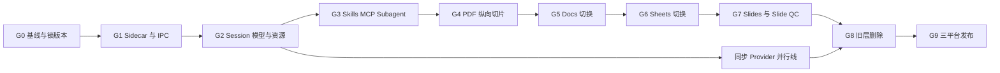

# Pi Agent Platform 最终实施规则

<!-- markdownlint-disable MD013 MD060 -->

日期：2026-08-09

状态：Approved for implementation

适用范围：`features/pi-agent-platform-migration-spec` 后续所有 Pi Agent Platform 实施 PR

## 1. 文档效力

本文把[迁移规格](2026-08-07-pi-agent-platform-migration.md)、`CONTEXT.md`、ADR 与六个
Spike 的结论转换成工程团队可直接执行的顺序和质量门。它不授权改变已确认的产品边界。
实现与本文冲突时必须停下，先修订 ADR/规格；不能用代码现状反向覆盖决策。

证据已经闭合：

| Spike               | 结论                                                                            | 状态     |
| ------------------- | ------------------------------------------------------------------------------- | -------- |
| 01 MCP              | Pi `0.84.0` + `@modelcontextprotocol/client@2.0.0` + inline Extension 薄桥      | resolved |
| 02 Subagent         | `@agwab/pi-subagent@0.4.8` 只作执行/产物引擎，权限与 lineage 由 GenOffice 管理  | resolved |
| 03 Codex OAuth 图片 | 通过 Codex Responses `image_generation` 调用 `gpt-image-2`，不走公开 Images API | resolved |
| 04 Sidecar          | Node `22.19.0` 可执行文件 + unpacked ESM bundle，UDS/Named Pipe                 | resolved |
| 05 MinerU           | 精准解析 5/5 转换成功；语义优先，不承诺公式、栏布局、页数、底图高保真           | resolved |
| 06 WebDAV/S3        | immutable blob/revision + 单一 CAS `head.json`，本地 current 永远优先           | resolved |

六个 Spike 的原型与票据位于
[`../../../.scratch/pi-agent-platform-migration`](../../../.scratch/pi-agent-platform-migration/)。
它们是设计证据，不进入最终安装包。

## 2. 不可协商的不变量

实施过程中始终成立以下规则：

1. `@earendil-works/pi-coding-agent` 的 `AgentSession` 是唯一 Agent Runtime。不得新增、
   保留或隐藏第二套 AgentLoop、compaction、会话树或模型流协议。
2. Runtime 进程名固定为 `open-genoffice-pi-agent-runtime`，由每个 Electron 应用实例
   启停和回收。不得使用 `utilityProcess`、系统 Node、`npx`、常驻 daemon 或 SEA。
3. 每条 Pi Session 只绑定一个 Office 文档。旧聊天与旧 Provider 凭据直接删除，不迁移、
   不显示只读入口。
4. renderer 不接触模型/MCP/OCR/同步 secret，不加载 Extension，不启动 MCP/Subagent
   子进程，也不直接连接 Runtime socket。
5. 全局 Agent Resource Home 只使用 `~/.open-genoffice`。不得扫描或写入 `~/.pi`、
   `~/.codex`、`.pi`、`.mcp.json` 或其他 Agent 客户端目录。
6. 项目级 `.open-genoffice` 只有在 canonical project root 获得 Project Trust 后才能
   提供 Skill、Extension、MCP 或其他可执行/联网资源。
7. Subagent 默认只读。Mutation Tool 只有在用户给具体 run、文档与精确工具集合签发
   当前 run 有效的 Mutation Grant 后才可见、可执行。
8. 本地 Office 文件始终是 current。同步不静默覆盖；远端分叉落为旧 Conflict Copy，
   用户选择后产生双 parent resolution revision。
9. MinerU 是默认关闭的 OCR 服务商。PDF→DOCX 默认且首版只走精准解析 Standard API；
   Agent 轻量解析、Pandoc 与其他服务都不能成为静默回退。
10. 正式安装包必须是 Genspark-Free Build。Agent 不可用时显示明确故障，不能回退到
    Genspark 或旧 AgentLoop。

## 3. 仓库落点与所有权

保持现有领域 executor 原位，新增边界尽量少：

```text
apps/pi-agent-runtime/                 # 新增：sidecar 入口与受信 Runtime 实现
packages/agent-runtime-protocol/       # 新增：IPC 命令、事件、版本与校验 schema
packages/electron-utils/               # 演进：sidecar launcher、握手、回收、升级诊断
packages/ui/                           # 演进：现有 AI Panel 的共享 Session/MCP/Subagent UI
packages/project-store/                # 演进：文档绑定、sync revision、Conflict Copy
packages/ai-search/                    # 演进：只保留非 Genspark 搜索实现
apps/{pdf,docs,sheets,slides}/src/main/agent-tools/
                                       # 新增：应用内 executor -> Pi tool adapter
packages/agent-core/                   # 所有应用切换后删除
packages/ai-provider/                  # 所有模型/图片路径切换后删除
```

`packages/agent-runtime-protocol` 只保存无 secret、可序列化的协议类型，不包含模型、工具或
业务实现。`apps/pi-agent-runtime` 拥有 `AgentSession`、Provider、CredentialStore、MCP
连接、Subagent 调度与资源加载。每个 Office 应用的 main process 继续拥有编辑器状态和
executor，通过窄 Office Tool Bridge 响应 Runtime 请求。

不要先建立一个统一 Office domain model。PDF、Docs、Sheets、Slides 的 tool adapter
分别贴着现有 executor 实现；只有两个应用已经出现完全相同的稳定逻辑时，才向共享包提取。

## 4. 依赖与产物锁定

根 `package-lock.json` 是唯一权威 lockfile。`package.json` 与 lockfile 必须同时精确
固定，禁止 range、workspace 外隐式解析和安装时更新：

| 组件                                                  | 固定版本   | 规则                                                                             |
| ----------------------------------------------------- | ---------- | -------------------------------------------------------------------------------- |
| Node Runtime                                          | `22.19.0`  | 每个目标平台复制完整官方发行物并记录 SHA-256                                     |
| `@earendil-works/pi-{ai,agent-core,coding-agent,tui}` | `0.84.0`   | 四包必须解析为同一版本                                                           |
| `@modelcontextprotocol/client`                        | `2.0.0`    | 不采用要求 Pi `0.84.1` 的 `pi-mcp-adapter@2.21.1`                                |
| `@agwab/pi-subagent`                                  | `0.4.8`    | 锁定 npm integrity，并记录源码 commit `daa7b83819116a62008ad17aa65fcd50fefbafd0` |
| `webdav`                                              | `5.10.0`   | WebDAV transport；二进制请求显式转 `Buffer`                                      |
| `@aws-sdk/client-s3`                                  | `3.1106.0` | S3/AWS/MinIO Provider                                                            |
| `fflate`                                              | `0.8.2`    | MinerU 结果包受限解压                                                            |

`@agwab/pi-workflow`、`pi-mcp-adapter`、`pi-mcporter`、`oh-my-pi` 与
`@genspark/cli` 不进入首版生产依赖。任何版本升级必须独立 PR：更新依赖 ADR、SBOM、
许可证、原型 contract tests 与三平台安装包 smoke，不得夹带功能开发。Pi 升级必须四包
同升，并重新评估 MCP/Subagent peer compatibility；禁止自动升级。

Runtime bundle manifest 至少固定 `runtimeVersion`、`protocolVersion`、Node/Pi 版本、
platform、arch、executable、entry、全树 hash 与 license/notices hash。`beforePack` 对
缺文件、symlink、架构错误、hash 漂移、Linux 无 executable bit 或依赖落入 `app.asar`
一律 fail closed。

## 5. 实施主线

正式工作按下面的 gate 顺序前进。允许同步 Provider 在 G2 后并行开发；四个应用的 UI 与
Agent 切换必须保持 PDF → Docs → Sheets → Slides/Slide QC 的顺序，避免同一套共享 AI
组件在多个未稳定调用方之间来回改动。



### G0：基线与禁止项 CI

落地精确依赖、Runtime manifest schema、协议版本、fake Model Provider、四应用黄金用例和
生产路径禁止项扫描。冻结现有 Office tool 清单，给每个工具标注应用、read/mutation、
executor、输入 schema、回滚与 UI details。

验证：根 lockfile 只有一套 Pi `0.84.0`；fake Provider 可重复产生 message/thinking/tool/
compaction 序列；生产构建扫描能拒绝 `@genspark/cli`、旧 wire contract 和未授权外部
Agent home。

### G1：Sidecar 与 IPC

新增 Runtime workspace、target-platform Node bundle、manifest 校验和 Electron
`PiRuntimeManager`。正式通信只用私有 UDS/Named Pipe；一次性 token、endpoint、协议版本
和父 PID 只经 inherited stdin bootstrap。实现 create/open/prompt/steer/followUp/abort/
compact/fork/navigate/status/subscribe，并保留同一入口的独立 debug/test 模式。

Windows 的 Runtime、MCP 与 Subagent 子进程必须进入 kill-on-close Job Object 或提供经过
等价故障测试的进程树监督实现。静态 PE/DLL 检查不能替代 Named Pipe、Job Object 和退出
回收实跑。

验证：无 Office tool 的 Pi Session 可创建、流式运行、取消、恢复；错误 token、重用
token、错误协议/Runtime 版本和错误父 PID 全部拒绝；显式退出、父 stdin EOF、崩溃和
Electron 强退后没有进程或 socket 残留。

### G2：Session、模型、凭据与 Resource Home

建立一 Session 一文档绑定、Pi JSONL 唯一 transcript、OS CredentialStore 和
`~/.open-genoffice` 目录。支持一个云模型、一个本地 OpenAI-compatible 模型与 Codex
OAuth 登录/刷新/退出；不读取任何其他客户端 OAuth 凭据。

renderer 只能获取 Provider ID、能力、健康状态和脱敏错误。旧聊天、索引、Provider 配置、
明文 key 与 Genspark token 用幂等升级清理删除，不迁移到 Pi JSONL。

验证：多文档、多 Session、fork、compaction、renderer reload 与应用重启不串文档、不
重复消息；secret 不出现在 renderer、IPC、session、日志和普通 JSON 配置。

### G3：Skills、Extensions、MCP 与 Subagent

接入 Pi `DefaultResourceLoader`、Package/Extension 生命周期和项目 Trust。Package 只允许
本地目录、精确 npm 版本或固定 Git commit，生成来源、integrity 与内容 hash lock。

MCP 使用官方 client 的 stdio/Streamable HTTP/OAuth/AbortSignal；自有薄层只负责配置
命名空间、连接监督、Pi ToolDefinition 映射和 actor-aware 授权。工具禁用必须同时从
模型可见集合和执行入口消失。结果记录 server/tool provenance；mutation 网络结果不确定
时禁止自动重放。

Subagent 使用 `@agwab/pi-subagent/api` 的 headless/session 路径。GenOffice 保存权威
`runId/parentRunId/rootRunId/sessionId/documentId/budget/grant`，并把第三方事件归一化；
模型传入的 tools 不得直接透传。父级取消按 run tree child-first 取消所有后代。

验证：fake HOME 不读取/创建 `~/.pi`；stdio 与 Streamable HTTP 完整调用、取消、重连和
退出通过；Subagent 默认只读，Mutation Grant 精确生效且终态撤销；Windows 原生 runner
完成 spawn/watch/cancel/reconcile/resume 与进程树回收。

### G4：PDF 纵向切片与 MinerU

先把 PDF 的现有 AI Panel 接到共享 Runtime UI，适配 read-only context 和 PDF 工具，再
加入默认关闭的 MinerU OCR 服务商。首次开启弹窗说明第三方上传和持续授权；关闭时不读
token、不发请求。PDF→DOCX 一文件一批，固定 `model_version: "vlm"`、
`extra_formats: ["docx"]`，使用精准解析签名上传和 batch poll。

签名/结果 URL、token、任务 ID和文档内容不进入 renderer/session/log。下载必须做 HTTPS、
体积、文件数、路径穿越、唯一 DOCX 和 OOXML 校验。本地取消不声称远端任务已取消。

UI 文案固定为“转换优先保留可编辑正文和阅读顺序；不保证结构化公式、栏布局、页数、
字体、图内可搜索文字或扫描底图”。完成后提供原 PDF 与 DOCX 并排检查；原 PDF 永不删除。

验证：PDF 的 Pi Session、停止、恢复与工具回滚通过；MinerU 关闭时零网络；黄金语料重跑
并符合 Spike 05 边界。完成同一 gate 后删除 PDF 对旧 `ai:stream`、AgentTransport 和
Genspark PDF 转换的引用，不保留运行时开关。

### G5：Docs 切换

把 Docs executor 逐项包装为 Pi tool，保持每轮实时 selection/document context、第一次
mutation 快照、顺序 mutation、undo/redo 与 UI-only details。先用 fake Provider 对照黄金
文档，再用云端与本地模型各跑一次工具 E2E。

验证：读、插入、替换、格式、附件、失败回滚和 Session 恢复无回归；通过后立即删除 Docs
的 `ai:stream` preload/main handler、旧 AgentLoop 和 Provider 类型引用。

### G6：Sheets 切换

适配 workbook/sheet/range context 与表格 mutation。所有写工具按模型顺序串行，公式、
格式和多区域写入必须先做预校验，不能依赖模型并行工具调用。

验证：活动 sheet/range 实时更新，批量写入无竞态，失败可恢复第一次 mutation 前快照；
通过后删除 Sheets 的旧 IPC、AgentLoop 与 Provider 路径。

### G7：Slides 与 Slide QC 切换

Slides 和 Slide QC 视为同一个原子 gate。迁移普通读写工具、整页生成、图片生成、media
分析和 QC；不得先切 Slides、后留 Slide QC 继续调用旧 Agent。

`CodexOAuthImageProvider` 复用 Pi `openai-codex` OAuth，固定调用 Codex Responses 的
`image_generation`，外层模型 `gpt-5.4-mini`、工具模型 `gpt-image-2`。单次一张且省略
`n`；final 图片经 MIME/魔数/尺寸/字节/hash 校验后原子写项目 asset。协议不兼容只禁用
图片能力并提示，不能换到 API key、OpenRouter、Sub2API 或其他计费通道。

整页替换前必须先生成候选 PPTX/页并执行结构检查；只有“PPTX 可打开、文字可编辑、无
越界、无重叠、图片资源完整”全部通过才替换。任何异常保持原页。

验证：Slides/Slide QC 共享同一 Pi Session 事实源，图片取消/usage/协议故障明确，黄金
PPTX 全过；随后删除 Slides 的 `ai:stream`、GSK image/media/slide_generate 与旧 QC Agent。

### 同步 Provider 并行线

G2 的文档绑定与 `project-store` schema 固定后即可开发。WebDAV 和 S3 使用同一 repository
contract：immutable blob/revision、单一 CAS `head.json`、SHA-256 正文完整性、tombstone
删除与 reconcile-only 离线队列。WebDAV 要求 HTTPS、强 ETag 和 conditional PUT；S3
要求 conditional PutObject，支持 endpoint/region/bucket/prefix/path-style 和 SSE-S3/
SSE-KMS。

Project 与 Global Asset 使用独立 namespace。Global Asset 包含 Assets、Skills、
Extensions、Prompts、Package lock 与脱敏 MCP 配置；不包含凭据、Project Trust 或设备
设置。新设备对可执行/联网资源按内容 hash 重新授权。

验证：WebDAV loopback、MinIO、AWS S3 和至少两个实际 WebDAV 服务完成相同 contract；
双客户端分叉始终保留本地 current，远端成为 Conflict Copy；选择任一版本都生成双
parent resolution，不用 wall-clock 决胜。

### G8：共享旧层与 Genspark 删除

四个应用 gate 全过后，删除 `packages/agent-core`、`packages/ai-provider` 及所有生产引用；
清除 Genspark 登录/device-code/token UI、i18n、`@genspark/cli`、extraResources、GSK
search/image/media/slide/convert/project API、proxy URL、header、model catalog、credits
错误与环境变量。`packages/ai-search` 只保留 Serper/DuckDuckGo 和明确配置的扩展路径。

删除必须发生在一个可审计的收束 train 内。迁移说明和 ADR 可以保留历史名称，但生产
源码、renderer 资源、lockfile、安装包、日志模板和网络 fixture 必须为零。

验证：静态 import/string/lockfile/bundle 扫描和运行时网络拦截全部通过；所有原云能力要么
有已验收替代，要么从 UI 完整移除，不能留下死按钮。

### G9：三平台发布

在现有 release workflow 支持的每个 platform/arch 原生 runner 上构建、安装、首次启动、
运行 Agent/MCP/Subagent、退出、升级和卸载。macOS 完成 nested signing/notarization；
Windows 完成 Runtime/app/installer signing、Named Pipe 与 Job Object 实跑；Linux 固定
glibc，验证 executable bit、AppImage/安装路径和进程回收。交叉构建只算静态预检。

验证：完整验收矩阵、license/notices/SBOM、全仓 typecheck/lint/test 和安装包网络审计
通过，没有临时豁免。

## 6. 每个 PR 的实施规则

每个 PR 在描述中必须写清“改动边界、对应 gate、删除了什么旧路径、验证证据、失败时
如何回滚”。遵循下列约束：

- 一个 PR 只推进一个可独立验证的 contract 或一个应用纵向切片，不跨两个应用切换。
- 先写能复现目标 contract 的测试，再实现；新增平台模块 lines/branches/functions 均不低于
  95%，不是只看仓库平均值。
- IPC、session、sync revision、Mutation Grant 和 provider error schema 的兼容性变化必须
  升协议/schema version，并附升级/拒绝测试。
- 不提交真实 token、OAuth account ID、签名 URL、任务 ID、用户文档、`live-results/`、
  `.open-genoffice` 或系统凭据库导出。
- 不顺手重构 Office executor。旧代码只在对应新路径验收通过后删除。
- Gate 没过时不允许用“暂时回退旧 Agent/Genspark”让测试变绿；应保持功能明确不可用。

## 7. 切换与删除规则

研发分支可以同时包含尚未切换应用的旧代码和新 Runtime，但正式安装包不能包含双运行时。
每个应用使用下面的五步原子切换：

1. 冻结旧黄金行为与工具清单；
2. 在测试/开发构建接入 Pi 路径；
3. 完成 fake Provider、真实 Provider 与故障 E2E；
4. 让该应用生产入口只指向 Pi；
5. 在继续下一个应用前删除该应用旧 IPC、transport、AgentLoop 与 Genspark 能力入口。

共享 `agent-core`/`ai-provider` 只有在最后一个应用切换后删除。Genspark 登录和账号 UI 在
模型配置、Codex OAuth 与必要能力替代可用后立即删除；不能等到发布前才隐藏。Slides 与
Slide QC 必须同时切换和删除。

迁移期间不发布“半切换”正式版本。需要内部试用时使用明确的 developer/nightly channel，
并在界面和遥测环境中与正式版本隔离。

## 8. 失败与回滚边界

同一安装包内没有旧 Runtime 回退。允许的回滚是安装上一版已签名产物；Office 文件和
项目资产保持普通格式，新版本写入的 `~/.open-genoffice` schema 必须让旧版安全忽略，
不能让旧版误读为旧聊天或 Provider 配置。

能力故障按最小影响面降级：

| 故障              | 产品行为                                                                |
| ----------------- | ----------------------------------------------------------------------- |
| Runtime 启动/崩溃 | AI Panel 显示 Runtime 不可用与诊断；Office 本地编辑继续，不启用旧 Agent |
| 模型认证/协议     | 禁用对应 Provider，保留其他用户已配置 Provider                          |
| Codex 图片协议    | 只禁用 Codex 图片，文本 Agent 与其他显式 Image Provider 不受影响        |
| MinerU            | 停止新的云转换，保留原 PDF 与已下载 artifact；不切轻量解析/Pandoc       |
| MCP server        | 隔离该 server/tool，Session 继续；不确定的 mutation 不重试              |
| Subagent          | 返回结构化失败，撤销 Grant，父 Session 可继续或用户重试                 |
| 同步              | 保持本地 current，记录 reconcile 意图；不阻塞 Office 与 Agent 本地工作  |
| Slides 候选页     | 不替换原页，保留可诊断的失败 artifact                                   |

## 9. 安全与隐私门

所有 cloud/extension/tool 路径按 actor、文档和能力授权。Runtime 日志默认只记录 provider/
server/tool ID、状态、耗时、错误类别和相关性 ID；不记录 prompt、工具参数/结果、正文、
token、完整 URL 或图片 base64。

MinerU 首次开启必须明确“文件上传第三方云 OCR、授权持续有效、可在设置关闭”。后续操作
持续显示云处理标识。MCP OAuth 校验 PKCE、state、issuer 与 server URL binding；stdio
只注入白名单环境。Codex OAuth 与用户显式配置的 OpenAI-compatible Provider 使用不同
凭据记录，不能互相借用。

同步只接受 TLS endpoint；凭据只在本机 CredentialStore。首版只承诺传输加密与 S3
provider-side encryption，不宣称客户端端到端加密。

## 10. 压力与恢复基线

除功能矩阵外，发行候选必须达到以下可重复基线：

- 参考 CI 机器上 Runtime cold-ready p95 不高于 5 秒，崩溃后重建 ready p95 不高于 8 秒；
  连续 100 次启停、50 次 renderer reload 后无重复事件、遗留进程或 socket。
- UI Abort 后 cooperative 模型/tool/MCP/Subagent 在 2 秒内结束；不协作子进程在 5 秒内
  强制回收。任一平台存在孤儿进程即失败。
- 同一 Runtime 同时维持 20 条已打开 Session，串行 mutation 仍保持文档隔离和事件顺序；
  内存持续增长必须有可解释上限和 heap evidence。
- WebDAV 与 S3 各对 10,000 path manifest、1,000 个 unchanged blob、100 组双客户端分叉
  运行随机断网/重连；不得重复上传 unchanged blob、丢失 revision 或静默覆盖 current。
- MinerU 的黄金语料只用于受控、明确授权的云端回归；普通 CI 使用 mock/已脱敏固定产物，
  不消耗配额、不上传用户文件。

阈值若需调整，必须先提交性能证据和 ADR，不能在发布 PR 中临时放宽。

## 11. 最终发布硬门

发行负责人必须逐项签字，不接受“已知问题后补”：

- 迁移规格 `AR/OT/MD/RS/MCP/SA/OCR/SY/SL/GX/PK/QA` 全部通过；
- 新平台模块 lines/branches/functions 覆盖率均 ≥95%，全仓 test、typecheck、lint 通过；
- macOS、Windows、Linux 原生安装包完成首次启动、升级、卸载、Runtime/MCP/Subagent
  进程回收与签名验证；
- lockfile、asar、bundle、SBOM、license/notices 与第三方依赖 hash 一致；
- 安装包和运行时网络审计没有 Genspark 登录、域名、CLI、资源、凭据或服务依赖；
- 干净用户目录只创建 `~/.open-genoffice`，不读写 Pi CLI、Pi Web、Codex 或其他 Agent
  客户端资源；
- 旧聊天和旧凭据删除 fixture 幂等，Office 原文档与项目资产不被删除；
- MinerU 默认关闭，Codex 图片失败只影响图片，同步失败不影响本地 current；
- Slides 整页质量门和失败保留原页在真实 PPTX 上通过；
- 没有兼容层、双运行时开关、临时 Genspark fallback 或发布豁免。

满足这些条件后，Pi Agent Runtime 才能被视为 GenOffice 唯一、完整且可发行的 Agent
Platform。
